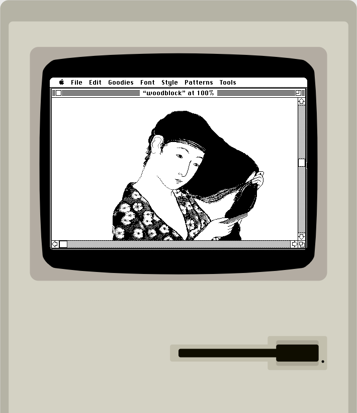

我的古董电脑是在开始写作之初的想法就是希望能够建立西方Retrocomputing社区和中文世界之间的联系，也在陆续探索各种更好地向中文社区介绍古董电脑和Retrocomputing文化的方式。

这些年来随着V8引擎等前端技术的发展。以往只用来处理网页特效的Javascript代码现在也被用作更多的用途。asm.js、Emscripten等工具的出现让向浏览器移植模拟器变得更加便利，其中与Retrocomputing社区关系特别密切的就是用Javascript编写古董硬件的模拟器。

这篇文章并没有打算向大家介绍网页模拟器的技术细节，而是希望通过介绍一些网络上已有的开源网页模拟器，来给大家提供一种更加便利的尝试古董电脑的手段。也希望网页模拟器这种比较方便的工具，能够让更多人体会到Retrocomputing的乐趣。

## Apple2js： Apple II

第一个模拟器是Apple II的模拟器，Apple 是1977年开创家用电脑行业的三大开山鼻祖之一，相比之前的微电脑多数以发烧友为目标人群，Apple II是最早面向普通大众公开销售的个人电脑。在Apple II上面出现了许多非常有意思的游戏，最值得体验的游戏有有偷金者、神偷卡门、以及太空入侵者和俄勒冈小径等等。

    
    
Apple II上的“偷金者”

{{site.data.alerts.tip}}
体验 <b><a href='{{ "/player.html?machine=apple2" | prepend: site.computer_museum_base_url }}' target='_blank'>Apple II 模拟器</a></b>
{{site.data.alerts.end}}

<https://github.com/whscullin/apple2js>

## Apple2jse：Apple IIe

Apple IIe是Apple II系列的第三代，在1983年3月接替Apple II Plus推出，并一直销售到1993年，不仅是Apple II系列中最“长寿“的一款，也是最后停产的一款Apple II系列电脑。Apple IIe对中国的电脑行业有着深刻的影响，CEC-I型”中华学习机“就是以Apple IIe为原型设计的。

    
    
《魔法门II：异世界之门》

{{site.data.alerts.tip}}
体验 <b><a href='{{ "/player.html?machine=apple2e" | prepend: site.computer_museum_base_url }}' target='_blank'>Apple IIe 模拟器</a></b>
{{site.data.alerts.end}}

操作提示，点击Load按钮即可打开软盘选择菜单，加载完软盘后点Reset重启，就会自动加载软盘，鼠标指向屏幕画面的时候可以作为游戏摇杆使用。

## JsBeeb： BBC Micro

1980年，BBC开始播放一系列电脑教育节目，即著名的“计算机认知项目（Computer Literacy Project）”。与此同时BBC也开始寻找适合于教育的电脑平台，最终他们选定了后来开发出ARM处理器的Acorn来生产BBC Micro。2009年，这段历史被BBC拍成纪录片《英国电脑业鼻祖》（Micro Men）。

BBC其中就包括了经典的太空冒险游戏《精英》。

    

在2020年卡内基梅隆大学举办的Demosplash聚会上，JsBeeb的作者Matt Godbolt亲自向参与者介绍了JsBeeb开发背后的故事。

    

{{site.data.alerts.tip}}
体验 <b><a href='{{ "/player.html?machine=bbcmicro" | prepend: site.computer_museum_base_url }}' target='_blank'>BBC Micro 模拟器</a></b>
{{site.data.alerts.end}}

操作提示：点击上方Discs，选择STH Archive，就会有大量游戏可以选择，选中Autoboot，这样选择游戏之后模拟器就会自动重新启动并加载游戏。

<https://github.com/mattgodbolt/jsbeeb>

## ElkJS： Acorn Electron

Acorn在生产BBC Micro的同时，还开发了一款较为廉价的Electron（电子），Acorn使用了单颗ULA门阵列芯片来开发Electron，但由于开发难度大，导致它远没有同时期的ZX Spectrum流行。

    

我在古董电脑室的第一篇文章[《追寻ARM的起源——Acorn电脑简史》](/a_brief_history_of_acorn_computers.html)中，曾经详细介绍过BBC Micro和Acorn Electron的故事，有兴趣的朋友可以去看看。

{{site.data.alerts.tip}}
体验 <b><a href='{{ "/player.html?machine=acornelectron" | prepend: site.computer_museum_base_url }}' target='_blank'>Acorn Electron 模拟器</a></b>
{{site.data.alerts.end}}

操作提示：点Game之后直接选择游戏就可以加载。

<https://github.com/dmcoles/elkjs>

## JSSpeccy： ZX Spectrum

1982年，英国大发明家克里夫·辛克莱推出了他的第三款个人电脑产品ZX Spectrum。这款电脑相比他前任的两款产品ZX80和ZX81都要强大很多，它支持彩色显示输出并且价格相当便宜，入门级的16K内存型号只要125英镑，因此成了英国许多青少年的第一台个人电脑和游戏机，并掀起了一股“卧室程序员”创作独立游戏的热潮，疯狂矿工（Manic Miner）就是其中最为知名的一款。

    

ZX Spectrum在欧洲的影响非常广泛，其仿制机型在前苏联国家曾广泛流行，甚至出现了以ZX Spectrum为基础开发的电视游戏机——Alf。

    

{{site.data.alerts.tip}}
体验 <b><a href='{{ "/player.html?machine=zxspectrum" | prepend: site.computer_museum_base_url }}' target='_blank'>ZX Spectrum 模拟器</a></b>
{{site.data.alerts.end}}

操作提示：直接从右侧列表中选择游戏就可以玩。

<https://github.com/gasman/jsspeccy2>

## PCjs： IBM PC

1981年IBM推出了第一款IBM PC Model 5150并且捆绑了微软提供的DOS和Basic语言解释器。PCjs可以在网页中模拟这款IBM PC系列的始祖机型，在上面我们不仅可以体验DOS 1.0版，还可以玩到比尔盖茨和尼尔·康森为IBM PC开发的第一款游戏——《DONKEY.BAS》。

    
    
最早的电子表格软件 VisiCalc

    
    
比尔盖茨的“赛车驴”游戏

{{site.data.alerts.tip}}
体验 <b><a href='{{ "/player.html?machine=pc5150mda" | prepend: site.computer_museum_base_url }}' target='_blank'>IBM PC 5150 (MDA单显)</a></b>
{{site.data.alerts.end}}

操作提示：开机后提示输入日期，建议输入2000年之前的日期（著名的“千年虫”），然后输B:回车进入第二个软驱，输入vc回车运行VisiCalc。VisiCale的热键是 / （斜杠），退出的命令是/SQ （Storage-Quit），更多的命令可以看这里：

<http://www.bricklin.com/history/refcard1.htm>

{{site.data.alerts.tip}}
体验 <b><a href='{{ "/player.html?machine=pc5150cga" | prepend: site.computer_museum_base_url }}' target='_blank'>IBM PC 5150 (CGA彩显)</a></b>
{{site.data.alerts.end}}

操作提示：开机后提示输入日期，输入BASIC SAMPLES.BAS回车，就可以加载演示程序菜单了，然后按照菜单选择即可，菜单项E是Donkey，就是赛车驴游戏。建议大家去[PCjs](https://www.pcjs.org)的官网看一看，有包括Windows 95在内的更丰富的镜像。

<https://github.com/jeffpar/pcjs>

## PCE.js： Macintosh Plus

1986年发布的Macintosh Plus是苹果的第三款Macintosh电脑，这个模拟器附带了许多80年代末的应用软件，比如Word 4.0a，以及PageMaker 2.0等等。jsdf/pce1986年发布的Macintosh Plus是苹果的第三款Macintosh电脑，这个模拟器附带了许多80年代末的应用软件，比如Word 4.0a，以及PageMaker 2.0等等。

    
    
MacPaint著名的演示图片——《梳头的女人》

{{site.data.alerts.tip}}

体验 <b><a href='{{ "/emularity.html?machine=macplus" | prepend: site.computer_museum_base_url }}' target='_blank'>PCE.js Classic Mac OS in the Browser 英文版</a></b>

体验 <b><a href='{{ "/emularity.html?machine=macpluschs" | prepend: site.computer_museum_base_url }}' target='_blank'>PCE.js Classic Mac OS in the Browser 中文版</a></b>

{{site.data.alerts.end}}

操作提示：英文版和中文版的内容基本上是一样的，App都是英文的，英文版的App放在HD2上。

<https://github.com/jsdf/pce>

---------

出处：https://zhuanlan.zhihu.com/p/38714978


