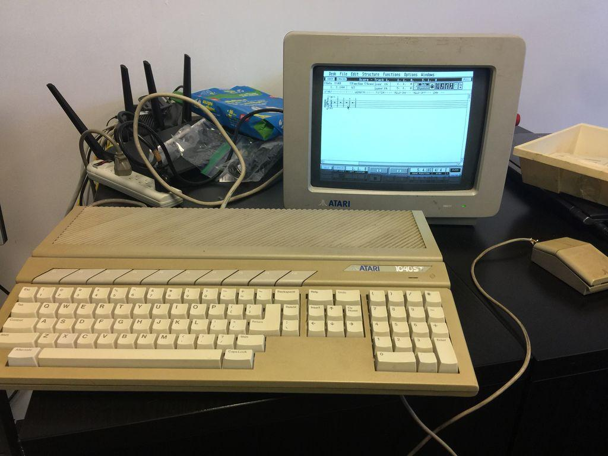

在[《电脑博物馆漫游：第一集》](/computer_museum_roaming_1.html)推出之后，很多小伙伴们纷纷表示有点距离感，所以作为《电脑博物馆漫游：第一集》的续集，《电脑博物馆漫游：第二集》将会从最早的国产家用电脑——中华学习机开始。

## 中华学习机CEC-I

1984年2月16日，邓小平参观上海市展览馆举办的十年科技成果展时，鼓励现场的工作人员“计算机普及要从娃娃做起”。从此开启了中国家用电脑和教育电子市场的大门。作为对领导人号召的响应，中国内地第一款家用电脑中华学习机在不久之后开始立项开发，并在1986年开始生产，中文世界里“学习机”一词的起源于英文“learning kit”，本来是用于训练技术人员的开发板，在台湾，有全亚EDU-80和宏碁小教授一号微处理器学习机。作为小教授一号的后续，宏碁的小教授二号是一款Apple II兼容机，从此“学习机”在许多场合成为平价家用电脑的代称。另外一个将家用电脑称作“学习机”的原因，则可能是相比计算机产品，教育产品能够得到较多的税务优惠。

    

{{site.data.alerts.tip}}

体验 <b><a href='{{ "/emularity.html?machine=ceci" | prepend: site.computer_museum_base_url }}' target='_blank'>CEC-I 模拟器</a></b>

中华学习机操作提示：

使用F7/F8切换中英文，F1~F3切换输入法

{{site.data.alerts.end}}

    
    
图片来自芬兰苹果爱好者对CEC-I的介绍

特别值得一提的是中华学习机的模拟器的开发过程，早在2011年，国内的开发者zzemu就已经在MESS的基础上开发出CEC-I的模拟器，不过由于种种原因，这段代码始终没有被合并到MESS的主代码库中，直到2017年夏天，美国历史学家Jason Scott将大量关于CEC-I的资料上传到互联网档案馆，MAME的维护者之一R. Belmont（rb6502）才开始尝试将CEC-I模拟器加入到MAME当中。

互联网档案馆的CEC-I资料 <https://archive.org/details/Apple_II_Chinese_Materials_Collection>

R. Belmont的blog里记录了开始开发CEC-I的情形 Arbee's WIP Emporium " 跟猴子比丟屎

{{site.data.alerts.tip}}

体验 <b><a href='{{ "/emularity.html?machine=cecidisk" | prepend: site.computer_museum_base_url }}' target='_blank'>CEC-I 模拟器和游戏软盘</a></b>

中华学习机操作提示：

使用F7/F8切换中英文，F1~F3切换输入法

{{site.data.alerts.end}}

而今天我们看到的网页版MAME，则是来自于互联网档案工作组的JSMESS项目。<https://wiki.archiveteam.org/index.php?title=Javascript_Mess>

    

CEC-I模拟器的故事从某种程度上反映了国内古董电脑社区较为封闭的现状，在西方以及日本的复古电脑社区日渐国际化的背景下，中文世界里的古董电脑社区却几乎处于若干“孤岛”的状态，不仅和国际社区缺乏互动，不同机型的爱好者之间交流也比较欠缺，而这正是“古董电脑室”致力于推动改进的一点。

中华学习机使用手册，网友himskleung扫描。 <http://jsemu.oss-cn-shanghai.aliyuncs.com>

## Atari ST

1984年，亲手创办Commodore并让Commodore 64登上8位家用电脑巅峰的Jack Tramiel离开了自己一首创办的公司，转身从时代华纳手中接手了Atari危机的主角Atari。凭借着雄厚的财力和过人的商业头脑，这位奥斯维辛集中营的幸存者在不到一年的时间里就让Atari起死回生，并带来了当年最热门的图形界面16位家用电脑。

    

和早一年发布的苹果Macintosh一样，Atari ST也使用了摩托罗拉68000处理器，并且具有图形界面，由于和Macintosh的诸多相似之处，很快Atari ST就有了“Jackintosh”的外号。

但Atari ST却并非山寨版Macintosh，相比Macintosh，Atari ST支持更高分辨率的黑白显示器，并且还支持彩色显示，这让Atari ST更加适合游戏等娱乐用途，并且配备了当时相当奢侈的512K内存，价格也只有Macintosh的1/3，而1986年推出的Atari 1040ST，更是成为市面上第一款低于2500美元的内存超过1MB的电脑。

{{site.data.alerts.tip}}

体验 <b><a href='{{ "/emularity.html?machine=atarist" | prepend: site.computer_museum_base_url }}' target='_blank'>Atari ST 模拟器 （彩显）</a></b>

Atari ST的彩色显示器版本模拟器基于PCE.js，A盘是《模拟城市》，B盘是《上帝也疯狂》

{{site.data.alerts.end}}

而Atari ST最大的亮点，则是所有的型号都内置有MIDI接口，这让它成为许多音乐人的最爱，相比之前的电脑都需要购买昂贵的MIDI扩展卡，Atari ST简直就是“买MIDI送电脑”，这也让它出现在包括橘梦乐团 (Tangerine Dream)、麦克·欧菲尔德（Michael Oldfield）、流线胖小子（Fatboy Slim）等音乐人的作品中。

{{site.data.alerts.tip}}

体验 <b><a href='{{ "/emularity.html?machine=ataristmono" | prepend: site.computer_museum_base_url }}' target='_blank'>Atari ST 模拟器 （黑白高分辨率）</a></b>

Atari ST的黑白显示器配置A盘是BASIC和LOGO语言，B盘是Atari ST上最著名的音乐软件Cubase 2.0。

{{site.data.alerts.end}}

    
    
橘梦乐团是Atari ST的忠实用户

<https://github.com/jsdf/pce>

---------

出处：https://zhuanlan.zhihu.com/p/42973469


