在电脑博物馆漫游系列发布两集之后，这一集我们将会再次回到80年代初8-bit电脑大战烽火连天的时代。

<div align="center">
    <a href="../images/dnbwg/computer_museum_roaming_26.png">
        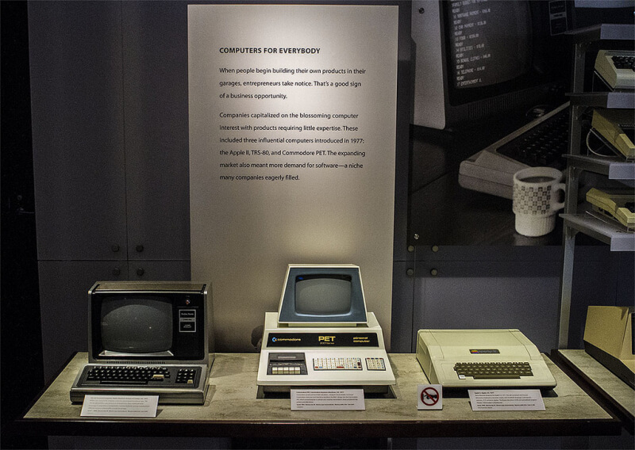
    </a>
</div>

## TRS-80

第一个出场的，是著名的Tandy/RadioShack推出的TRS-80，TRS-80发布于1977年8月，仅仅比苹果Apple II晚了两个月，这两款电脑与当年10月发布的Commodore PET一起构成了第一批面向公众发售的个人电脑。

<div align="center">
    <a href="../images/dnbwg/computer_museum_roaming_27.jpg">
        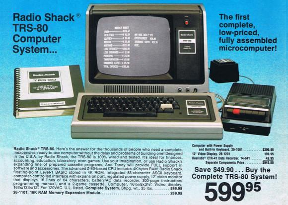
    </a>
</div>

在当时，Tandy是北美最大的电子产品销售商，拥有遍布全美国的3000家店面。凭借着强大的销售网络和较为便宜的价格，让TRS-80成为第一代个人电脑中最为畅销的产品。在1982年，几乎每销售一台苹果电脑的同时就会有五台TRS-80电脑被卖出。

TRS-80电脑不仅在北美广为流行，在中国也被广泛使用在工程计算和数据处理中，当我们搜索80年代电脑应用相关的论文时，可以发现不少领域都曾经使用过TRS-80电脑。

<div align="center">
    <a href="../images/dnbwg/computer_museum_roaming_28.png">
        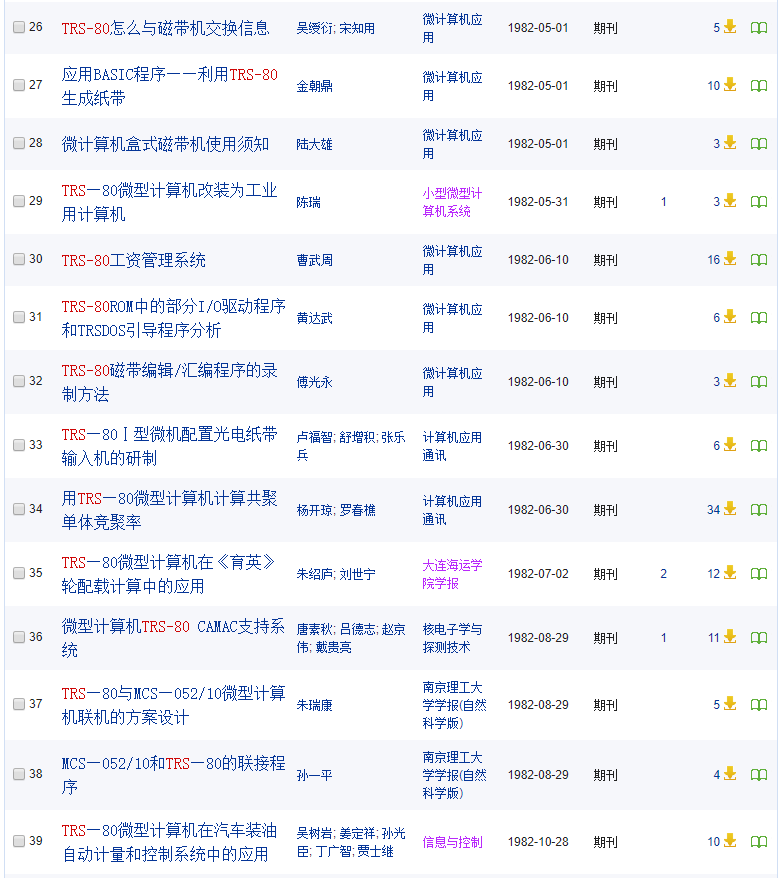
    </a>
</div>

TRS-80 Model III是TRS-80系列1980年的升级版，除了实时时钟和更快的处理器，其最大的改进是可以内置两个178KB容量的软盘驱动器，相比之下大多数同时代的8-Bit电脑使用的外置软盘驱动器，TRS-80内置软驱的设计让这台电脑不需要额外的连线，只要插上电源就可以使用，让它成为一款非常适合商业办公用途的台式电脑。

<div align="center">
    <a href="../images/dnbwg/computer_museum_roaming_29.jpg">
        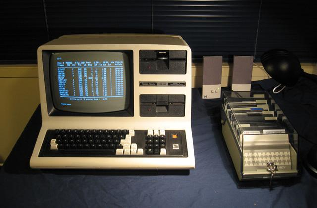
    </a>
</div>

与苹果和Commodore使用的6502处理器不同，TRS-80使用的是8-bit时代另一款非常流行的处理器Z80，Z80处理器在软件上和英特尔8080处理器兼容，在台式个人电脑领域之外，它还被广泛使用于S-100总线的工业电脑中。这让TRS-80可以比较方便的从这些电脑平台上移植软件，比如在MS-DOS出现之前应用最为广泛的CP/M操作系统。

<div align="center">
    <a href="../images/dnbwg/computer_museum_roaming_30.jpg">
        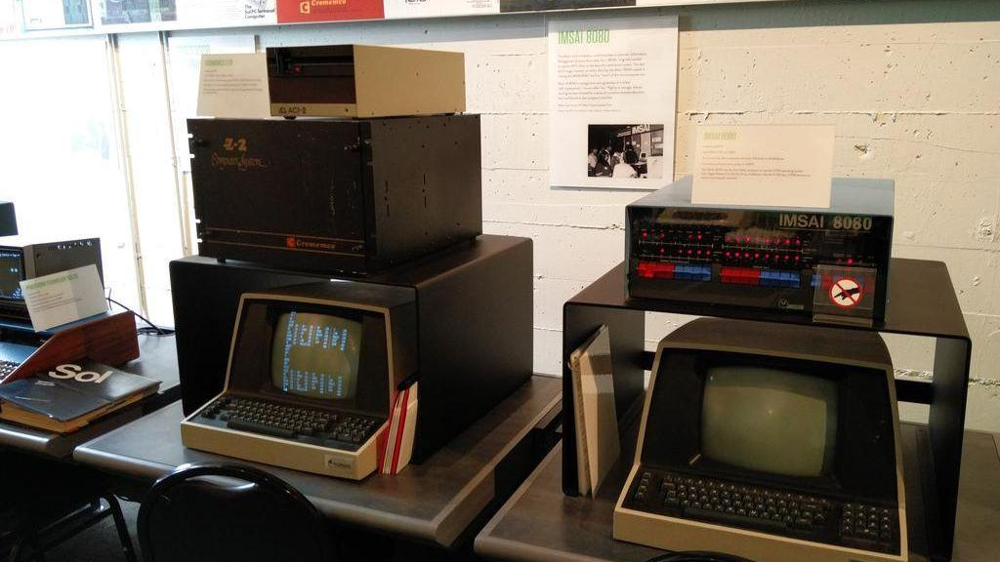
    </a>
    <p>Cromemco Z-2和IMSAI都是使用8080/Z80的电脑系统</p>
</div>

这一次网页里的古董电脑博物馆所使用的TRS-80模拟器是加拿大的爱好者Peter Phillips开发的，在这里可以下载到完整的源代码和资源文件，<http://trsjs.48k.ca/trs80.html>。

为了方便国内的读者使用，本站提供了镜像，可以点击这里访问：

{{site.data.alerts.tip}}
<p>体验 <b><a href='{{ "/player.html?machine=trs80model3" | prepend: site.computer_museum_base_url }}' target='_blank'>TRS-80 Model III 模拟器</a></b></p>
{{site.data.alerts.end}}


## Commodore 64

接下来的一款电脑就是在8-bit电脑历史上最有影响力的Commodore 64，Commodore 64电脑的成功，一方面是源于其优秀的硬件设计，6502的开发商MOS Technology作为Commodore内部的芯片设计团队，专门为Commodore 64定制了图像芯片VIC-II和声音芯片SID，获得了领先于当时所有竞争对手的图像和声音效果。

<div align="center">
    <a href="../images/dnbwg/computer_museum_roaming_31.jpg">
        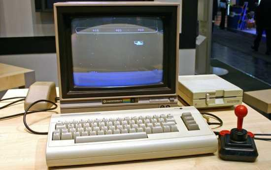
    </a>
</div>

而另一方面，则是其独特的历史机遇和商业策略，1970年代早期，在Commodore生产电脑之前曾经使用德州仪器的芯片生产科学计算器，但在1975年，德州仪器开始自行生产科学计算器，并以贴近成本价的价格销售。这一经验让Commodore的创始人决定拥有自己的芯片设计团队，并在1976年收购了设计6502芯片的MOS Technology，这一收购成为Commodore在80年代价格大战中最重要的资本。

<div align="center">
    <a href="../images/dnbwg/computer_museum_roaming_32.jpg">
        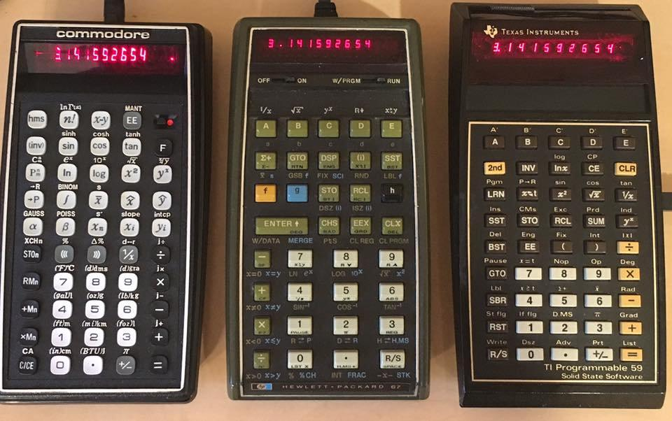
    </a>
    <p>Commodore 9190R，HP-67和TI-59科学计算器</p>
</div>

1983年，个人电脑价格战在Commodore和德州仪器这对“老冤家”中爆发，Commodore 64在一年之内降价超过6成，最终让德州仪器的TI-99系列电脑成为赔钱的产品并退出个人电脑行业，报了当年计算器市场上的一箭之仇。而在此之后Commodore 64在8-bit电脑市场上鲜遇敌手，成为历史上单个型号电脑销售最多的机型，并且也对大众文化产生了相当深刻的影响。

时至今日，Commodore 64仍然有着活跃的用户社区，并已经成为一个复古电脑社区的文化符号，无论是独立游戏社区、生成艺术社区还是Demoscene社区，Commodore 64仍是非常有号召力的品牌。

<div align="center">
    <a href="../images/dnbwg/computer_museum_roaming_33.jpg">
        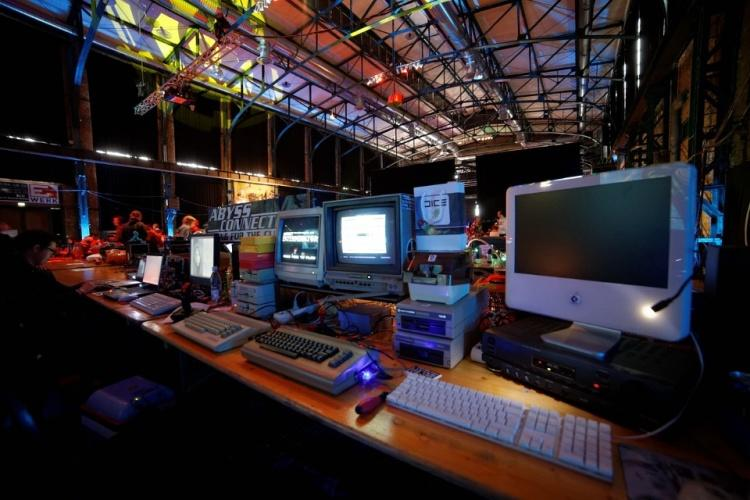
    </a>
    <p>德国Revision Party上的Commodore 64</p>
</div>

这次网页里的古董电脑博物馆使用的是VICE.js模拟器 ，它移植自PC平台上最为流行的Commodore 64模拟器VICE，这两者都是开源软件。

<span class="label label-info">Github</span>  [rjanicek/vice.js](https://github.com/rjanicek/vice.js/)

[the Versatile Commodore Emulator](https://vice-emu.sourceforge.io/)

值得一提的是，我在模拟器中加入了许多近年来爱好者开发的独立游戏，这些新作品的存在，向人们证明了复古电脑社区不仅仅是一种怀旧情绪的表达，也是展现当代爱好者们创意和技术的独特平台。

{{site.data.alerts.tip}}
<p>体验 <b><a href='{{ "/player.html?machine=commodore64" | prepend: site.computer_museum_base_url }}' target='_blank'>Commodore 64 模拟器</a></b></p>
{{site.data.alerts.end}}


## TI-99

虽然在与Commodore的价格大战中败下阵来，但德州仪器TI-99系列仍然是个人电脑发展史中非常重要的一款电脑，推出于1979年的TI-99/4使用了16-bit的TMS9900处理器，因此虽然人们通常将它和其他8-bit电脑一同提起，但TI-99却是世界上第一款16-bit个人电脑。

<div align="center">
    <a href="../images/dnbwg/computer_museum_roaming_34.jpg">
        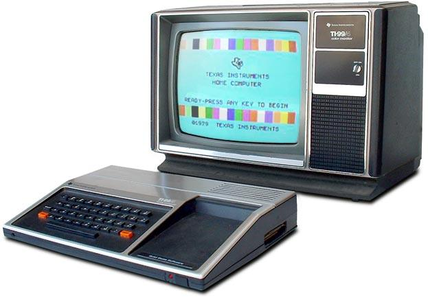
    </a>
</div>

但是这款16位电脑却有些“生不逢时”，因为当时市面上少有适合16-bit处理器的周边芯片，所以大多数的外设都要通过一个16位转8位的数据选择器（multiplexer）连接到CPU，而TMS9918a图像芯片虽然直接连接到CPU，但也只用了8位数据线，只有256字节内存被直接连接到CPU，而主机内置的其他内存（显存）则通过图像芯片间接的连接到CPU。因此相比同时代的8-bit电脑，TI-99系列并没有因为16-bit处理器而获得明显的性能优势。

而使用16-bit处理器带来的另一个麻烦则是16位芯片需要更多的针脚和布线，这也让TI-99系列电脑的成本始终高于来自Commodore的竞争对手VIC-20和Commodore 64。

<div align="center">
    <a href="../images/dnbwg/computer_museum_roaming_35.jpg">
        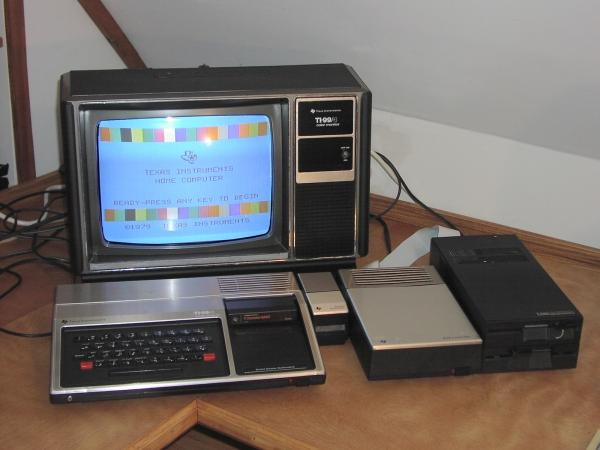
    </a>
</div>

TI-99系列有一个非常有趣的外设就是它的语音合成器，在这次网页里的古董电脑博物馆中同样提供了这款外设的模拟，利用BASIC语言中

```
CALL SAY(“HELLO”)
```

指令就可以让电脑说Hello了。

今天的TI-99社区虽然不大，但仍然有一些高水平的爱好者在参与，比如网页里的古董电脑博物馆使用的JavaScript版模拟器，就是Github上的开源代码

<span class="label label-info">Github</span>  [Rasmus-M/Js99er](https://github.com/Rasmus-M/Js99er)

<div align="center">
    <a href="../images/dnbwg/computer_museum_roaming_36.jpg">
        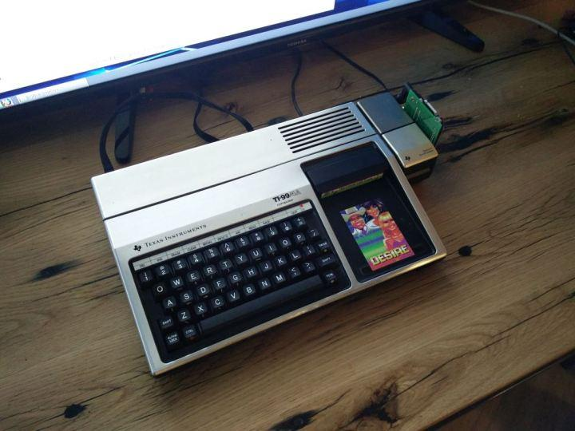
    </a>
</div>

此外我在《近距离接触北美Demo社区之Synchrony+Récursion》一文中曾经提到的Demo作品《別惹德州佬》（Don't Mess with Texas）也是2017年发布在SychorNY Demoparty上，笔者有幸在现场看到当时用来展示Demo运行的实物。而这个Demo也被放在网页里的古董电脑博物馆的模拟器里。

{{site.data.alerts.tip}}
<p>体验 <b><a href='{{ "/player.html?machine=ti99-4a" | prepend: site.computer_museum_base_url }}' target='_blank'>TI-99/4A 模拟器</a></b></p>
{{site.data.alerts.end}}

当1976年Atari发布Atari 2600前夕，Atari内部预计2600会有三年左右的市场寿命，而针对Atari 2600的换代产品的开发也开始，到1978年的时候，Atari 2600图形芯片TIA（Television Interface Adaptor – 电视接口适配器）的升级版本CTIA已经接近完成，而此时恰逢1977年Apple、Tandy和Commodore引来家用电脑的畅销，因此Atari的管理层决定使用新的芯片推出一款家用电脑。

<div align="center">
    <a href="../images/dnbwg/computer_museum_roaming_37.jpg">
        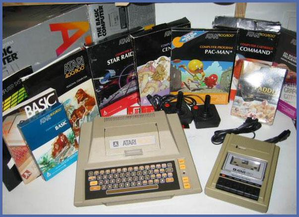
    </a>
</div>

这就是后来的Atari 400/800系列，也被称作Atari 8-bit系列，这一系列电脑中，CTIA芯片负责处理游戏角色精灵，ANTIC（Alphanumeric Television Interface Controller – 字符电视接口控制器）用来处理背景位图和字符显示，以及POKEY（Pot Keyboard Integrated Circuit – 电位器/键盘集成电路）用来处理声音和用户输入。相比“1977三杰”中TRS-80和Commodore PET只能处理黑白图像，Apple II完全靠CPU处理图像来说，装备了“独立显卡”的Atari 8-bit系列是第一款“游戏PC”。

<div align="center">
    <a href="../images/dnbwg/computer_museum_roaming_38.jpg">
        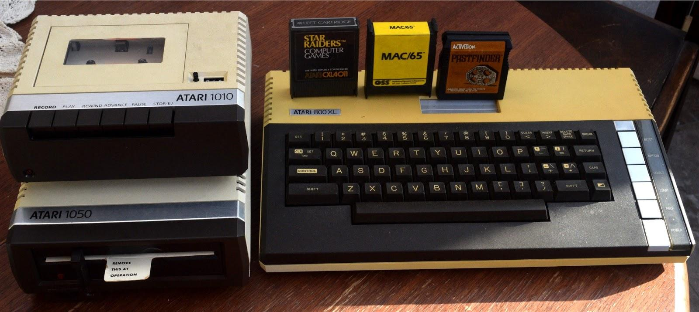
    </a>
</div>

值得一提的是，Atari 8-bit系列CTIA和ANTIC芯片的开发者Jay Miner因不满Atari内部管理，在1982年和其他一些Atari员工出走创业成立了Amiga的前身Hi-Toro。而Atari 8-bit系列的芯片组设计也很大程度上影响了Amiga电脑的设计，因此许多人也将Atari 8-bit系列而不是Commodore视做Amiga的前身。

A8E：[Atari 800 XL Emulator](https://www.zerstoerung.de/)

网页里的古董电脑博物馆使用的Atari 8-bit模拟器jsA8E，是从A8E模拟器移植而来，模拟的是Atari 800XL，相比原版Atari 800，它的内存容量从8KB增加到64KB，因此可以运行更大型的软件和游戏。

{{site.data.alerts.tip}}
<p>体验 <b><a href='{{ "/player.html?machine=atari800xl" | prepend: site.computer_museum_base_url }}' target='_blank'>Atari 800XL 模拟器</a></b></p>
{{site.data.alerts.end}}


## MSX

在1980年代初期，日本流行的8-bit家用电脑平台主要有NEC PC-8000系列、富士通FM系列、日立BASIC Master以及夏普的MZ系列，这些电脑平台硬件上互不兼容，但都使用了微软提供的BASIC解释器。而微软公司与日本的联系，则要追溯到1978年创立《ASCII》杂志的西和彦访问微软公司，获得了微软产品在日本的代理权，并创办了微软第一家海外办公室ASCII Microsoft。

<div align="center">
    <a href="../images/dnbwg/computer_museum_roaming_39.jpg">
        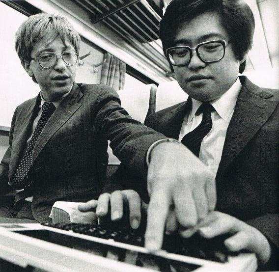
    </a>
</div>

而此时其他的一些日本电器厂商，也在试图生产自己的个人电脑产品，但为每一种不同品牌的电脑移植专用的BASIC解释器和应用软件显然不是最好的方案，这促使西和彦设想出能够有一种标准化的电脑规格，可以使用相同的微软BASIC解释器，并提供通用的应用软件——这就是MSX标准。

<div align="center">
    <a href="../images/dnbwg/computer_museum_roaming_40.jpg">
        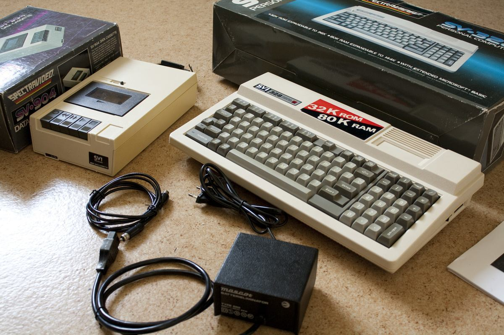
    </a>
</div>

MSX平台的原型主要参考的是Spectravideo发布于1983年的的SV-328电脑，而SV-328电脑的硬件规格则很大程度上参考了ColecoVision游戏机，由于出现的较晚，它使用了许多已经在市面上广泛使用的电脑芯片其中就包括了，与TRS-80相同的Zilog Z80处理器，和与TI99系列相同的德州仪器TMS9918/9928图像芯片，以及在许多家用电脑种都使用的AY3-8910声音芯片。

<div align="center">
    <a href="../images/dnbwg/computer_museum_roaming_41.png">
        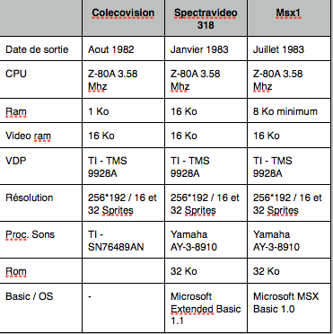
    </a>
</div>

在美国市场上Commodore掀起的价格大战将大部分日本8-bit电脑挡在了门外，但在Commodore较少触及的前苏联和拉美市场上，都有不少MSX兼容机售出，甚至还被用在和平号空间站上，下面图中所使用的，是Sony HB-G900。

<div align="center">
    <a href="../images/dnbwg/computer_museum_roaming_42.jpg">
        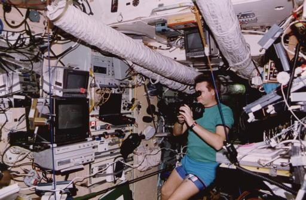
    </a>
</div>

这次网页里的古董电脑博物馆提供展示的是WebMSX模拟器，同样也是开源的

<span class="label label-info">Github</span>  [ppeccin/WebMSX](https://github.com/ppeccin/WebMSX)

这款模拟器可以模拟多种不同的MSX型号，可以在界面上进行切换，默认配置是1985年升级后的型号MSX2，MSX2的基本配置与MSX初代相似，但提供了更大的显存，在80年代后期MSX电脑上出现了许多重要的日式RPG游戏，其中许多系列延续至今，比如《合金装备》和《伊苏》。在网页里的古董电脑博物馆的MSX模拟器里也带了这两款的最初版本，大家可以试试看。

{{site.data.alerts.tip}}
<p>体验 <b><a href='{{ "/standalone/webmsx.html" | prepend: site.computer_museum_base_url }}' target='_blank'>MSX2 模拟器</a></b></p>
{{site.data.alerts.end}}


---------

出处：https://zhuanlan.zhihu.com/p/46601587


