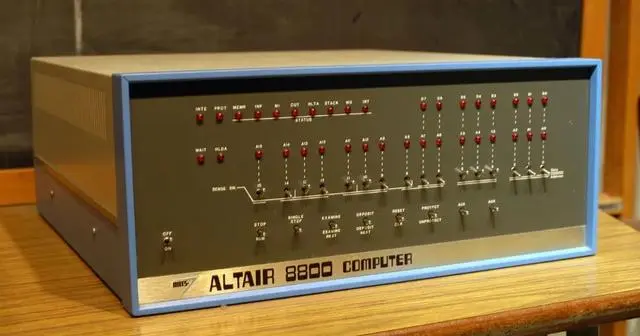
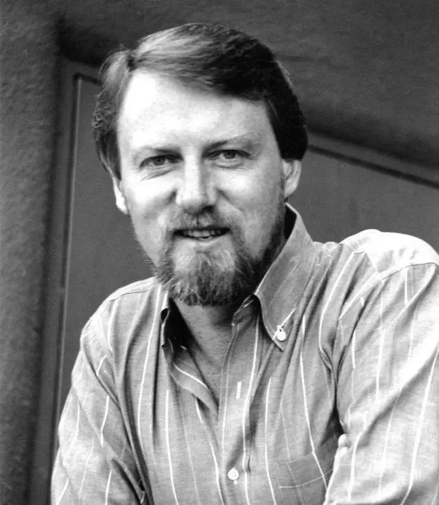
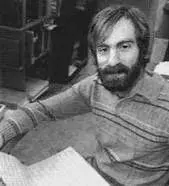
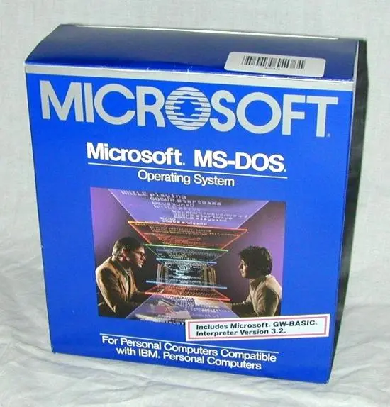
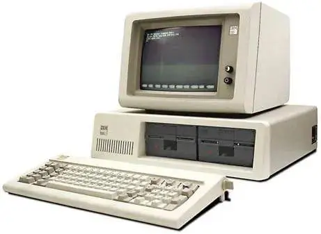
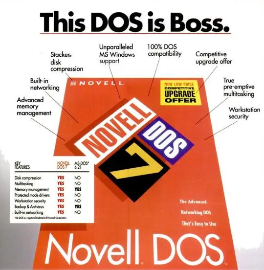
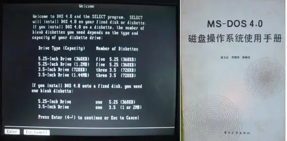
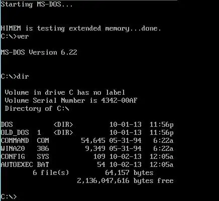
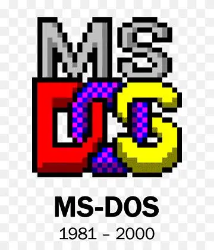
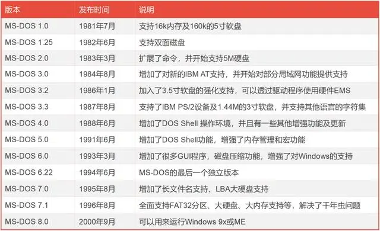

上期提到，20世纪70年代，伴随着计算机技术的成熟，操作系统也进入了一个快速发展阶段。现代操作系统的概念，也在那一时期逐渐形成。

1975年初，MITS电脑公司推出了基于Intel 8080芯片的Altair 8800微型计算机。这是人类历史上第一台PC（个人电脑），具有重要意义。

    
    
<b>Altair 8800</b>

1976年，美国的Digital Research公司（以下简称DR公司），成功研制出一套名为CP/M（Control Program/Monitor，控制程序/监控）的操作系统，专门用于搭载了8080芯片的微型计算机（包括Altair 8800）。

后来，到了1980年，IBM公司也秘密搞起了自己的PC项目。

这个被命名为“国际象棋”的项目，由唐·埃斯特里奇（Don Estridge）负责领导，旨在开发一款价格足够低廉的微型计算机产品，面向小企业和家庭用户市场。

为了给这款新PC搭配合适的操作系统，他们找到了微软公司的比尔·盖茨 (Bill Gates）。

之所以找比尔·盖茨，主要有两个方面的原因：

一，微软公司此前开发了一款让CP/M在Apple II上运行的Z-80 SoftCard产品，所以，IBM以为微软拥有CP/M。

二，比尔·盖茨的妈妈——玛丽·麦克斯韦尔·盖茨 (Mary Maxwell Gates），在担任全美联合劝募协会执行理事会主席期间，与IBM的首席执行官约翰·埃克斯（John Fellows Akers）共事，所以做了牵线搭桥。

比尔·盖茨和IBM团队进行洽谈后，表示自己并不拥有CP/M，建议他们直接去找DR公司。

因为签订了严格的保密协议，比尔·盖茨在和DR公司负责人加里·基尔代尔（Gary Kildall）说明此事时，并没有直接点明是IBM要找他们，而是说：“有人来看你了。好好对待他们，他们是重要的人。”

    
    
<b>加里·基尔代尔，传奇程序员，他还发明了BIOS</b>

但是，基于种种原因，DR公司和IBM公司没有谈拢，双方不欢而散。（一种说法是：IBM一见面就让加里签严格的保密协议，让加里很不爽。也有一种说法是，DR公司想打包卖，而IBM想按单台授权买。）

看到这个情况，比尔·盖茨觉得，这是一个巨大的商业机会，一定不能错过。

经过一番调查，比尔·盖茨得知，SCP（西雅图计算机产品）公司有一个名叫蒂姆·帕特森（Tim Paterson）的24岁程序员，花了四个月的时间，写了一个QDOS系统（Quick and Dirty Operating System，快速和肮脏的操作系统，后来觉得名字不太好听，改成86-DOS）。这个系统是CP/M系统的变种，貌似能够满足IBM的需求。

    
    
<b>蒂姆·帕特森，DOS之父</b>

一开始，比尔·盖茨只是花了2.5W美元，买了86-DOS的授权。后来，考虑到IBM这个项目的巨大商业潜力，比尔·盖茨直接掏了5-7W美元，一口气买断了版权。

为了更好地对86-DOS进行改造，比尔·盖茨还把蒂姆·帕特森直接挖了过来，让他加入了微软。

1981年7月27日，微软正式推出了MS-DOS系统（MS是MicroSoft的意思，DOS是Disk Operating System，磁盘操作系统）。

    
    
<b>MS-DOS的第一个版本</b>

几天后，1981年8月12日，IBM也正式发布了个人电脑产品——IBM PC，采用MS-DOS 1.14版（在IBM PC上被命名为PC-DOS）。

    
    
<b>IBM PC</b>

{{site.data.alerts.tip}}

<b><a href='{{ "/osjs/player.html?os=pcdos" | prepend: site.computer_museum_base_url }}' target='_blank'>体验 PC-DOS 5.0</a></b>

PC-DOS 则由国际商业机器公司（IBM）对MS-DOS略加改动而推出。此镜像包含了 WOLF、Civilization、MONKEY 三款游戏。

{{site.data.alerts.end}}

当时，IBM和微软采用的是单台授权的方式。用户每买一台IBM PC，就要支付40美元的MS-DOS使用费。

DR公司得知此事后，提出了强烈的抗议。IBM为了平息抗议，表示允许IBM PC用户在DR公司CP/M-86系统和微软公司PC-DOS系统之间进行自由选择。

CP/M-86系统售价高达240美元，PC-DOS只需要40美元。很快，CP/M-86系统就败下阵来。

DR公司也曾试图挽回局面。他们发行了DOS Plus，后来，又发行了DR-DOS（两者可以与MS-DOS和CP/M-86的软件兼容），但都没有获得成功。再后来，DR公司被Novell买下，DR-DOS变成了Novell DOS 7（1993年）。

    
    
<b>Novell DOS 7</b>

回到MS-DOS。

IBM公司推出IBM PC之后，继续对产品进行升级迭代。微软这边，也不断推出新版本的DOS。

1983年3月8日，IBM推出增强版IBM PC/XT，第一次在PC上配备了硬盘，使用的操作系统是MS-DOS 2.0版。1984年，IBM推出IBM PC/AT，搭配MS-DOS 3.0版。

1988年，微软又推出了MS-DOS 4.0版本。

    

到了90年代，因为Windows系统的大获成功，微软逐渐开始抛弃MS-DOS。

大家需要注意，早期版本的Windows，只是在DOS之上执行的应用程序。90年代初，Windows仍非常依赖DOS。一直到Windows for Workgroups 3.11出现后，DOS才逐渐退居二线，只负责引导及加载Windows核心。

1994年4月，MS-DOS 6.22版发布。这是一个经典的版本，80后读者应该都对这个版本非常熟悉。

    
    
<b>这个界面，很多人应该还记得</b>

{{site.data.alerts.tip}}

<b><a href='{{ "/osjs/player.html?os=msdos" | prepend: site.computer_museum_base_url }}' target='_blank'>体验 MS-DOS 6.22</a></b>

DOS虽然版本众多，但其中家喻户晓的还是MS-DOS，微软独立发行的最终版MS-DOS版本为6.22。此镜像集成了增强工具、QBasic、vim等程序以及一些游戏（games目录）和演示（demos目录）。

{{site.data.alerts.end}}

2000年9月14日，MS-DOS最后一个版本8.0版发布。从那时开始，微软正式终止了对MS-DOS的开发。

    

    

微软抛弃DOS，并不意味着DOS的完全消失。

90年代中期，开源软件大行其道，很多程序员趁机开发了DOS的衍生版本，例如FreeDOS、PTS-DOS、ROM-DOS等。这些DOS的功能十分强大，甚至超过了MS-DOS。

在DOS命令行界面的基础上，一些程序员还开发了仿Windows的界面增强程序，例如Seal、Qube、WinDOS等等。还有人开发出了内核为32位的DOS操作系统，如FreeDOS 32等。

{{site.data.alerts.tip}}

<b><a href='{{ "/osjs/player.html?os=freedos" | prepend: site.computer_museum_base_url }}' target='_blank'>体验 FreeDOS</a></b>

FreeDOS旨在建立一个完整的、自由开放的并且与MS-DOS完全兼容的新型DOS操作系统。此镜像集成了 nasm、vi、debug.com、Rogue 等程序以及一些游戏和演示。启动完成后，输入 invaders、snake 或 tetris 可启动相应的游戏。

{{site.data.alerts.end}}

这些“杂牌”DOS，从某种意义上来说，也算延续了DOS的生命。

---------


