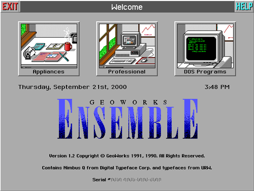
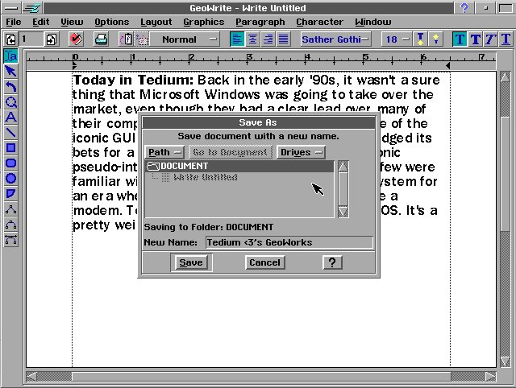
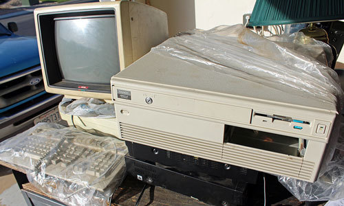

在Windows进入大多数电脑用户的生活之前，一个名叫GeoWorks的暴发户曾经试图取代微软的地位，虽然它失败了，但是却为我们带来了美国在线。

*嘿，Ernie在这里发表了一篇关于GeoWorks的新文章，这是PC时代早期的伟大失败之一。它包含了我一直希望增加的一些内容，以及一些我认为技术爱好者可能会喜欢的一些详细信息。这里的文章是这篇文章的第二次修改版。*

回望90年代初，尽管MS-DOS让Microsoft Windows在在许多竞争对手中遥遥领先，但人们仍不能确定Windows是否会是未来市场的主宰。实际上，当时具有代表性的基于图形用户界面（GUI）的软件美国在线（AOL）就曾经押宝过别的技术，他们使用了一种鲜为人知的技术去构建其著名的伪互联网软件的图形用户界面，这就是GeoWorks。GeoWorks是一款操作系统，它来自那个我们还不确定是否需要调制解调器的时代。今天，我们会深入探究GEOS的世界，这会是一个迷人的领域。

原文 [GeoWorks: The Other Windows](https://tedium.co/2019/06/20/geoworks-geos-history/)

在继续阅读这篇文章之前，可以尝试在网页里的电脑博物馆中体验GeoWorks：

{{site.data.alerts.tip}}
<b><a href='{{ "/emularity.html?machine=geos" | prepend: site.computer_museum_base_url }}' target='_blank'>体验 GeoWorks</a></b>
{{site.data.alerts.end}}

```
“GEOS并不是GUI的先锋；大多数的特性已经出现在当时更大型的操作系统中，比如古典Mac系统（尽管不是Windows）。GEOS希望展示的是在廉价、低功耗的日常硬件上运行简单的办公室生产力软件。你并不需要为录入和打印这样的简单工具去购买2000美元的机器。”
—— OS News作者Kroc Camen 对GEOS（图形环境操作系统 Graphical Environment Operating System）发布和早期成功的讨论。

GEOS开始于为Commodore 64电脑开发的可选的操作系统，它的开发者名为Berkeley Softworks，请不要将它的开发者与开发了著名的“飞行面包机（Flying Toasters）”屏幕保护程序的Berkeley Systems混淆。由于GEOS功能强大并且可以在很便宜的硬件上运行，因此一度成为C64上最受欢迎的软件之一。最终，这款操作系统在90年代初被以一种更高级的形式迁移到PC上，Berkeley Softworks也改名为GeoWorks。
```

<div align="center">
    <a href="../images/dnbwg/geoworks_another_windows_01.png">
        
    </a>
</div>

## 那么，GeoWorks究竟是一款什么样的系统呢

我确实有一些使用Commodore 64的经验，这要感谢我的一位儿时的好友，他当时有一台C64并且给了我一些使用它的机会。不过最终我还是发现了PC版的GeoWorks，因为我童年时的一台386曾经捆绑有这款软件。

那台386电脑并不是非常快的型号，它只有40MB的硬盘和1MB内存，也因此它受益于GeoWorks轻量级、面向对象的特性，这款操作系统占用了大概10MB的硬盘空间。在当时连接到更大的世界还并不是那么重要的事情，因此这种规格上的简化实际上是一种不错的做法。

关于这个平台有趣的事情包括：

<div align="center">
    <a href="../images/dnbwg/geoworks_another_windows_02.png">
        
    </a>
</div>

**针对不同操作水平的用户提供不同的界面：**DOS并不是为新手准备的简单的操作系统，而GeoWorks Ensemble则努力确保它易于使用，它提供了两种不同的操作层次：“家用电器”和“专业环境”，以及可以跳转到DOS程序的shell，因此如果你想玩《指挥官基恩》（Commander Keen）也是完全没问题的。对于完全没有PC使用经验的人群来说，这种策略堪称完美————它是自带训练机制的。


**内置的办公工具：**这款软件包含了一系列应用程序，这些应用程序几乎可以与其它操作系统上找到的各种应用程序相媲美，包括了文字处理软件，日历和电子表格。它还包括了一个打印店风格的横幅制作工具，如果您有一台针式打印机它可能就会派上用场。总体而言这些软件非常适合家庭用户，而Windows历史的初期微软并没有真正重视这些受众。GeoWorks的软件不像Microsoft Bob那样高大上，但使用效果却更好。

<div align="center">
    <a href="../images/dnbwg/geoworks_another_windows_03.png">
        
    </a>
    <p><b>图片来自：https://www.flickr.com/photos/bossco/8678697129/</b></p>
</div>

**功能强大，低功耗：**不过GeoWorks最棒的一点还是它不需要强大的硬件就能运行良好。Windows 3.1实际上需要486处理器才能流畅运行，而GeoWorks在只有286或386就可以毫无障碍的高效运行了。这是一个很明智的设计，因为当时低配置电脑的市场规模很大。[1991年的Compute！杂志的一篇文章](https://www.atarimagazines.com/compute/issue128/30_GeoWorks_Ensemble_t.php)提到：“无法顺利运行Windows的XT和286电脑（Windows 3.0主要是为基于80386的电脑设计的）的数量估计高达2000万台。GEOS可能会接管这个巨大的市场————只要它能够生存下去。”GeoWorks的性能很稳定，即使它本质上（和早期的Windows一样）是一款DOS的图形外壳，也很少出现故障。

GEOS和GeoWorks有着非常热情的粉丝群体，特别是在德国的用户，许多人都在努力地保存这份记忆。

那么它为什么失败了呢？原因有许多，其中的一个理由认为微软[依靠着其领导地位](https://www.economist.com/user/3755826/comments)将GeoWorks排除在OEM市场之外。但更大的原因则是它缺少App。美国在线是该平台上唯一一个被认为是比较大型的第三方软件开发者，但即使是美国在线也无法推动一款平台的销售。而造成这一点的原因则是该平台的早期[需要Sun工作站](https://books.google.com/books?id=2yYT_SOlHzAC&pg=PA29)才能为GeoWorks开发软件，这样的需求显得非常讽刺-因为它要求开发者使用一台7000美元的电脑来为低端PC开发软件。也因此家庭式经营的小型开发者根本没有机会参与其中。而于此同时的微软则发布了想Visual Basic这样的Windows原生开发平台来争取小型开发者的参与。

但是，坦白地说，如果一款桌面操作系统本身能够获得大量用户，这些问题都可以得到解决。但即使是GeoWorks最坚定的支持者也知道由于微软本身已经建立起良好的口碑，GeoWorks并没有机会与Windows抗衡。

“我感到非常遗憾这款真正令人惊叹的程序却没有得到任何机会，因为IBM和微软都绝不会允许它。”[一位爱好者在1991写给PC Magazine的信中](https://books.google.com/books?id=6UNWdidjDmIC&pg=PP20)这样说到：“我希望软件开发人员能够看到Ensemble的惊人潜力，并开始为它开发软件，没有第三方的开发者Ensemble将无法生存。”

但微软毕竟是站在了巨人的肩膀上，而GeoWorks始终望尘莫及。

```
“Promenade界面将使所有的家庭成员都可以轻松使用我们的服务，而不需要烦恼于复杂的命令和功能。于此同时这款软件也强大到足以满足有经验的用户对在线服务的要求。”

————Steve Case，Quantum Computer Services的执行副总裁在1990年的新闻稿中这样评价他们新推出的Promenade拨号服务。

这款软件运行于GeoWorks的一个预发布版本上，并专门为IBM PS/1平台设计，而后者是最早默认安装有内置调制解调器的电脑之一。（即使对于复古软件侦探们来说找到Promenade的某个版本也是件相当困难的事情，就像这个冗长的留言板帖子里所提到的那样，它的界面看起来大概是这样）。在一年之内，这一平台被重新改版为美国在线（一个90年代著名的企业案例），而在未来的十年间，这家公司则激进地发起了与时代华纳的合并。
```

<div align="center">
    <a href="../images/dnbwg/geoworks_another_windows_04.jpg">
        
    </a>
</div>

一款基于Motif的应用软件，它并不是GeoWorks Ensemble的软件，但看起来很类似。

---------

出处：https://zhuanlan.zhihu.com/p/101861028


