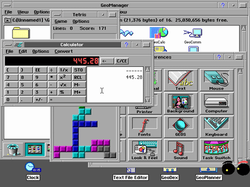

在Windows进入大多数电脑用户的生活之前，一个名叫GeoWorks的暴发户曾经试图取代微软的地位，虽然它失败了，但是却为我们带来了美国在线。

*嘿，Ernie在这里发表了一篇关于GeoWorks的新文章，这是PC时代早期的伟大失败之一。它包含了我一直希望增加的一些内容，以及一些我认为技术爱好者可能会喜欢的一些详细信息。这里的文章是这篇文章的第二次修改版。*

回望90年代初，尽管MS-DOS让Microsoft Windows在在许多竞争对手中遥遥领先，但人们仍不能确定Windows是否会是未来市场的主宰。实际上，当时具有代表性的基于图形用户界面（GUI）的软件美国在线（AOL）就曾经押宝过别的技术，他们使用了一种鲜为人知的技术去构建其著名的伪互联网软件的图形用户界面，这就是GeoWorks。GeoWorks是一款操作系统，它来自那个我们还不确定是否需要调制解调器的时代。今天，我们会深入探究GEOS的世界，这会是一个迷人的领域。

原文 [GeoWorks: The Other Windows](https://tedium.co/2019/06/20/geoworks-geos-history/)

在继续阅读这篇文章之前，可以尝试在网页里的电脑博物馆中体验GeoWorks：

{{site.data.alerts.tip}}
<b><a href='{{ "/emularity.html?machine=geos" | prepend: site.computer_museum_base_url }}' target='_blank'>PC/GEOS</a></b>
{{site.data.alerts.end}}

> “GEOS并不是GUI的先锋；大多数的特性已经出现在当时更大型的操作系统中，比如古典Mac系统（尽管不是Windows）。GEOS希望展示的是在廉价、低功耗的日常硬件上运行简单的办公室生产力软件。你并不需要为录入和打印这样的简单工具去购买2000美元的机器。” 
—— OS News作者Kroc Camen 对GEOS（图形环境操作系统 Graphical Environment Operating System）发布和早期成功的讨论。 
GEOS开始于为Commodore 64电脑开发的可选的操作系统，它的开发者名为Berkeley Softworks，请不要将它的开发者与开发了著名的“飞行面包机（Flying Toasters）”屏幕保护程序的Berkeley Systems混淆。由于GEOS功能强大并且可以在很便宜的硬件上运行，因此一度成为C64上最受欢迎的软件之一。最终，这款操作系统在90年代初被以一种更高级的形式迁移到PC上，Berkeley Softworks也改名为GeoWorks。

    

---------

出处：https://zhuanlan.zhihu.com/p/101861028


