在1986年9月Apple IIGS发布之前，所有的Apple II电脑使用的都是8-bit 1Mhz的6502处理器和5.25英寸软盘，调色板的颜色非常有限，声音功能也基本上算是没有。Apple IIGS的出现，颠覆了人们对Apple II的印象。

GS是Graphics（图像）和Sound（声音）的缩写，这也正是Apple IIGS所强于其他Apple II电脑的优势。相比之下，当年的Mac仍然采用黑白屏幕，而PC则仅仅停留在16色的EGA时代。

    <a href="../images/dnbwg/what_kind_of_computer_is_the_Apple_IIGS_01.jpg">
        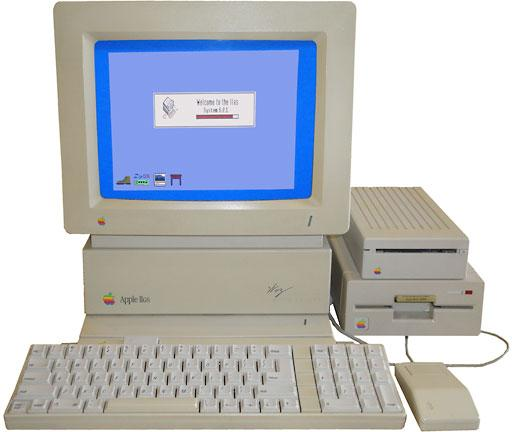
    </a>

Apple IIGS支持320x200像素分辨率，并支持从4096色中选取16种颜色组成调色盘。与EGA不同，IIGS允许每条扫描线都拥有自己的独立调色盘，这意味着它最多可以同屏显示3200种颜色（16色 x 200线）。分辨率更高的640x200模式将每条扫描线显示的颜色限制为4种，最高支持同屏显示800种颜色。

IIGS是第一款使用全数字合成器芯片的个人电脑，搭载了8-bit的Ensoniq 5503芯片，这块芯片具有自己独立的内存，支持32通道和15个独立的立体声和弦（第16和旋被系统保留）。由于强大的图像和声音处理能力，IIGS成为一款优秀的游戏平台。

    <a href="../images/dnbwg/what_kind_of_computer_is_the_Apple_IIGS_02.jpg">
        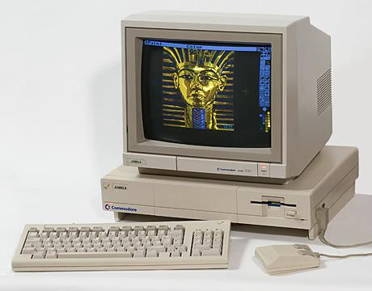
    </a>
    
<b>Amiga 1000的4096色HAM模式打开了电脑图形创作的大门 <a href="amiga_computer_legend_1.html" target="_blank">Amiga电脑传奇（一）</a></b>

这些功能也让IIGS成为Amiga 1000的竞争对手，Amiga 1000是Commodore在1985年推出的个人电脑，为图像和声音的创作领域带来了突破性的进展。Amiga 1000可以支持320x200和320x400图形模式，支持32、64和4096色。同时还支持更高分辨率的640x200和640x480 16色模式。音频方面，Amiga具有四个8-bit PCM通道，支持28Khz采样率。售价1295美元的Amiga在图形方面优于IIGS，不过IIGS在音频方面更加先进。

Apple IIGS是苹果整个Apple II产品线中唯一一款实用16-bit处理器的机型。相比老旧的6502，IIGS采用了Western Design Center开发的65c816处理器，这款处理器可以100%向后兼容6502处理器的软件 - 不仅可以直接启动旧版的Apple DOS，还可以使用ProDOS，以及苹果基于Apple III SOS开发的新款操作系统。

不同于Apple II产品线一贯的1 Mhz，新的CPU运行在2.8 Mhz的频率上，这可能是苹果在IIGS上做的最有争议的决定。当时苹果的旗舰级电脑Mac Plus装备了1MB内存和8Mhz的68000处理器，苹果不希望人们认为IIGS会对Macintosh造成竞争。

    <a href="../images/dnbwg/what_kind_of_computer_is_the_Apple_IIGS_03.jpg">
        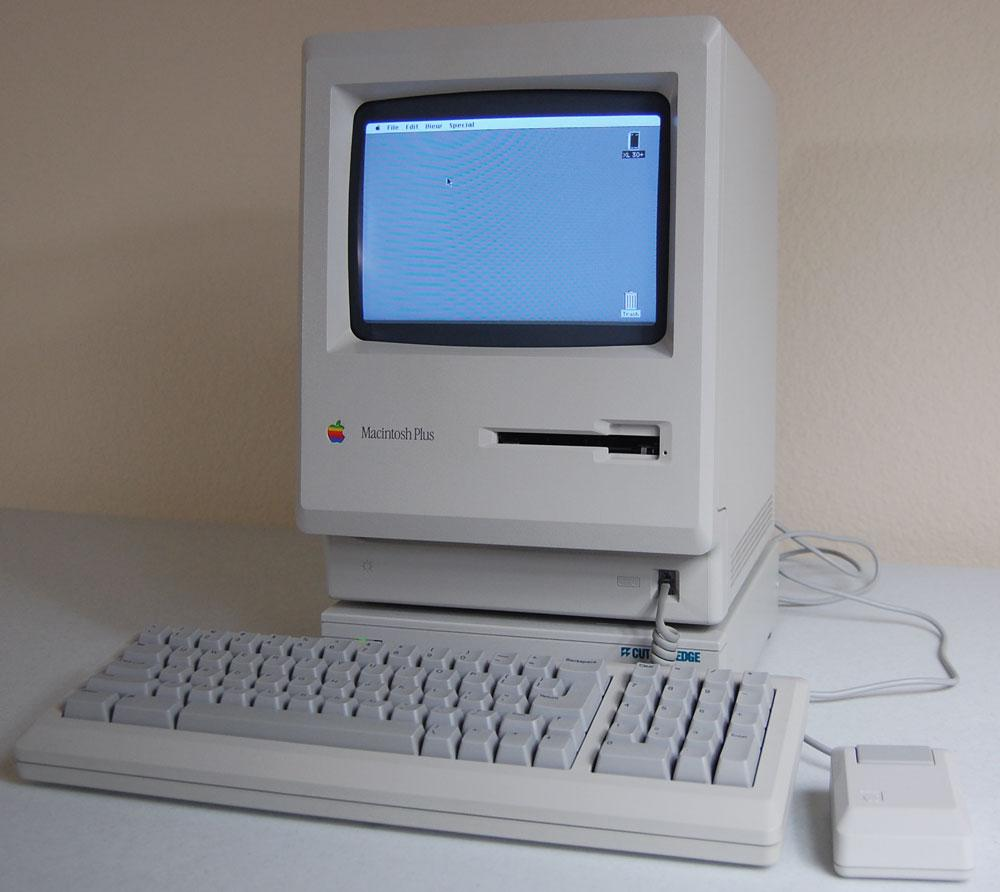
    </a>
    
<b>Macintosh Plus，8Mhz 摩托罗拉68000处理器，1MB内存，512x342黑白屏幕</b>

65C816S的设计频率高达14 Mhz，苹果将IIGS的处理器限制在2.8Mhz上，这让它的性能相比Mac至少低了80% - 因此完全不会造成竞争。

但即使如此，相比1 Mhz的6502处理器，2.8 Mhz的65C816的性能也有着突破性的提升。（资料表明，65C816并没有被广泛采用，任天堂的SNES使用了3.58 Mhz的改版65C816，而Acorn Communicator则将频率锁定在2.0 Mhz，不过针对Commodore 64开发的SuperCPU升级套件将频率提升到惊人的20 Mhz）。

IIGS出厂时的内存容量为256KB，最多则可以扩展到8MB，这个数字是Mac Plus最大内存容量的两倍。

    <a href="../images/dnbwg/what_kind_of_computer_is_the_Apple_IIGS_04.jpg">
        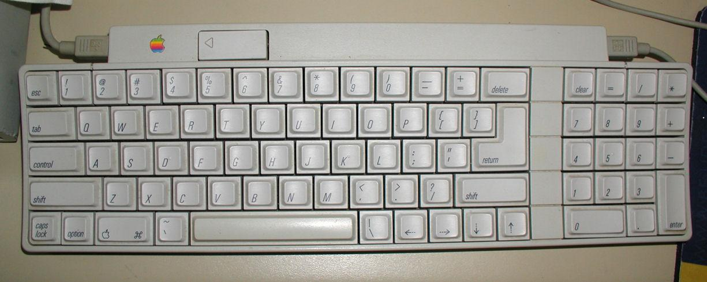
    </a>
    
<b>Apple IIGS的键盘上有两个ADB接口，可以分别连接电脑和鼠标</b>

在IIGS上，苹果引入了新的Apple Desktop Bus（ADB）接口。此接口通常被用来连接键盘和鼠标，不过也可以用在绘图板和Modem上。ADB支持以菊花链的形式串联设备，所以IIGS（和一些Mac PowerBook机型）只预设有一个ADB接口。

在IIGS内部，有七个扩展插槽外加内存插槽。由于IIGS的接口相当齐全：自带软驱接口，两个串行接口，ADB接口，外加复合视频和RGB视频接口，让额外的扩展卡显得不那么必要。不过利用苹果的高速SCSI卡添加一块SCSI硬盘却是一个相当实用的选择。

    <a href="../images/dnbwg/what_kind_of_computer_is_the_Apple_IIGS_05.jpg">
        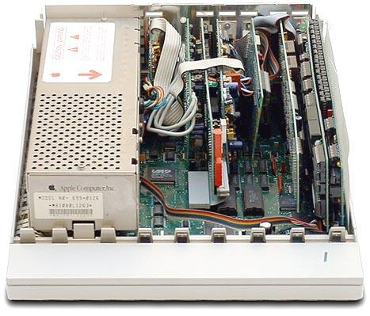
    </a>

IIGS是第一款内置实时钟的Apple II，通过连接LocalTalk网络，IIGS还可以利用AppleShare服务器启动。（相比之下Mac要等到十年后的Mac OS 8才能使用网络启动，苹果稍后推出的Apple IIe工作站卡让Apple IIe也具备网络启动的功能）

IIGS延续了Apple IIc所使用的白雪公主设计语言，并且是第一款使用“白金色”的设备，“白金色”是苹果公司对暖灰色的称呼。从1987年三月起苹果开始在新的设备上启用“白金色”和ADB接口。

如果说IIGS最大的遗憾是什么的话，可能要数它没有内置的3.5英寸软驱了。

在苹果公司的十周年庆典上，发布了五万台沃兹尼亚克签名纪念版IIGS。不过“签名版”（实际上是丝网印刷）外壳可以被替换到别的IIGS电脑上，所以沃兹版IIGS并不比普通版IIGS更有价值。

    <a href="../images/dnbwg/what_kind_of_computer_is_the_Apple_IIGS_06.jpg">
        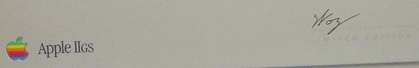
    </a>

令人难以置信的是，苹果还曾经发布过售价500美元的Apple IIe - Apple IIGS升级套件，该套件的价格只有新的IIGS电脑的一半。这款套件包括了新的主板、电脑外壳的下半截、以及IIGS铭牌，不过升级之后的电脑看起来与Apple IIe差别不大。此外如果想更完整地享受到新系统的好处，你还需要ADB鼠标和键盘，这进一步增加了升级的花费。

Apple IIGS最终于1992年12月停产，而Apple IIe则成为Apple II家族最后停产的成员，直到1993年11月15日才退出市场。

## 软件

由于65C816既可以作为8-bit处理器，也可以作为16-bit处理器，所以IIGS可以运行的软件分为两类。所有为之前推出的Apple II家族所开发的软件都完全兼容，同时运行速度达到之前的两倍（你也可以利用控制面板手工降速，这个功能内置于Mac OS当中）。

    <a href="../images/dnbwg/what_kind_of_computer_is_the_Apple_IIGS_07a.jpg">
        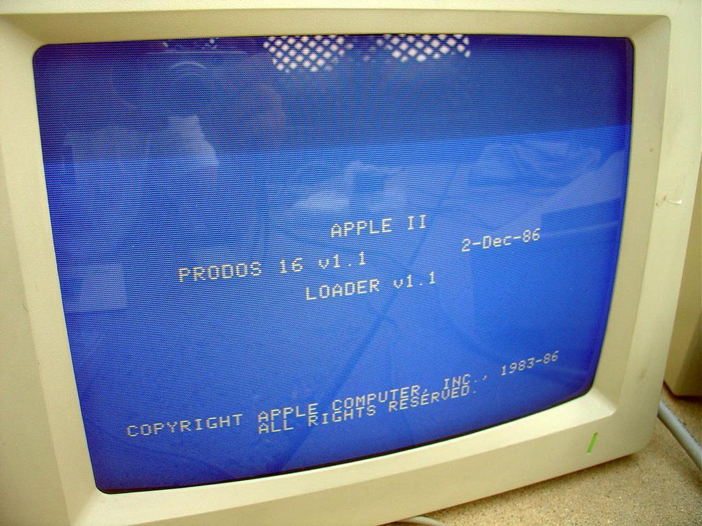
    </a>

Apple IIGS最初的操作系统是ProDOS 16，这是之前ProDOS 8的增强版，ProDOS 16基本上是一款8-bit操作系统，不过针对IIGS的硬件做了相应的修改。一年之后，ProDOS 16就被真正的16-bit操作系统所替代。

1988年，针对16位环境开发的GS/OS取代ProDOS 16成为IIGS的默认操作系统。GS/OS有着类似于Mac System 5的Finder、字体和设备驱动。GS/OS的升级一直持续到1993年Mac System 6.0.1发布之后。

    <a href="../images/dnbwg/what_kind_of_computer_is_the_Apple_IIGS_07.jpg">
        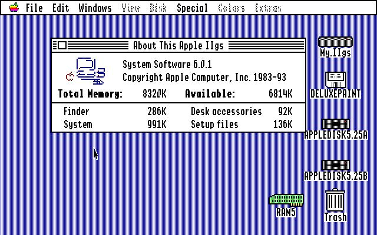
    </a>

不过有一款称为GS/OS 6.0.2的系统发布于2015年7月15日，这次发行的并不是来自于Apple的官方版本，不过却修复了一系列6.0.1版本的bug。如果你有一台IIGS的话那你一定不要错过这次免费的升级。

如果你对IIGS感兴趣的话，你可以尝试通过KEGS模拟器体验Apple IIGS的软件。运行模拟器首先需要获得IIGS的ROM镜像，有了ROM之后就可以运行在Mac OS X，Win32和大多数的Unix/Linux电脑上运行这款模拟器了。

{{site.data.alerts.tip}}
<b><a href='{{ "/emularity.html?machine=apple2gs" | prepend: site.computer_museum_base_url }}' target='_blank'>体验 Apple IIGS</a></b>
{{site.data.alerts.end}}

## ROM版本

1987年的时候我曾经在一加苹果经销商工作，而在当时最为麻烦的事情之一，就是当苹果升级他们的ROM之后，用户需要将它们的电脑带回商店才能更新ROM芯片，并且升级后的ROM可能会干扰已有软件的运行。有些客户在升级ROM之后仍然需要降级回去，除非他们的软件被修复到可以运行在新的ROM下。

## 最初版本

苹果的第一版ROM存在着很多的问题，从某种程序上讲“几乎是beta版的质量”。1987年底，新开发的IIGS软件多数已无法兼容原版的IIGS ROM，同时GS/OS4和更高版本的系统也无法兼容原版ROM。此外，原版ROM还将内存的最大容量限制在4MB，即使安装了更大容量的内存也无法识别。

## 01版ROM

在IIGS上市接近一年之后的1987年8月，苹果发布了01版ROM。这一版本修复了一些列问题并更新了系统工具，这一版本一经推出软件开发者们就放弃了对问题多多的原版ROM的支持。

## 512KB Apple IIGS

1988年三月，苹果开始发售预装Apple IIGS内存扩展卡的IIGS机型，将内存增加到512KB，电脑主板自带了256KB，扩展卡上则安装有另外256KB。

    <a href="../images/dnbwg/what_kind_of_computer_is_the_Apple_IIGS_08.jpg">
        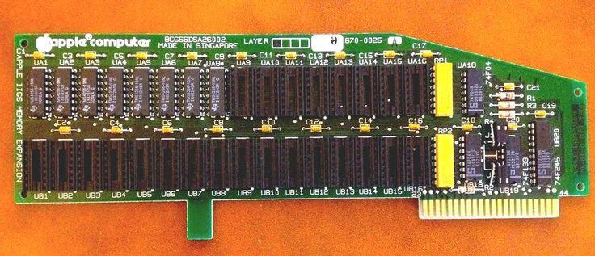
    </a>

## 第三版ROM

IIGS发布两年之后的1989年8月，苹果配合新的IIGS主板，以及预装1.125MB内存的IIGS发布了第三版ROM，这一版本完全为新的主板设计，所及不能用作旧机型升级。

## 超越2.8Mhz

最初的65C816处理器支持4Mhz频率，而之后的版本则支持5Mhz和14Mhz，一些开发者找到了让IIGS运行在比2.8Mhz更快频率的办法，并开发出一系列IIGS加速卡，当然到今天这些加速卡都停产了。

    <a href="../images/dnbwg/what_kind_of_computer_is_the_Apple_IIGS_09.jpg">
        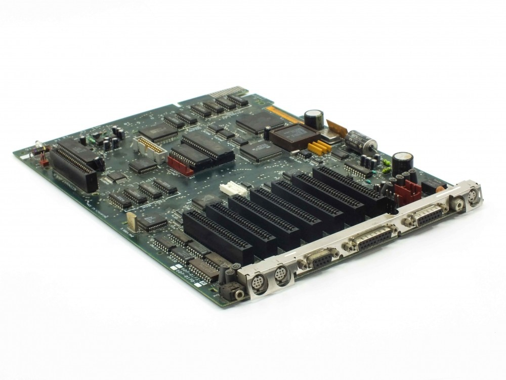
    </a>
    
<b>通过更换主板，可以将Apple IIe升级为IIGS</b>

## Applied Engineering的TransWarpGS

使用TransWarpGS加速卡可以让Apple IIGS达到原厂配置的两倍，这款加速卡带有更快的CPU和8KB缓存。此外这款加速卡附带的控制面板程序可以设置处理器运行在1 Mhz，2.8 Mhz或者7.0 Mhz等不同频率上。一些改装过的TransWarpGS的频率可以高达18.75 Mhz。Applied Engineering还提供32 KB缓存升级卡，让电脑的平均性能再提高22%。

    <a href="../images/dnbwg/what_kind_of_computer_is_the_Apple_IIGS_10.jpg">
        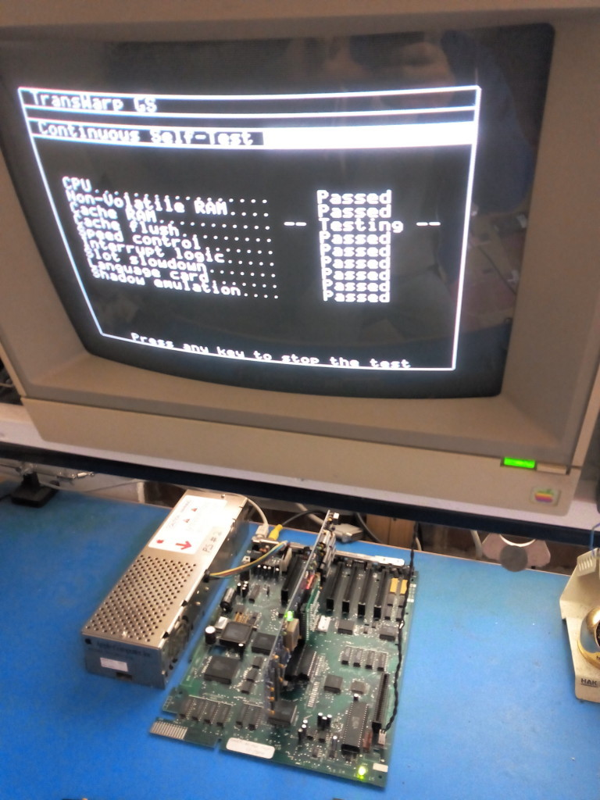
    </a>
    
<b>技术逆天的苹果发烧友自行开发了TransWarp GS的复刻版</b>

## ZIP Technology的ZipGS Accelerators

ZIP Technology为Apple IIGS开发了三款8 Mhz加速卡，ZipChipGS（Model 1500）, ZipChipGS Plus（Model 1525），以及ZipGSX（Model 1600）。基本款的ZipChipGS搭载了8 KB缓存，另外两款则搭载了16 KB，和上面提到的TransWarpGS类似，缓存可以升级到32KB或者64KB。高端的ZipGSX还提供10 Mhz和12 Mhz版本。

    <a href="../images/dnbwg/what_kind_of_computer_is_the_Apple_IIGS_11.jpg">
        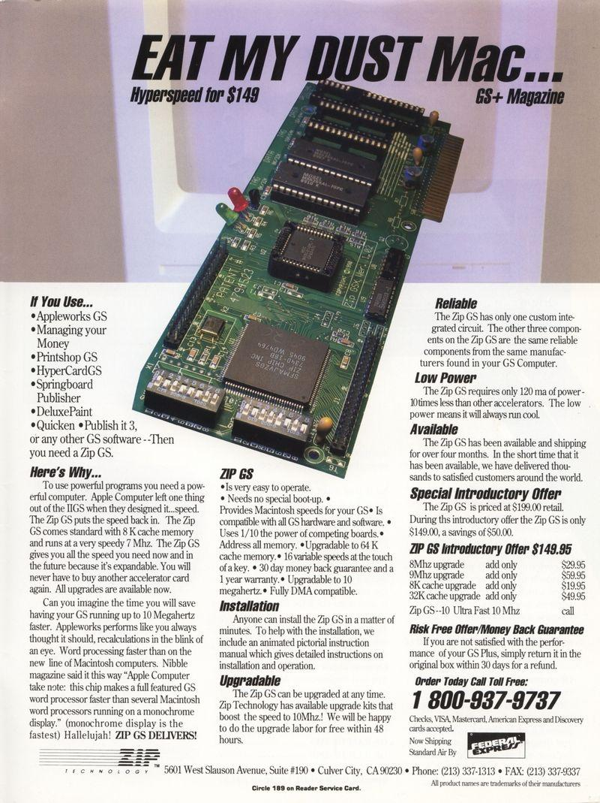
    </a>
    
<b>1992年四月的ZipGS广告，售价149美元</b>

一名ZipGSX在网上分享了他超频到12.5Mhz的<a href="https://web.archive.org/web/20141125212436/http://www.cirruscomms.com.au/~mike_stephens/apple2/hardware/ZIP_GSX_Mod/index.html" target="_blank">心得</a>。

---------

出处：https://zhuanlan.zhihu.com/p/23417891


