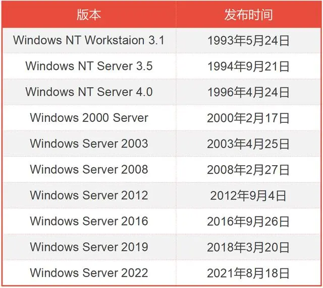

1979年，苹果公司创始人史蒂夫·乔布斯（Steve Jobs）来到施乐公司（Xerox）著名的PARC研究所，参观他们的PC原型机——Alto。

    
    
<b>施乐公司的Alto</b>

Alto的技术非常超前，尤其是它的GUI（Graphic User Interface，图形用户接口）界面和鼠标，都是前所未有的设计。

{{site.data.alerts.tip}}
<b><a href='{{ "/player.html?machine=salto" | prepend: site.computer_museum_base_url_2 }}' target='_blank'>体验 Xerox Alto</a></b>
{{site.data.alerts.end}}

乔布斯对这些设计爱不释手，于是，以很低的价格（施乐公司高层根本没有意识到这些设计的价值），将这些设计买下，并准备应用于自己的PC产品。

1983年，全球首款采用GUI界面的商业计算机产品推出，也就是Apple Lisa。

    
    
<b>乔布斯和Apple Lisa</b>

Apple Lisa的诞生，震撼了所有人，其中就包括微软的比尔·盖茨。

那时候的比尔·盖茨，刚刚在MS-DOS上获得成功。看到Apple Lisa后，他很清楚，GUI界面才是PC操作系统的未来。

因此，他立刻找到乔布斯，说要和苹果公司合作，帮助开发苹果另一款新机型（Macintosh）的应用软件。

乔布斯轻信了比尔·盖茨，答应与之进行合作。结果，在合作的过程中，微软一直都在对苹果的GUI图形操作系统进行研究和“仿制”。

## Windows 1.0/2.0/2.1

1984年，苹果公司发布Macintosh（麦金托什，麦金塔），再次震撼世界。一年后，1985年11月，微软正式发布Windows 1.0。

    
    
<b>Windows 1.0 界面</b>

{{site.data.alerts.tip}}

<b><a href='{{ "/player.html?id=windows100" | prepend: site.computer_museum_base_url_2 }}' target='_blank'>体验 Windows 1.0: Premiere Edition</a></b>

<b><a href='{{ "/player.html?id=windows101ega" | prepend: site.computer_museum_base_url_2 }}' target='_blank'>体验 Windows 1.01</a></b>

{{site.data.alerts.end}}

得知受骗，乔布斯怒不可遏，但为时已晚。因为这件事，乔布斯后来和比尔·盖茨一直都不太对付，经常隔空对骂。

前面说过，早期的windows，其实就是套在DOS外面的一个“壳”，只是起到操作界面的作用。最开始，微软把它称之为“界面管理器”。你也可以把它看成DOS下面的一个应用程序。

后来，在1.0的基础上，微软又在1987年和1988年先后发布了Windows 2.0及Windows 2.1。这两个版本同样不太成功，经常蓝屏，被用户疯狂吐槽。

    
    
<b>Windows 2.0</b>

{{site.data.alerts.tip}}
<b><a href='{{ "/player.html?id=windows20" | prepend: site.computer_museum_base_url_2 }}' target='_blank'>体验 Windows 2.01</a></b>
{{site.data.alerts.end}}

痛定思痛，比尔·盖茨觉得，继续在DOS上套壳，肯定不是办法，还是应该重新开发一个全新的内核。
于是，他到处招兵买马，找来了施乐公司最早做图形界面的一些人，还有VMS系统（当时很牛的一个操作系统）的开发者大卫·卡特勒（David Neil Cutler），以及操作系统顶级高手吉姆·阿尔钦（Jim Allchin）等，一同进行新系统的开发。

    
    
<b>吉姆·阿尔钦</b>

吉姆·阿尔钦对比尔·盖茨的邀请很是不屑。他告诉比尔·盖茨，你们微软的系统是世界上最烂的。比尔·盖茨倒是非常大度，回答说，正因为它们很烂，所以才请你来把它们做好嘛。
最后，盖茨的诚意和微软的股票期权打动了吉姆·阿尔钦。他选择了加入。

## Windows 3.x

1990年5月22日，微软终于迎来了第一个具有里程碑意义的作品—— Windows 3.0。后来，1992年4月，更成熟的Windows 3.1也诞生了。

    
    
<b>Windows 3.0</b>

Windows 3.0是第一个获得全面成功的Windows版本，在两年内卖出1000万份。

它引入了16色图标，拥有更先进的内存管理和界面管理，兼容性和稳定性更强。此外，它还引入了纸牌游戏，增加了娱乐性。

{{site.data.alerts.tip}}
<b><a href='{{ "/osjs/player.html?os=windows30" | prepend: site.computer_museum_base_url }}' target='_blank'>体验 Windows 3.0</a></b>
{{site.data.alerts.end}}

而Windows 3.1更是添加了多媒体功能、CD播放器，以及对桌面排版很重要的True Type字体，大大提升了用户使用体验。

{{site.data.alerts.tip}}
<b><a href='{{ "/osjs/player.html?os=windows31" | prepend: site.computer_museum_base_url }}' target='_blank'>体验 Windows 3.1</a></b>
{{site.data.alerts.end}}

值得一提的是，在上世纪80年代，除了Windows之外，微软还和IBM合作开发了OS/2系统。

    
    
<b>OS/2系统</b>

{{site.data.alerts.tip}}
<b><a href='{{ "/player.html?id=os2" | prepend: site.computer_museum_base_url_2 }}' target='_blank'>体验 OS/2系统</a></b>
{{site.data.alerts.end}}

但是，Windows 3.0的成功，让微软坚定了开发Windows、抛弃OS/2的信心。

1991年5月，比尔·盖茨正式宣布，结束与IBM的OS/2合作伙伴关系，将所有资源都投入到Windows上。

那一时期，网络技术高速发展，互联网迅猛崛起。

为了应对这一趋势，1993年11月，微软正式发布了Windows for Workgroups 3.11，重点加强了对网络的支持——包括支持以太网和热门的Novell netware，并利用对等网络的概念构建 Windows工作组网络。

1994年4月14日，微软发布了基于MS-DOS的中文图形界面操作系统Windows 3.2。相信国内有不少Windows的先驱用户就是从这个版本开始接触Windows操作系统的；Windows 3.2相当于Windows 3.1的一个中文版本。由于Windows 3.2消除了语言障碍，降低了学习门槛，因此很快在国内流行了起来，这个版本开始可以播放音频、视频，甚至有了屏幕保护程序和传真。

{{site.data.alerts.tip}}
<b><a href='{{ "/emularity.html?machine=wps97" | prepend: site.computer_museum_base_url }}' target='_blank'>体验 Windows 3.2 中文版</a></b>
{{site.data.alerts.end}}

所有这些努力，帮助Windows逐渐在90年代激烈的操作系统竞争中赢得优势，并逐渐构建了强大的“Wintel（Windows+Intel）”体系。

## Windows NT

1993年7月27日，Windows NT正式发布。NT就是New Technology，新技术的意思。

Windows NT是支持多任务处理的32位操作系统，实际上有两个版本：Windows NT Server，设计用作网络中的服务器；Windows NT Workstation，用于独立或客户端工作站。

## Windows 95/98

1995年8月24日，这是一个重要的日子。因为，在这一天，我们很多读者非常熟悉的Windows 95，正式发布了。

    

Windows 95的成功，是显而易见的。这套系统在发布后的5周内，售出了700多万份。它的界面有了很大的改进，稳定性和流畅性也远胜于此前的Windows。

    
    
<b>抢购Win95的用户</b>

在Windows 95里，开始菜单首次出现，IE浏览器也随该系统出现。它的整体外观，在后来的20多年里，没有太大的变化，在很多用户心里留下了深刻的印象。

{{site.data.alerts.tip}}
<b><a href='{{ "/osjs/player.html?os=windows95" | prepend: site.computer_museum_base_url }}' target='_blank'>体验 Windows 95</a></b>
{{site.data.alerts.end}}

和Windows 95同样经典的，还有 1998年6月25日发布的Windows 98，也就是俗称的“瘟酒吧”。

    
    
<b>Windows 98 桌面界面</b>

{{site.data.alerts.tip}}
<b><a href='{{ "/osjs/player.html?os=windows98" | prepend: site.computer_museum_base_url }}' target='_blank'>体验 Windows 98</a></b>
{{site.data.alerts.end}}

Windows 98就是升级版的Windows 95，在界面和工具上有所改进。大家也很熟悉，我就不多介绍了。

Windows 95和Windows 98，基本上奠定了微软在PC操作系统上的霸主地位，也形成了事实上的市场垄断。

## Windows 2000

跨入21世纪后，Windows又进入了一个新的发展阶段。
2000年2月17日，微软公司推出了32位计算机操作系统——Windows 2000（内核版本号Windows NT 5.0）。

    

Windows 2000共有四个主要版本：Professional（专业版）、Server（服务器版）、Advanced Server（高级服务器版）和Datacenter Server（数据库服务器中心版）。

很多的IDC数据中心服务器，包括web服务器、电子邮件服务器、ftp服务器等，都采用了Windows 2000 Server，这也迎合了当时互联网的发展需求。

Windows 2000的最大特点是稳定。它升级完善了活动目录功能，增强存储服务，开始支持新型设备，并采用了NTFS 5文件系统，可靠性和安全性有明显的提升。

{{site.data.alerts.tip}}
<b><a href='{{ "/osjs/player.html?os=windows2000" | prepend: site.computer_museum_base_url }}' target='_blank'>体验 Windows 2000</a></b>
{{site.data.alerts.end}}

## Windows Me

不久后，2000年9月14日，微软发布了Windows Me（Windows Millennium Edition）。
这个Me，除了“我”的意思之外，也表示Millennium（千禧年），以及Multimedia（多媒体）。
Windows Me是16位/32位混合的系统，也是最后一款基于MS-DOS的Windows 9X内核系列的Windows操作系统。它的稳定性不如Win2000，又比较“吃”配置，所以市场表现并不成功，不被用户认可。

## Windows XP

很快，微软亡羊补牢，推出了崭新的Windows XP（2001年10月25日）。“XP”的意思，是英文中的“体验”（Experience），尽管我们有时候也叫它——“擦屁”。

    

Windows XP也是一代经典，甚至很多老电脑现在还在使用它（2008年停止销售，2014年停止技术支持）。
它使用了Luna（月神）图形用户界面和双列开始菜单，提升了系统的安全性和工作性能，提供了WiFi支持，简化了软件的安装和运行，并增加了远程桌面功能。

## Windows Vista/7

90年代末，乔布斯经过一番波折，重新入主苹果公司。在他的带领下，苹果推出了一系列酷炫的产品，包括非常惊艳且流畅的MacOS。

在界面体验上，Windows XP根本不是MacOS的对手。于是，微软又从IBM手中买回了OS/2，并在此基础上发布了Windows Vista（2006年11月30日）。

    

Windows Vista的界面确实蛮酷，多媒体和通信能力也明显增强，但是，华丽界面大幅拉低了系统性能，被用户疯狂吐槽。

无奈之下，微软在短时间内重新研发，推出了Windows 7（2009年10月22日，内核版本号Windows NT 6.1）。

    

## Windows 8/10/11

再往后，就是Windows 8（不太成功）、Windows 10（非常成功）、Windows 11（刚起步）。大家都在用，应该都很熟悉。

Windows 10在易用性和安全性方面有了极大的提升，稳定性也不错，现在是全球市场占比最高的Windows操作系统。

    

Windows 11的话，2021年6月24日发布，目前还处于起步上量的阶段。

    

除了桌面操作系统之外，面向服务器平台的Windows Server也在不断升级，陆续诞生了Windows Server 2003/2008/2012/2016等众多版本（如下表）。

    

下面这张图，看得更清晰一些：

    

## 结语

好了，以上就是Windows的完整发展历史。

作为大家最熟悉的操作系统，Windows伴随着我们很多人的成长历程。我们抱怨它，吐槽它，但也离不开它。

未来，Windows还会陪伴我们多久？它还会不会有颠覆性的创新？就让时间来告诉我们答案吧。

    

---------


