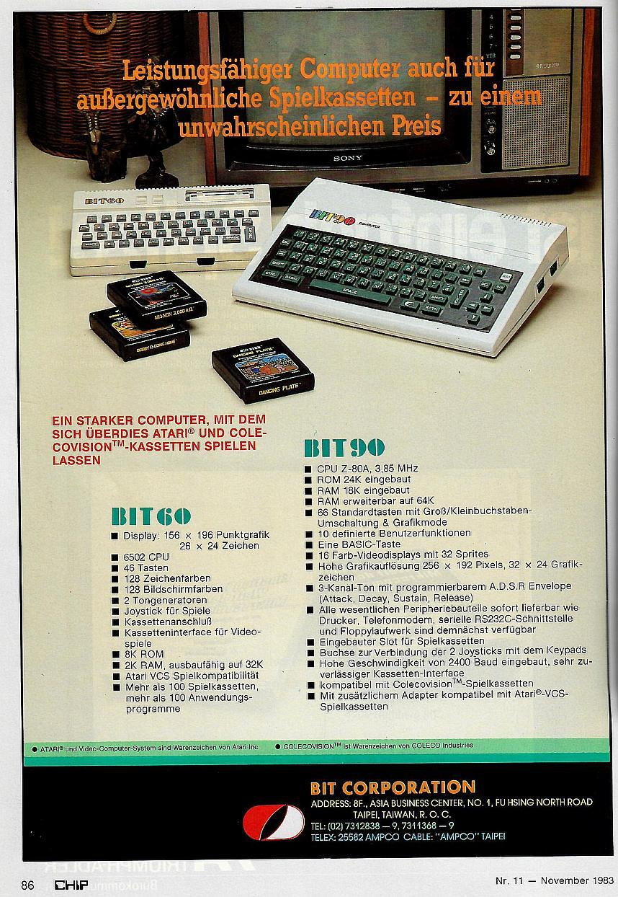
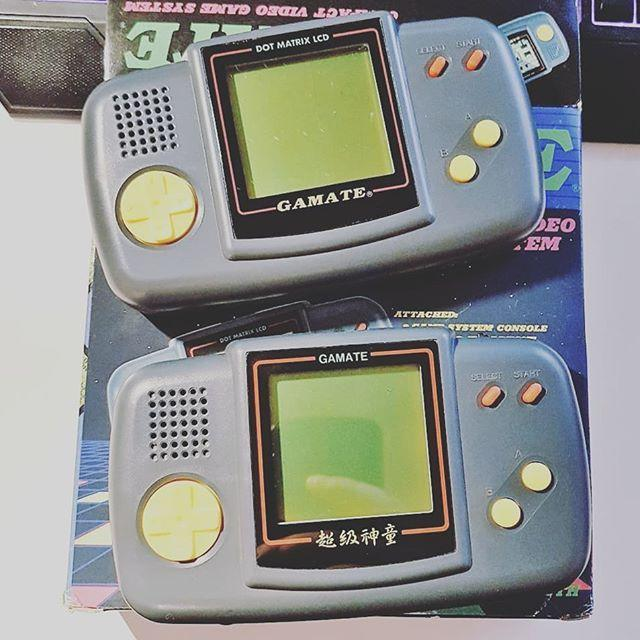
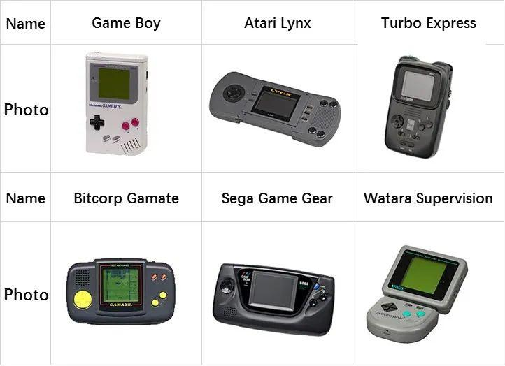
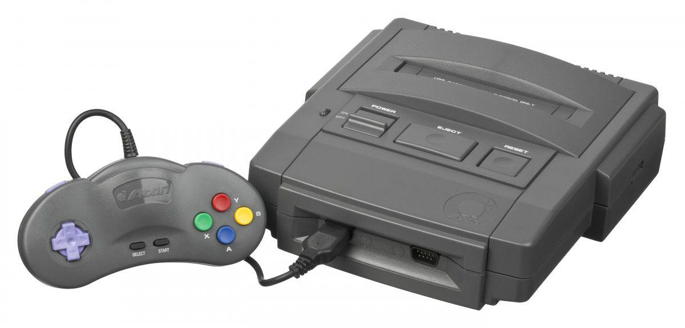
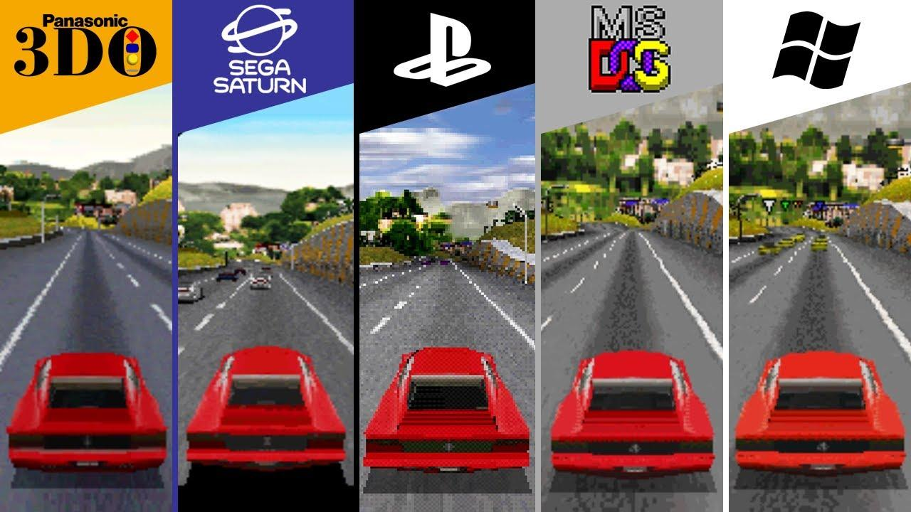
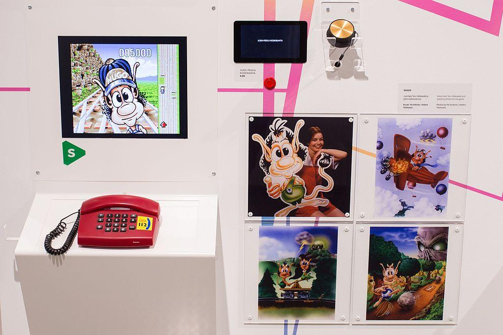

1970年代，台湾地区选择半导体行业作为其产业突破的方向，1980年代，联华电子（简称“联电”）从公立机构工研院中分离出来，成为独立运行的企业，在不晚于1983年时，联电就具备生产MOS 6502兼容型微处理器的能力，在拥有本土生产的微处理器之后，台湾地区电脑行业开始爆炸性的增长。联电生产的MOS 6502兼容芯片UM6561，也成为台湾和大陆任天堂兼容机最常用的CPU。但在作为“小天才”、“小霸王”等任天堂兼容机的另一面，联电也曾经在开发独立的游戏机架构上付出过不少努力。

## 普泽和Gamate

诞生于1982年的普泽（Bit Corporation）公司很可能是“学习机”兼容游戏卡这一功能的起源，他们设计的BIT 60和BIT 90分别是使用6502和Z80微处理器的家用电脑，同时分别兼容Atari VCS和ColecoVision游戏卡带，值得一提的是，上述两款家用电脑所对应的游戏机并没有类似任天堂Family BASIC的官方键盘方案，其BASIC语言解释器也是自行开发的，因此具备相当的原创性。

    
    
1983年11月德国《CHIP》杂志上的普泽BIT-60和BIT-90

‍BIT-60和BIT-90‍‍的之所以设计成电脑而非电子游戏机的形态，一方面与CreatiVision加入家用电脑功能的原因类似，是对1980年代初家用电脑热潮的回应，而另一方面则是在1982年到1987年间台湾地区的电子游戏禁令下的无奈之举。

1982年3月，台湾地区停止受理申请电动玩具（即电子游戏）的经营、进口、买卖、修理，直到1988年2月才再度开放[1]。与2000年开始大陆开始实行的电子游戏禁令相似，台湾地区的电子游戏禁令主要是针对经营性街机厅在民众间造成的恶劣观感，但家用电子游戏机却是受打击最为惨重的领域。

在1982年五月号的《音响技术》杂志第77期中，《功成身退话“电玩”》[2]一文在“始作俑者为电脑业”章节指出，电脑企业与家用游戏机企业在电子游戏领域存在一定竞争关系，因此电脑行业对电子游戏机禁令在相当程度上是支持的。

虽然没有明确的证据表明电子游戏禁令的出台受到电脑行业游说的影响，但这确实带来了台湾地区游戏行业以电脑游戏为主的情形。类似的效应也出现在中国大陆，相比家用游戏机玩家的规模，以电脑为主要平台的网络游戏的受众要广泛的多。

    
    
Gamate及大陆版本“超级神童”

Gamate“超级小子”（在大陆销售时改名为“超级神童”）是普泽的最后一款产品，也是市场上第一款回应任天堂Gameboy的手持游戏机——它的推出相比NEC的PC Engine GT和世嘉Game Gear都要早上几个月，它使用的联电开发的，基于6502微处理器的UA6588F（后期型号改用NCR 81489微处理器）。无论从横板外形还是处理器的选用，Gamate都和Gameboy设计上有着明显的差异（Gameboy使用的Sharp LR35902是一款Z80处理器）[3]。

|               | Game Boy      | Atari Lynx   | Gamate        | Turbo Express   | Game Gear     | Watara Supervision |
|---------------|---------------|--------------|---------------|-----------------|----------------|-------------------|
| 上市时间       | 1989年4月     | 1989年9      | 1990年初       | 1990年12月      | 1991年4月      | 1992              |
| 上市售价(美元) | 89.99	     | 179.99       | 69	         | 249.99	      | 149.99	      | 49.95              |
| 分辨率/ 彩色   | 160x144  黑白 | 160x120  彩色 | 160x152  黑白  | 336x221  彩色   | 160x144  彩色 | 160x160  黑白      |
| CPU 指令集    | Z80           | 6502          | 6502          | 6502	          |  Z80          | 6502               |

值得一提的是，很大程度上，1990年代初的手持游戏机市场并不是一个统一的市场，而是分别在任天堂Gameboy开启的单色手持游戏机和以雅达利Lynx开启的彩色手持游戏机两条战线上展开的，在当时，彩色手持游戏机的价格明显高于单色手持游戏机，最便宜、也是最成功的彩色手持游戏机世嘉GameGear发布时售价149美元，是90美元的Gameboy的1.6倍，雅达利Lynx的发布价格180美元是Gameboy的两倍，而另一款较为流行的彩屏手持游戏机NEC TurboExpress售价则高达250美元。

    
    
Gamate的主要竞争者

相比之下，两款在100美元以下价位上直接与Gameboy竞争的产品都是由港台企业开发的，Gamate在1990年上市时的价格为69美元，而另一款更晚推出的，在香港开发的Watara Supervision的售价则为49美元。

相比本系列上一篇文章提到的香港伟易达将产品的重心完全放在海外，普泽开发的Gamate游戏更加具有本土色彩，比如《包青天》就使用了就使用了《三侠五义》中的包拯、展昭和《儿女英雄传》中的十三妹等古典侠义小说人物。而其中的音乐也来自1993年热播的电视剧《包青天》中的配乐，体现出台湾地区大众文化与电子游戏中的相互影响。

许多人把Gamate的失败归结于硬件素质，特别是其绿底的单色显示屏，但这无法解释同样有动作拖影等问题的早期Gameboy的成功。在我看来，Gamate遇到的最大困境是其缺乏第三方游戏开发商，在Gamate已知的近70款游戏中，绝大多数是由普泽自行开发的，另有少量来自于其芯片提供者，同时也是1992年普泽歇业之后Gamate产品的运营方的联电，而唯一的第三方游戏开发者只有一家“Phinnex Co., Ltd.”。

由于Gamate的失利，普泽在1992年结束运营[4]，但Gamate产品却没有消失，而是转让给联电的子公司敦煌科技（Funtech）继续经营，目前能找到的最后一款为Gamate开发的游戏，是1995年的《昆虫战机》（Insect War）。

## 敦煌科技和Super A'Can

从某种角度讲，当敦煌科技从普泽手中接手Gamate的同时，也接过了“本土游戏机”的大旗，而1995年敦煌科技推出的Super A'Can也可以视为Gamte的“续作”。Super A'Can是一款国产化程度相当高的家用游戏机，除了CPU使用了摩托罗拉68000处理器之外，它的图形和声音都是由联电自主设计的——UM6618图形芯片和UM6619声音芯片。这款游戏机的硬件资料目前已经难以获得，不过从MAME模拟器的代码里还是可以一窥其硬件设计，比如其音频处理芯片UM6619中应当集成了一颗6502微处理器核心[5]。

    
    
Super A'Can

虽然有着“开发适合12亿中国人的电玩平台”的初衷[6]，但90年代中期的内、外部环境都让Super A'can有些“生不逢时”。90年代初的游戏市场上正在面对一场有2D到3D的巨变，传统以卷轴、精灵为核心的二维游戏画面正逐渐变得“过时”，而多边形绘图、纹理填充等三维图形技术则成为当时电子游戏发展的新方向，同时CD-ROM光盘的运用也让游戏容量大大超出以往卡带的限制。1993年10月随3DO主机一同发布的游戏《坠毁赛车》（Crash 'n' Burn）和第二年发布的《极品飞车》（Need for Speed）都运用了高速刷新的三维图像，而这两款游戏也发展成为长盛不衰的竞速游戏系列。

在PC一边，1992年的《德军总部3D》（Wolfenstein 3D）和1993年的《毁灭战士》（Doom）带动了第一人称射击游戏的流行，同样发布于1993年的演示场景（Demoscene）作品《第二现实》（Second Reality）则展现了使用486处理器的PC在展现游戏图形上的潜力。1994年的PC游戏《天旋地转》（Descent）展示了完全由多边形和纹理绘制的，可以自由移动视角的3D游戏。

    
    
在90年代中期各个游戏平台上，《极品飞车》都是最具代表性的3D游戏之一

家用游戏机上更加广泛的变革也在酝酿：1994年，索尼在PlayStation的发布会上展示了其著名的霸王龙演示程序，与其类似的由电脑合成图像（CGI）生成的恐龙形象正是前一年的电影《侏罗纪公园》中最重要的元素。也是游戏画面“电影化”的起点之一。

在成熟市场上，Super A'can不仅要和以PlayStation和世嘉土星为代表的第五代游戏机进行竞争，同时也要与以世嘉Genesis/MegaDrive和超级任天堂为代表的第四代游戏机竞争。在1996年《电子游戏软件》杂志组织的A'CAN F-16杯《电子游戏知识有奖竞赛》就出现了尴尬的一幕，特等奖和一等奖的奖品分别是世嘉土星和3DO游戏机，而为竞赛冠名的Super A'can只能作为二等奖的奖品出现。

而在大陆市场上，90年代中期仍处于小霸王等仿制红白机最热销的时代，小霸王300元人民币左右的售价和丰富的红白机游戏要比Super A'can超过千元的售价容易接受的多。1995 年7 月，联电转型为纯晶圆代工（Foundry）公司。而任天堂也是其大客户之一，有消息指出，当时任天堂在代工订单上针对联电施压，迫使联电提早结束了Super A'can的生产和开发[7]。

    
    
芬兰游戏博物馆（Finnish Museum of Games）展示的电话互动游戏Hugo

值得一提的是，Super A'can除了以家用游戏机的形式销售，也曾经通过“爆米花电玩”频道向台湾地区的观众提供互动电视的游戏服务，观众可以使用电话按钮远程操纵电视台播放的游戏画面[8]。类似的交互式电视游戏最早出现在1994年的欧洲，丹麦开发商ITE互动电视娱乐（Interactive Television Entertainment）推出了以卡通角色Hugo为主角的互动电视节目，其技术架构使用了基于Amiga 3000电脑的ITE 3000定制系统[9]。而联电在台湾地区的这一实践也反映了当时视频点播（VOD）、互动电视等技术对华人世界的影响[10]。

## 注释

[1] 关于台湾地区的游戏机禁令的详情，可以参考 林应嘉：《从「全面禁绝」到「文创产业」： 台湾电玩政策论述之变迁》；黄国昌：《我国电玩业管理法制之研究》

[2] 功成身退話「電玩」：https://zazu.tw/talks/8265

[3] 关于Gamate的硬件细节，可参考 Kevtris：《Gamate Inside》，http://blog.kevtris.org/blogfiles/Gamate%20Inside.txt

[4] 《普泽、升友停权》，台湾区玩具工业同业公会，1992，http://www.toybase.com.tw/h/n1930359.html

[5] 与Super A'can模拟器相关的MAME源代码：https://github.com/mamedev/mame/blob/master/src/mame/drivers/supracan.cpp

[6] 《熊猫专访》，《A'can特辑》创刊号，尖端出版 1995年10月 https://archive.org/details/acan-special-issue

[7] 《敦煌Super A'Can国产主机兴衰史以及Mess模拟器》（互联网档案馆存档）

[8] 《[问题] 十几年前用电话在电视上玩游戏》，看板Old-Games，批踢踢实业坊，https://www.ptt.cc/bbs/Old-Games/M.1370775205.A.873.html

[9] 《Halt, Hugo's there!》，《The One Amiga》第66期，第46页，1994年3月 The One Amiga 66 (March 1994)

[10] 在中国大陆，南通有线台可能是最早开通以电话线路作为回传通道（return path）的交互电视节目的地方有线台；而1996年西安电视二台的“游戏俱乐部”栏目则是中国大陆最早以此种手段提供游戏节目的实践。参见1995年6月15日《视听界》王美玲，陈铿，施振平，范煜：《南通有线台推出多媒体交互式电视查询》；1997年《西安年鉴》第246页，广播电视，曹永森：《西安电视台二台研制出交互式电视》

---------

出处：https://zhuanlan.zhihu.com/p/629939492


