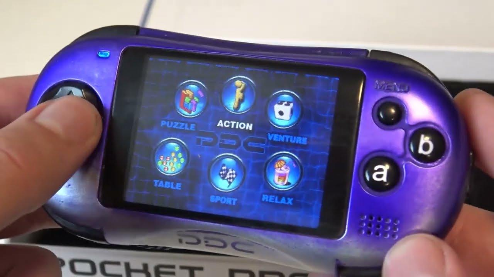
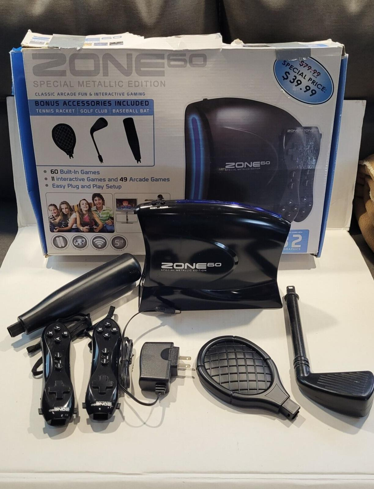
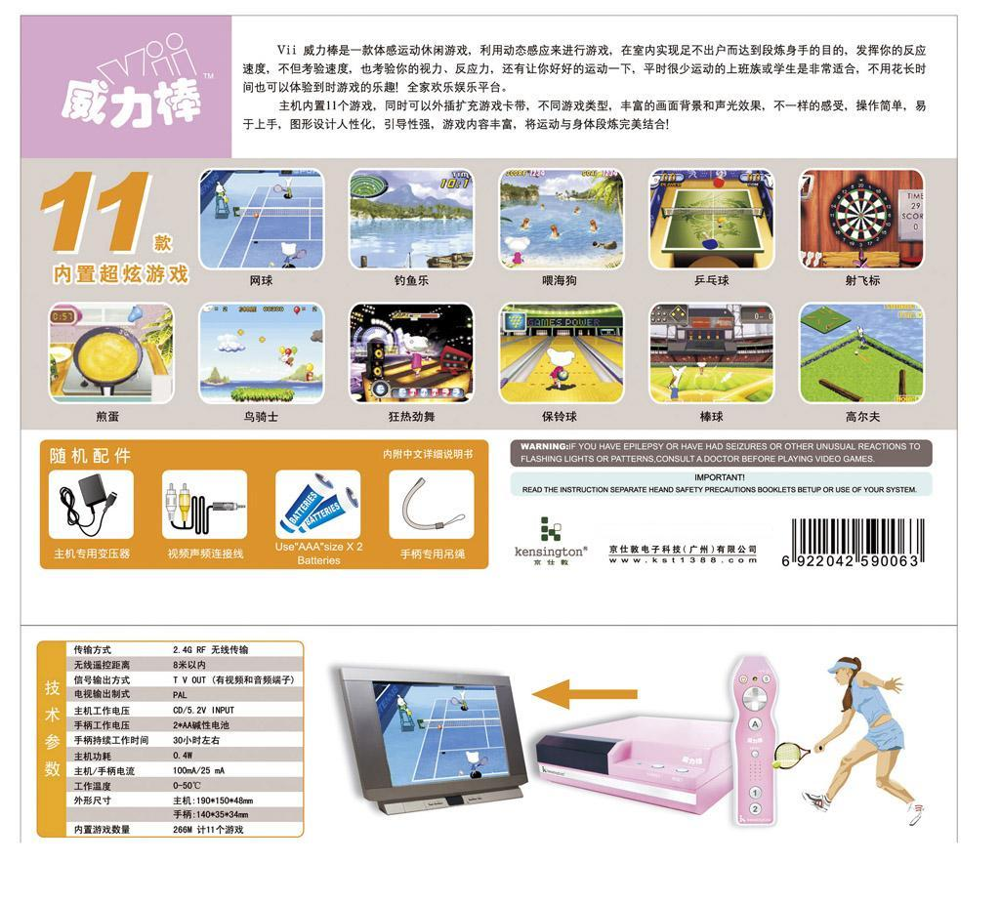
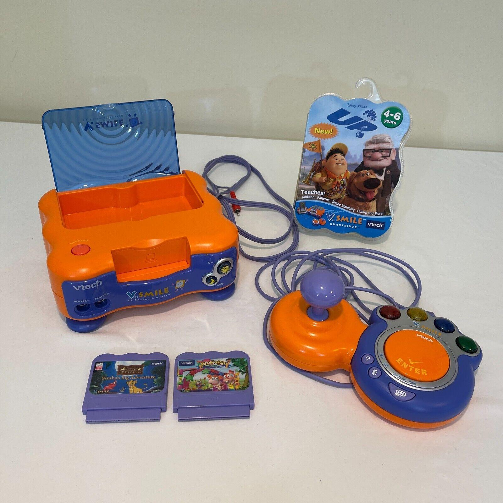
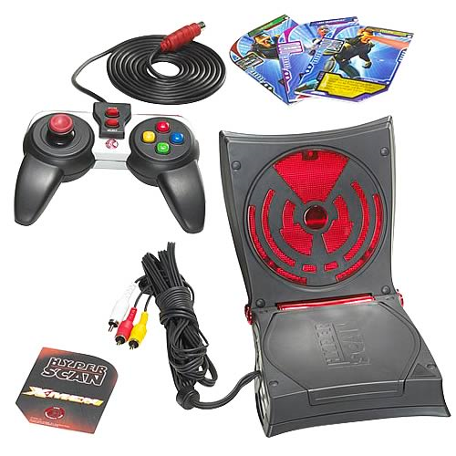
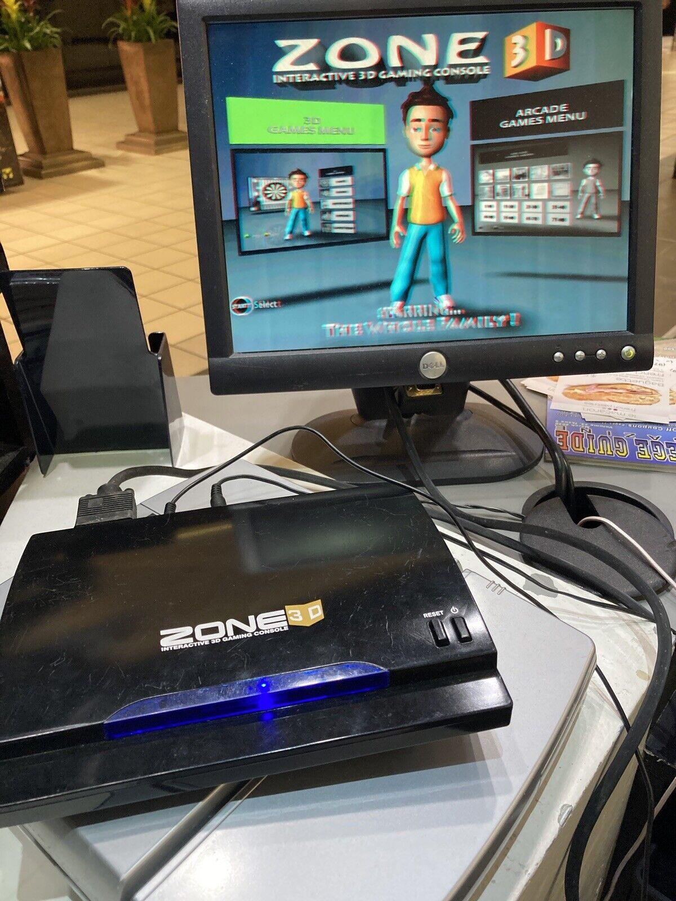

在2000年代，中国东南沿海逐渐成为电子产业的“世界工厂”，而这其中的一个重要参与者就是与联华电子一样位于台湾新竹科技园的凌阳科技，2001年，凌阳在为语音识别应用开发的SPCE500芯片及使用了自主研发的µ’nSP（Microcontroller and Signal Processor）16位单片机内核，并在同年启动了“凌阳大学计划”，特别是在从2002年起，凌阳和大陆许多大专院校合作建立单片机实验室，推广其µ’nSP内核的SPCE061A单片机（常简称为“61单片机”），在中国训练了大量熟悉µ’nSP芯片的开发者。这也成为了在中国形成以凌阳SPG芯片为基础的电子游戏生态的基础。

## 禾维PDC

2006年发布的珠海禾维科技的Pocket Dream Console（通常简称为PDC）应当是使用凌阳SPG芯片影响力最大的游戏机，它在全球各地通过不同的游戏厂商销售，它在日本的销售商是特佳丽多美，在美国则是Videojet。

    
    
Pocket Dream Console是一款非常小巧的掌机

2000年代，由于低功耗、高性能的移动处理器逐渐成熟，手持游戏机市场空前繁荣，除了任天堂的Gameboy Advanced，SNK的Neo Geo Pocket Color，万代的SwanCrystal等日本厂商的产品，许多其他国家的厂商都加入到手持游戏机的竞争中，比如诺基亚基于S60智能手机的N-Gage/QD，Tapwave基于Palm OS掌上电脑的Zodiac，以及Game Park基于Linux的GP32，这些非日本厂商的游戏机往往在游戏功能之外，也有着较强的非游戏应用。

但禾维PDC却是一款封闭系统的专用游戏机（Dedicated console），所有的游戏在出场时就已经内置，并不能通过购买游戏卡或网络下载进行扩充，虽然出厂内置的游戏较多，从最少的30款到最多200款不等，但也失去了通过软件改进进一步挖掘硬件潜力的可能。在其他游戏机型上，效果最好的游戏往往都在游戏机硬件发布数年之后，软件开发团队熟练掌握硬件特性，并能对其做较为深入的优化设计时才出现。禾维PDC的游戏也带有很强的模仿痕迹，包括了淘金者、打砖块、炸弹人等流行游戏的复制品。

## 丛林互动

另一个有较大影响力的凌阳SPG芯片的用户则是丛林互动科技，丛林互动的硬件开发团队位于深圳，而软件开发团队则位于福州，与红白机时代著名的本土游戏开发商外星科技关系密切。

    
    
Zone60，配有棒球、网球、高尔夫球三种“球杆”配件

丛林互动生产的硬件主要市场在海外，较为知名的产品是Zone系列，如Zone 40、Zone 60等，提供一个类似任天堂Wii的无线手柄，游戏内容也主要以体感运动类为主。

丛林互动也可能是SPG芯片相关的游戏产品中唯一在中国本土发布产品的厂家，他们的代表产品“威力棒”即Sport Vii在外形上模拟任天堂Wii游戏机，而销售渠道则主要通过电视购物；在2000年后的游戏机销售禁令时期，这是位数不多的可以在中国大陆合规销售的游戏机之一。

与禾维PDC和Zone系列无法扩充游戏不同，Sport Vii支持以卡带的形式扩充游戏，丛林互动发布过三张包含多个游戏的合卡，VC-1、VC-2和VC-3，分别于蓝、白、粉三种颜色的Vii捆绑销售，不过除了发布时捆绑的三张游戏卡之外，Vii并没有任何第三方游戏加入。

    
    
威力棒宣传彩页

伟易达在这一时期也基于凌阳SPG芯片开发了一系列电视游戏产品，即V.Smile电视教学系统（V.Smile TV Learning System）。由于其产品主要面向低年龄的儿童玩具市场，因此在并未受到主流游戏玩家的关注，但其游戏阵容却可能是相似技术架构的游戏机中最为丰富的，其中包括了迪士尼互动的《阿拉丁世界奇观》（Aladdin's Wonders of the World）、华纳兄弟的《蝙蝠侠：哥谭市救援》（Batman: Gotham City Rescue）芝麻工作室的《芝麻街：毕特与恩尼的幻想冒险》（Sesame Street: Bert & Ernie's Imagination Adventure）等知名影视IP授权游戏。

    
    
V.Smile电视教学系统

由于2000年代中国电子市场变化剧烈，让大多数使用SPG芯片的游戏机的详细资料难以被寻找，但通过对知网上学术论文的搜索，我们会发现在2010年代仍有部分高校在基于SPG芯片进行教学和科研活动。这些论文也让我们能够一窥凌阳SPG系列处理器的硬件参数，较为常用的SPG260处理器是主频为27Mhz，支持320x240像素输出，图形部分能够支持128个卡通精灵，技术规格上仍然与前面所述的Super A'can属于第四代家用电子游戏机范畴。

而2000年代凌阳SPG芯片也随着凌阳内部不同业务部门的分分合合而几经易手。先是在2006年12月1日凌阳将移动多媒体部门拆分为Sunplus mMobile，又在2009年再次拆分成三家公司，目前游戏产品相关的IP应当属于灵通科技（Generalplus Technology）。

    
    
美泰HyperScan

在SPG系列的后期产品SPG290中，16位的µ’nSP内核被替换为32位的S+core，主频也更高。SPG290最知名的产品是2006年美泰（Mattel）开发的HyperScan，与大多数完全由中国本土厂商设计的游戏机不同，它使用了CD-ROM光盘作为存储介质，并通过RFID射频卡片加入了卡牌收集等元素。

    
    
Zone 3D可以通过红绿3D眼镜提供立体画面

SPG290等S+core的机型相比µ’nSP内核的机型较少，另一些具有代表性的产品包是丛林互动的Zone 3D体感游戏机，和外星科技的iSports Pro等。而禾维PDC在开发其后续产品PDC touch（也被称作Mi2）时，则选用了MIPS处理器。

## 参考资料

本文成文与2020年底，在此之后SunPlus的资料在网上大幅增加，本文未必覆盖最一些新的逆向研究成果

[1] HackMii: SunPlus: The biggest chip company you’ve never heard of

[2] 孙乾恒：《基于凌阳μ'nSP系列单片机的电视游戏设计与实现》，西安电子科技大学，硕士论文，2009年。

[3] 于腾潇：《2D游戏资源编辑工具的设计与开发》，北京邮电大学，硕士论文，2010年

[4] 王涛，邓丽君：基于凌阳32位单片机游戏十三张设计与实现，《软件》，2014年第35卷第4期

[5] HandWiki: S+core - HandWiki

[6] BootlegGames: Sunplus SPG

[7] MAME开发者David Haywood的Under the Surface系列，是介绍SPG系列最为详尽的文章，亦覆盖部分虚实科技VR Technology的VT系列产品的信息：Under the Surface (part 1) (part 2) (part 3) (part 4) (part 5) (part 6) (part 7) (part 8) (part 9) (part 10) (part 11) (part 12) (part 13) (part 14) (part 15)

[8] 我在2022年收集到的一些Sunplus单片机和SPG系列的开发资料： https://archive.org/details/sunplus-mcu-spg

[9] GitHub - MooglyGuy/unsp: A playground for SunPlus μnSP (SPG24x/SPG28x/PAC300) reverse-engineering

---------

出处：https://zhuanlan.zhihu.com/p/630474136


