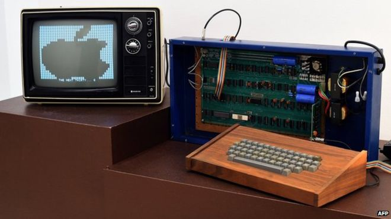
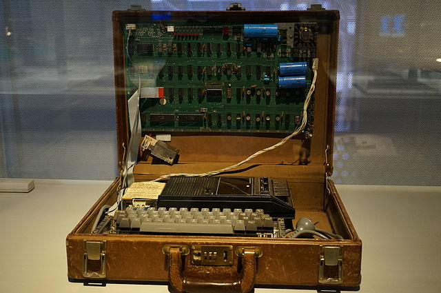

Apple I 是 Apple 于 1976 年发布的电脑原型机。首台 Apple I 由斯蒂夫·沃兹尼亚克设计并在惠普办公室手工打造。他的好友乔布斯发现了商机，提出了将这种电脑推向市场的想法。作为第一代产品，用户买回后仍需提供电源、键盘、显示器才能让它工作，Apple I 大约只生产了约 200 台左右。

    
    
Apple I 连接显示器运行照

## Apple I 参数

|           |           |
|-----------|-----------|
| 发布日期   | 1976年 |
| 停售日期   | 1977年 |
| 售价       | $666.66 |
| 上市口号   | Apple Introduces the First Low Cost Microcomputer System with a Video Terminal and 8K Bytes of RAM on a Single PC Card.  |
| CPU型号    | Mos technology 6502 |
| CPU速度    | 1Mhz 8-bit |
| 内存       | 内建 4KB,最大8KB(板载),65KB(扩展卡) |
| 操作系统   | Integer BASIC（磁带卡） |
| 显卡       | 内置 1KB 显存,使用 Composite Video(AV端子) 传输信号 |
| 最大分辨率 | 使用电视机,最大显示 40×24个字符 |
| 最大功率   | 58W |

## Apple I 收藏价值

截止到 2013 ，据统计目前现存 Apple I 数目至少 63 台，其中有 6 台被证实至今仍可以工作。

    
    
悉尼 Powerhouse 博物馆 Apple I 藏品

以下是部分有记载的拍卖纪录:

2009 年 9 月 Apple I 在 eBay 以 $17,480（约合人民币 12 万） 成交。

2010年 11 月，Apple I 以约合 $210,000（约合人民币 140 万） 价格在伦敦佳士得拍卖行拍卖。之所以买这么贵是因为这台电脑“身世”不凡，它带有乔布斯亲笔签名的有关技术的回复信，信得地址为 Apple 总部，就是大家熟知的乔布斯父母家的那个车库。

2012年 6 月 15 日，一台仍可以正常工作的 Apple I 以超过预期一倍的价格，在苏富比拍卖行以 $374,500（约合人民币 249 万） 成交。这台电脑在韩国济州岛的 Nexon 计算机博物馆展出。

2012年10 月，一台已经不能工作的 Apple I 被苹果公司雇员 Joe Copson 拿到佳士得拍卖行拍卖，可是并没有投资者拍下这个起拍价已经达到 $80,000（约合人民币 50 万） 产品。

2012年 11 月 24 日，一台仍可以正常工作的 Apple I 被拍卖团队 Breker 以 €400,000（$515,000）的价格拍卖。

由此可见，目前 Apple I 已经由一台古老的电子设备，变成了一种艺术收藏品。

## 有关 Apple I 的序列号

    
    
Apple I 的主板

尽管乔布斯和斯蒂夫·沃兹尼亚克都曾表示并没有给发售的 Apple I 分配过序列号，但是似乎每个主机主板上都有类似 “01-00##” 这样的编号，这个编号可能是主办的生产厂商的质检标签或者某些销售商的库存编号。这曾被拍卖行和部分媒体错误的认为是 Apple I 的序列号。

---------

出处：https://www.maczd.com/post/2.html


