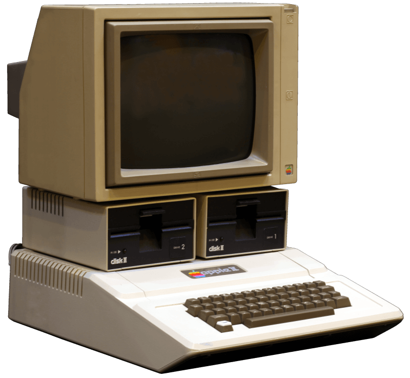
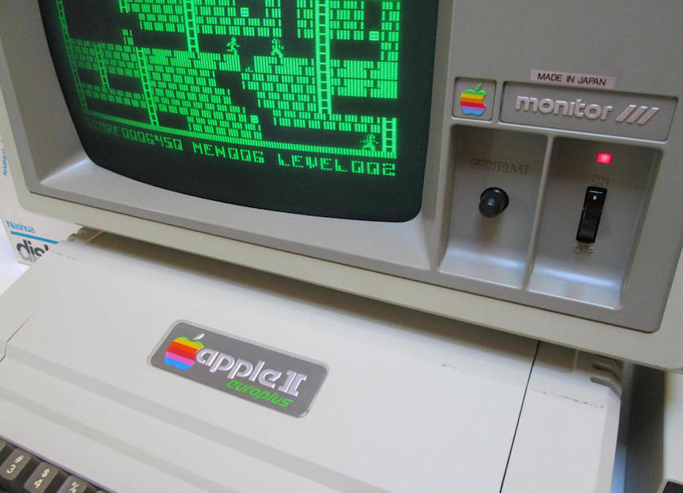
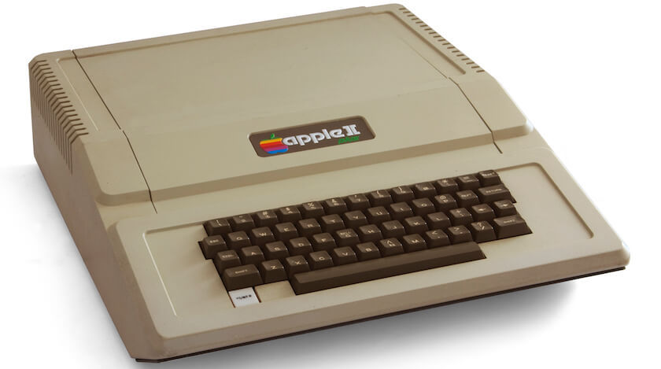
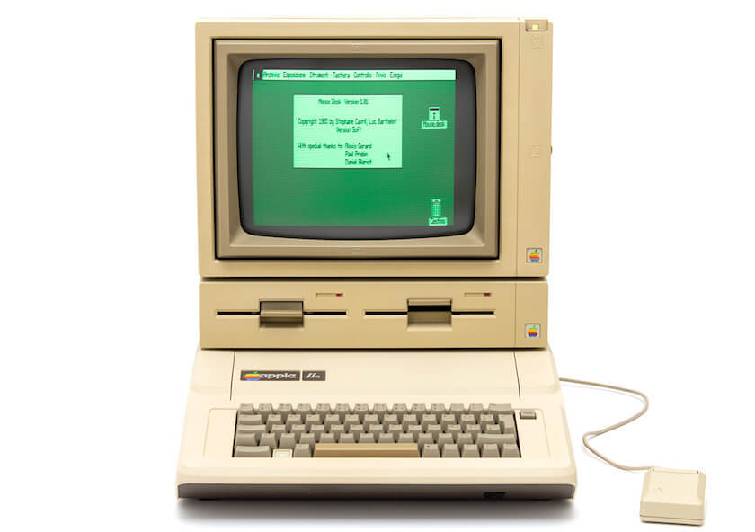
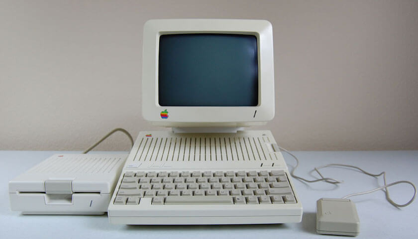
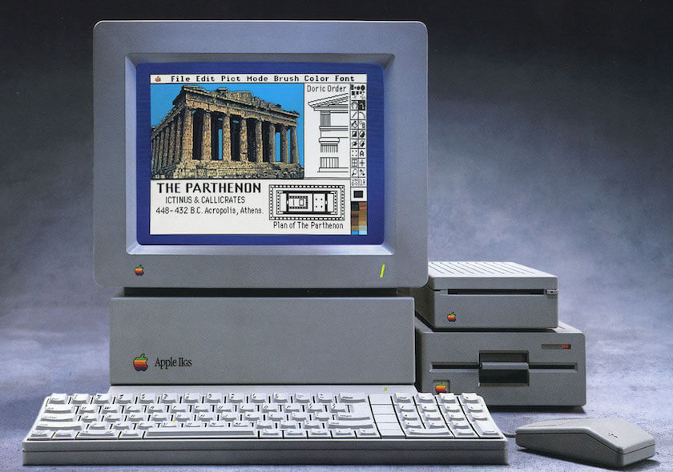
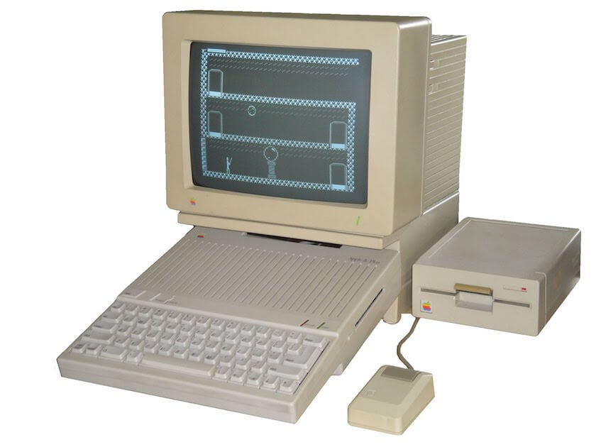
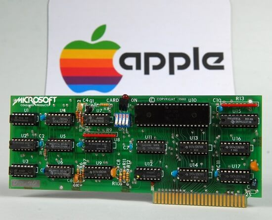

Apple II 系列是美国苹果公司发布的一个系列普及型的电子计算机，相比于它的第一代产品 Apple I 有了很大的改进。

自从 Apple II 在1977年于美国西海岸电脑展（West Coast Computer Faire）首次亮相以来，直到 1993年末为止，据估算 Apple II 系列电脑大约生产了 600 万台。这期间经历了数次硬件更新，更新型的号包括 ：

 - Apple II
 - Apple II Plus
 - Apple II Europlus
 - Apple IIe
 - Apple IIc
 - Apple IIGS
 - Apple IIc Plus

围绕它生产的各种硬件卡产品也是数不胜数。

Apple II 系列从发布以来就广受用户欢迎，在家庭和教育领域普及率很高。从开始的内置的 BASIC 语言编译器到后来加入的 Apple DOS 系统，各种新硬件也可以很好的支持。正是由于这些特性，Apple II 系列从 1977 年一直生产到 1993 年，直到 1990 年代底，仍然可以在许多领域见到 Apple II 系列的电脑产品。

# Apple II 系列各种型号

## 一、Apple II

    
    
1977版Apple II

Apple II 不像当时发布的一些计算机，它看起来更像一台家用电器，因此无论是办公、家用都很合适。它的上盖很容易开启，内置了 8 个扩展插槽，很容易添加扩展卡增加功能。

Apple II 的推出掀起了个人电脑革命，因为它面向大众，而且售价在当时也可以接受。Apple II 的设计理念深深影响了之后个人电脑的发展。

### Apple II 总览

|         |           |
|---------|-----------|
| 发布日期 | 1977年4月 |
| 停产日期 | 1979年6月 |
| 市场型号 | A2S0016(16KB内存)   A2S0032(32KB内存)   A2S0048(48KB内存) |
| 市场口号 | Simplicity is the ultimate sophistication,Introducing Apple II,   the personal computer. |
| 市场售价 | $1298(16K内存版)   $2638(64K内存版) |
| 支持状态 | 已停售,已停止技术支持 |
| 产品颜色 | 米黄色 |
| 重量尺寸 | 约 5.21 KG   107mm H x 387mm W x 457mm D |

### Apple II CPU 内存和存储

|         |           |
|---------|-----------|
| CPU型号 | MOS Technology 6502 |
| CPU速度 | 1MHz |
| 核心数 | 1 |
| 总线速度 | 1MHz |
| 内置内存 | 16KB,32KB,48KB |
| 最大扩展内存 | 48KB |
| 硬盘 | 无 |
| 硬盘接口 | 无 |
| 扩展存储 | 磁带卡，Disk II 软盘（5英寸） |
| ROM | 8K |

### AppleII 显示

|         |           |
|---------|-----------|
| 分辨率 | 280×192（6bits色）   40×48（16bits色） |
| 显示连接 | RCA AV端子 |
| 字符显示 | 24行，每行40字符 |

### Apple II 固件和系统

|         |           |
|---------|-----------|
| 内置固件 | Apple Integer BASIC |
| 支持 OS | Apple DOS 3.1(1978年) |

### Apple II 内置接口和输入设备

|         |           |
|---------|-----------|
| 磁带卡接口 | in/out 1500bps |
| 游戏卡接口 | 内置 16针 Game I/O |
| 扬声器 | 内置 8 欧喇叭 |
| 显示接口 | AV端子输出 |
| 其他接口 | 8x 50针 Apple II 专用外部接口 |
| 键盘 | 内置 52 键位大写字母键盘 |

### 工作电压

|         |           |
|---------|-----------|
| 最大功率 | 未知 |
| 工作电压 | 110V（美国）或220V |

## 二、Apple II Europlus/J-Plus

为了在欧洲和日本开拓市场，苹果公司在 1978 发布了 Apple II Eourplus 和 Apple II J-Plus (Japan)，只在软件硬件上做了少量的更改，大部分硬件软件与 Apple II 相同。包括电源电压支持部分欧洲的 240V，AV 输出格式由  NTSC 改为 PAL，使用修改过的 ROM 可以打出一些罗马字符。

Apple II Europlus 一直生产到 1983 年。

    
    
Apple II Europlus

## 三、Apple II Plus

    
    
Apple II Plus 主机

### 总览

|         |           |
|---------|-----------|
| 发布日期 | 1979年7月 |
| 停产日期 | 1982年12月 |
| 市场型号 | A2S0016(16KB 内存)   A2S0032(32KB 内存)   A2S0048(48KB 内存) |
| 市场售价 | $1195(16K内存版)   $1295(32K内存版)   $1395(48K内存版) |
| 支持状态 | 已停售,已停止技术支持 |
| 产品颜色 | 米黄色 |
| 重量尺寸 | 约 5.21 KG   107mm H x 387mm W x 457mm D |

### 固件和软件

|         |           |
|---------|-----------|
| 内置固件 | Applesoft BASIC |
| 支持 OS | Apple DOS 3.2 |

Apple II Plus 是 Apple II 的升级产品，其他硬件软件参数如 CPU 键盘等和 Apple II 相同。

更新包括：ROM 中包含了由微软编写的 Applesoft Basic 语言，支持浮点运算。

## 四、Apple IIe 、 Apple IIe Enhanced 和 Apple IIe Platinum

Apple IIe 延续了 Apple II Plus 的特点，并且使用了更加便宜强大的电子元件，不仅售价合理，而且功能强大。正是因为如此，Apple IIe 是 Apple II 系列中最畅销的型号，期间大约生产了 11 年。

    
    
拥有双磁盘位的 Apple IIe

在此期间，Apple IIe 有两种经过重大更新。

 1. IIe Enhanced（包括一颗改进过的处理器 65C02，后被应用在后期的 IIc 上。）
 2. IIe Platinum（应用了与当时苹果电脑其他产品相合的机箱颜色及附加九宫格数字键盘。）其中，扩充到128KB 内存的 IIe Platinum 可以运行大部分于1988年后推出的Apple II软件。

### 总览

|         |           |
|---------|-----------|
| 发布日期 | 1983年7月(Apple IIe)   1985年3月(Apple IIe Enhanced)   1987年1月(Apple IIe Platinum) |
| 停产日期 | 1985年3月(Apple IIe)   1987年7月(Apple IIe Enhanced)   1993年11月(Apple IIe Platinum) |
| 市场口号 | It’s the same old Apple II.Except for the front,back and inside. |
| 开发代号 | Diana,Super II |
| 市场售价 | $1400(Apple IIe、Apple IIe Enhanced)   $1200(Apple IIe Platinum) |
| 支持状态 | 已停售,已停止技术支持 |
| 产品颜色 | 米黄色 |
| 重量尺寸 | 约 5.21 KG   107mm H x 387mm W x 457mm D |

### CPU 内存和存储

|         |           |
|---------|-----------|
| CPU型号 | MOS Technology 6502A(Apple IIe)   MOS Technology 65C02(Apple IIe enhanced)   MOS Technology 65C02(Apple IIe Platinum) |
| CPU速度 | 1MHz，8位 |
| 核心数 | 1 |
| 总线速度 | 1MHz |
| 内置内存 | 64KB |
| 最大扩展内存 | 1MB(实际)，128KB(Apple) |
| 硬盘 | 无 |
| 硬盘接口 | 无 |
| 扩展存储 | 可选磁带卡，Disk II ，或 DuoDisk 软驱 |
| ROM | 16K |

### 显示

|         |           |
|---------|-----------|
| 分辨率 | 280×192（6bits色）   40×48（15bits色）   80×48(15bits色)   560×192（15bits色） |
| 显示连接 | RCA AV端子 |
| 字符显示 | 24行，每行40字符   24行，每行80字符 |

### 固件和系统

|         |           |
|---------|-----------|
| 内置固件 | Applesoft BASIC |
| 支持 OS | Apple DOS 3.3 and ProDOS 8 |

### 内置接口和输入设备

|         |           |
|---------|-----------|
| 磁带卡接口 | 1x in/out 1500bps |
| 游戏卡接口 | 1x 内置 16针 Game I/O，1x external DE-9 |
| 扬声器 | 内置喇叭 |
| 显示接口 | AV端子输出 |
| 其他接口 | 8-50针 Apple II 专用外部接口，1-60针 Auxiliary |
| 键盘 | 内置 63 键位大小写字母键盘(Apple IIe,Apple IIe Enhanced)   内置 81 键位大小写字母键盘(Apple IIe Platinum) |

### 工作电压

|         |           |
|---------|-----------|
| 最大功率 | 80W |
| 工作电压 | 95-127V AC |

## 五、Apple IIc

Apple IIc 在宣传的时候被冠名便携式 Apple II，因为它整体质量和体积都有所减小。但是它也算不上是笔记本产品，因为 Apple IIc 并没有内置显示器和电池。

Apple IIc 在宣传的时候被冠名便携式 Apple II，因为它整体质量和体积都有所减小。但是它也算不上是笔记本产品，因为 Apple IIc 并没有内置显示器和电池。

Apple IIc 整体石头白色的风格也是在 Apple II 系列之中首次出现，为了体现它便携式的特点，有两款配套它使用的单色液晶显示器随后推出，但是价格很高并且经常出现质量问题导致销售量并不很好。Apple IIc 有一个外接电源，可以将交流电转换成12V直流电。这使第三方厂商有能力为 Apple IIc 制造专用电池以及可以车载使用。

    
    
带有鼠标的 Apple IIc

### Apple IIc 总览

|         |           |
|---------|-----------|
| 发布日期 | 1984 年 4 月 |
| 停产日期 | 1988 年 8 月 |
| 市场口号 | Introducing the Apple IIc. The first transportable computer worth taking anywhere. |
| 开发代号 | Lollie, ET, Yoda, Teddy, VLC, IIb, IIp. |
| 市场售价 | $1295 |
| 支持状态 | 已停售,已停止技术支持 |
| 产品颜色 | 石头白 |
| 重量尺寸 | 约 3.40 KG   63.5mm H x 304mm W x 292mm D |

### CPU 内存和存储

|         |           |
|---------|-----------|
| CPU型号 | MOS Technology 65C02 |
| CPU速度 | 1MHz |
| 核心数 | 1 |
| 总线速度 | 1MHz |
| 内置内存 | 64KB |
| 最大扩展内存 | 1.12MB(Revision 3-4)，128KB(Revision 1-2) |
| 硬盘 | 无 |
| 硬盘接口 | 无 |
| 扩展存储 | 内置140KB，5.25英寸软盘驱动器 |
| ROM | 16K或32K |

### 显示

|         |           |
|---------|-----------|
| 分辨率 | 280×192（6bits色）   40×48（15bits色）   80×48(15bits色)   560×192（15bits色） |
| 显示连接 | 1,RCA AV端子   2,DB-15(特殊，与其他型号不同) |
| 字符显示 | 24行，每行40字符   24行，每行80字符 |

### 固件和系统

|         |           |
|---------|-----------|
| 内置固件 | Applesoft BASIC |
| 支持 OS | Apple ProDOS 8 |

### 内置接口和输入设备

|         |           |
|---------|-----------|
| 串口 | 2x DIN-5 |
| 游戏卡接口 | 1x DE-9 |
| 软驱接口 | 1x DB-19 |
| 音频接口 | 1x 3.5mm音频接口,1x 内置扬声器 |
| 内存接口 | 1x 34针内存扩展卡接口（Revision 3-4） |
| 键盘 | 内置 63 键位大小写字母键盘 |

### 工作电压

|         |           |
|---------|-----------|
| 最大功率 | 25W(额外电源供电)   18w(内置转换) |
| 工作电压 | 105-129V AC |

## 六、Apple  IIGS

Apple IIGS 拥有真正的 16 位处理器，是 Apple II 系列最强大的一款电脑。支持 Macintosh 图形界面和鼠标。

前 5 万部的 Apple IIGS 有史蒂夫·沃兹尼克的 “Woz” 签名，它们被称为”Woz限量版“。这些机器与那些没有签名的“普通版”在功能上并无不同，但是更具有收藏价值。

    
    
外置键盘、鼠标的 Apple IIGS

### Apple IIGS 总览

|         |           |
|---------|-----------|
| 发布日期 | 1986 年 9 月 |
| 停产日期 | 1992 年 12 月 |
| 市场口号 | Introducing the Apple IIGS. The first personal computer you can understand forward and backward. |
| 开发代号 | Phoenix, Rambo, Gumby, and Cortland |
| 市场售价 | $999 |
| 支持状态 | 已停售,已停止技术支持 |
| 产品颜色 | 铂金色 |
| 重量尺寸 | 约 3.955 KG   116.8mm H x 284.48mm W x 347.98mm D |

### CPU 内存和存储

|         |           |
|---------|-----------|
| CPU型号 | WDC 65C816 |
| CPU速度 | 2.8MHz,16位 |
| 核心数 | 1 |
| 总线速度 | 1MHz |
| 内置内存 | 256KB(Revision 1-2),1.125MB(revision 3) |
| 最大扩展内存 | 8.125MB |
| 硬盘 | 无 |
| 硬盘接口 | 无 |
| 扩展存储 | 可选 Apple 3.5英寸，Apple 5.25英寸,UniDisk 软盘驱动器 |
| ROM | 128KB(Revision 1-2),256KB(revision 3) |

### 显示

|         |           |
|---------|-----------|
| 显卡 | Custom Video Graphics Controller(VGC)
| 分辨率 | 320×200（16bits颜色每行,256bits颜色整屏）   640×200（4bits颜色每行,128bits颜色整屏）   560×192（16bits色）   40×48（15bits色）   80×48(6bits色)   280×192（6bits色）   40×48（16bits色） |
| 显示连接 | 1,RCA AV端子   2,DB-15 |
| 字符显示 | 24行，每行40字符   24行，每行80字符 |

### 固件和系统

|         |           |
|---------|-----------|
| 内置固件 | Applesoft BASIC |
| 支持 | OS	Apple ProDOS 16 或 GS/OS |

### 内置接口和输入设备

|         |           |
|---------|-----------|
| 串口 | 2x DIN-8 |
| 游戏卡接口 | 1x DE-9,1x 16针 Game I/O |
| 软驱接口 | 1x DB-19 |
| 音频接口 | 1x 3.5mm音频接口,1x 内置扬声器 |
| 内存接口 | 1x 44针内存扩展卡接口 |
| 键盘 | 无，需外置 |

### 工作电压

|         |           |
|---------|-----------|
| 备用电池 | 3.6V 锂电池 |
| 最大功率 | 60W |
| 工作电压 | 107-132V AC |
 

## 七、Apple IIc Plus

Apple IIc Plus 是 Apple II 系列中最后一款设备。它与 Apple IIc 有着一样的外观，但是内置的 5 英寸软驱被换成了当时流行的 3.5 英寸软驱，CPU 是改进过的 65C02，速度可达 4Mhz，运行 8 位应用程序时比 IIGS 还要快。因为科技的进步，Apple IIc Plus 还更加省电。

    
    
具有更快 CPU 的 Apple IIc Plus

### Apple IIc Plus总览

|         |           |
|---------|-----------|
| 发布日期 | 1988 年 9 月 |
| 停产日期 | 1990 年 11 月 |
| 产品编号 | A2S4500 |
| 开发代号 | Raisin，Pizza，Adam Ant |
| 市场售价 | $675 |
| 支持状态 | 已停售,已停止技术支持 |
| 产品颜色 | 石头白 |
| 重量尺寸 | 约 3.175 KG   63.5mm H x 304.8mm W x 292.1mm D |

### CPU 内存和存储

|         |           |
|---------|-----------|
| CPU型号 | Mos Technology 65C02 |
| CPU速度 | 1MHz 或 4MHz,8位 |
| 核心数 | 1 |
| 总线速度 | 1MHz |
| 内置内存 | 128KB |
| 最大扩展内存 | 1.15MB |
| 硬盘 | 无 |
| 硬盘接口 | 无 |
| 扩展存储 | 内置 800KB，3.5英寸软盘 |
| ROM | 32KB |

### 显示

|         |           |
|---------|-----------|
| 分辨率 | 280×192（6bits色）   40×48（15bits色）   80×48(15bits色)   560×192（15bits色） |
| 显示连接 | 1,RCA AV端子   2,DB-15(特殊，与其他型号不同) |
| 字符显示 | 24行，每行40字符   24行，每行80字符 |

### 固件和系统

|         |           |
|---------|-----------|
| 内置固件 | Applesoft BASIC |
| 支持 OS | Apple ProDOS 8 |

### 内置接口和输入设备

|         |           |
|---------|-----------|
| 调制解调器 | 1x modem 接口 |
| 串口 | 2x mini DIN-8 |
| 游戏卡接口 | 1x DE-9 |
| 软驱接口 | 1x DB-19 |
| 音频接口 | 1x 内置扬声器 |
| 内存接口 | 1x 34针内存扩展卡接口 |
| 键盘 | 内置 63 键大小写键盘 |

### 工作电压

|         |           |
|---------|-----------|
| 最大功率 | 20W |
| 工作电压 | 90-130V AC |

# Apple II 系列扩展卡

沃兹尼克创新性的为 Apple II 设计了许多扩展槽，由此可以借助扩展槽完成第三方的功能扩充。当时一度出现了很多针对 Apple II 的板卡，例如内存扩充卡，序列控制器卡，高级显示卡，硬盘卡以及网络板卡等。

    
    
Apple II 使用的 Z80卡

比较出名的的是 Z80 卡，可以让 Apple II 切换至 Z80 处理器，并且在此环境下开发多种软件，在1980年代中期运行 CP/M 的机器中，甚至是有一半以上的 Apple II 安装了Z80模拟卡。还有一种叫 6809 卡，可运行 OS-9 Level One。除此之外，Mockingboard 的声卡，可以合成音乐和把文字转换成语音。而各种加速卡可以让 Apple II 的性能提高 2 到 4 倍。

# Apple II 系列的影响

Apple II 系列的发布对科技产业和人们的生活产生了巨大的影响。针对 Apple II 系列的应用程序和游戏软件也非常多，其中最出名的就是 Visicalc ，一个表格数据处理软件。

由于 Apple II 系列的成功以及优秀的电路设计，如同 IBM PC 兼容机一样，Apple II 也迎来了许多的复制品，包括硬件和软件。

---------

出处：https://www.maczd.com/post/9.html


