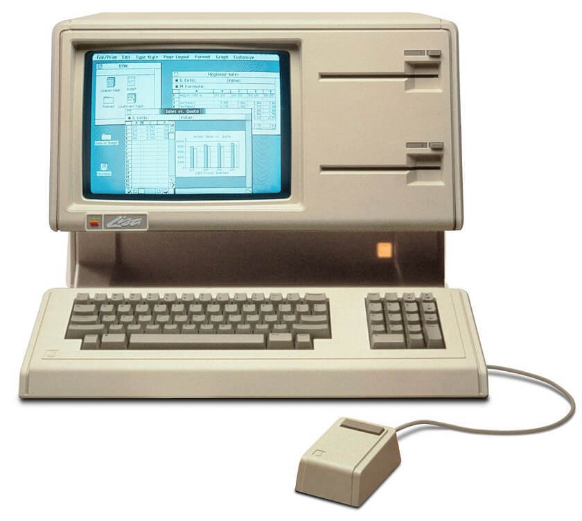
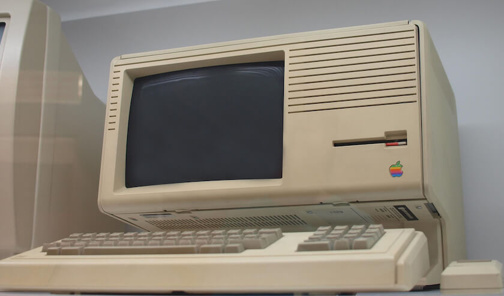

Apple Lisa 是苹果电脑公司 1983 年上市的一款个人电子计算机，是第一款搭载图形界面的个人电脑。

Apple Lisa 最初开发计划始于 1978 年，当时 Lisa 开发小组希望开发出一款针对企业和个人用户的全新操作方式的电脑，乔布斯参与了 Lisa 的开发。

    
    
正在运行的 Apple Lisa

Lisa 是以乔布斯的女儿的名字 “丽萨”（Lisa）来命名的。对此苹果的官方解释是“本地集成系统架构”（Local Integrated Systems Architecture）的缩写，而工程师们则私下解释为“Lisa:编造的愚蠢“缩写（Lisa:Invented Stupid Acronym）。在《乔布斯传》作者沃尔特·艾萨克森问起这件事时，乔布斯坦率承认Lisa是以他女儿的名字命名的。而当初给Lisa电脑定名的时候，是乔布斯提出了Lisa这个名字，让工程师们倒推出一个全称的。

## 一、Apple Lisa 参数

### 总览

|         |           |
|---------|-----------|
| 发布日期 | 1983 年 1 月 |
| 停产日期 | 1984 年 1 月 |
| 市场口号 | Apple invents the personal computer.Again. |
| 市场售价 | $9995 |
| 支持状态 | 已停售,已停止技术支持 |
| 产品颜色 | 米黄色 |
| 重量尺寸 | 约 21.77 KG   350.52mm H x 474.98mm W x 386.08mm D |

### CPU 内存和存储

|         |           |
|---------|-----------|
| CPU型号 | Motorola 68000 |
| CPU速度 | 5MHz，16位 |
| 核心数 | 1 |
| 总线速度 | 5MHz |
| 内置内存 | 无 |
| 最大扩展内存 | 2M |
| 硬盘接口 | 未知 |
| 硬盘 | 选配 5MB 或 10MB Apple ProFile 硬盘 |
| 扩展存储 | 2x 内置 871KB Apple FileWare 5.25 英寸软驱 |
| ROM | 16K |

### 固件和系统

|         |           |
|---------|-----------|
| 内置固件 | 未知 |
| 支持 OS | Lisa Office System 1.0 |

### 内置接口和输入设备

|         |           |
|---------|-----------|
| 串口 | 2x RS-232C，1x DE-9 |
| 扬声器 | CVSD |
| 显示接口 | 1x AV端子输出 |
| 内存插槽 | 2x Apple Lisa 内存板槽 |
| 其他插槽 | 3x Apple Lisa 扩展槽 接口 |
| 键盘 | 76 键打字机样式独立键盘（附带10数字键） |

### 工作电压

|         |           |
|---------|-----------|
| 最大功率 | 270W |
| 工作电压 | 115 – 230V AC |

## 二、Apple Lisa 2 参数

Apple Lisa 2 是Apple Lisa 的升级版， 售价也有所降低。除此之外，最明显的改变莫过于外观上由原来的两个 5.25 英寸软盘位变成了一个 3.5 英寸软盘。

    
    
Apple Lisa 2

### Lisa 2 总览

|         |           |
|---------|-----------|
| 发布日期 | 1984 年 1 月 |
| 停产日期 | 1986 年 1 月 |
| 市场口号 |  |
| 市场售价 | $3495 – 5495 |
| 支持状态 | 已停售,已停止技术支持 |
| 产品颜色 | 米黄色 |
| 重量尺寸 | 约 24.94 KG   350.52mm H x 469.9mm W x 386.08mm D  |

### CPU 内存和存储

|         |           |
|---------|-----------|
| CPU型号 | Motorola 68000 |
| CPU速度 | 5MHz，16位 |
| 核心数 | 1 |
| 总线速度 | 5MHz |
| 内置内存 | 无 |
| 最大扩展内存 | 2MB |
| 硬盘接口 | 未知 |
| 硬盘 | 内置 10 MB 硬盘(Lisa2/5)   选配 5MB 或 10MB Apple ProFile 硬盘（Lisa 2 和 Lisa 2/5） |
| 扩展存储 | 1x 内置 400KB 3.5 英寸软驱 |
| ROM | 16K |

### 固件和系统

|         |           |
|---------|-----------|
| 内置固件 | 未知 |
| 支持 OS | Lisa Office System 3.1 |

### 内置接口和输入设备

|         |           |
|---------|-----------|
| 串口 | 2x RS-232C，1x DE-9 |
| 扬声器 | 1x 内置扬声器 |
| 显示接口 | 1x AV端子输出 |
| 内存插槽 | 2x Apple Lisa 内存板槽 |
| 其他插槽 | 3x Apple Lisa 扩展槽 接口 |
| 键盘 | 76 键打字机样式独立键盘（附带10数字键） |

### 工作电压

|         |           |
|---------|-----------|
| 最大功率 | 150W |
| 工作电压 | 115 或 230V AC |

## 三、Apple Lisa 系列系统和软件

Lisa 使用的操作系统在当时具有先进的多任务和内存保护模式。系统设计在概念上类似于 Xerox，是一个办公用途的系统。

Lisa 的系统有两种模式，Lisa Office System 和 Workshop ,一个是办公环境，一个是开发环境。它内置了 7 个软件，分别是：LisaWrite，LisaCalc，LisaDraw，LisaGraph，LisaProject，LisaList，LisaTerminal。

## 四、总结

毫无疑问，Lisa 是一个优秀的产品，Lisa 的操作系统很先进，但是由于它的复杂性超出了处理器的能力，以至于用户觉得它很缓慢，特别是在滚动文本的时候。

由于高成本高售价，并且被更加廉价的 Macintosh 挤压，1986 年 Apple Lisa 停产。

---------

出处：https://www.maczd.com/post/11.html


