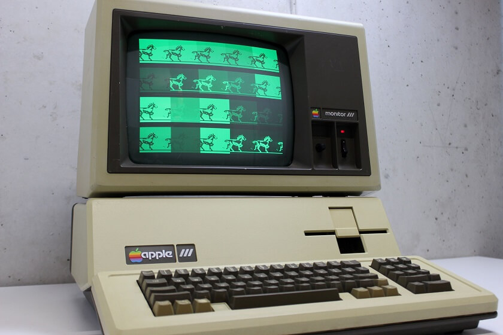
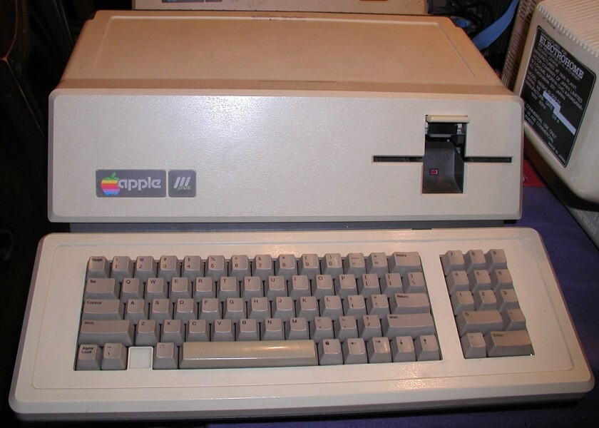

Apple III 系列电脑是原苹果电脑公司 1980 年 5 月推出，面向商业用户推出的电子计算机产品。它的上一代产品是 Apple II 系列，作为升级版下一代产品，Apple III 系列却没有像 Apple II 系列那样畅销，最终于1985 年 9 月就匆匆停产。

    
    
一台正在运行的 Apple III

Apple III 系列包括：

 1. Apple III（1980 – 1984）
 2. Apple III Plus（1983 – 1985）

## 一、Apple III / Apple III Plus 参数

### 总览

|         |           |
|---------|-----------|
| 发布日期 | 1980年5月(Apple III)   1983年12月(Apple III Plus) |
| 停产日期 | 1984年4月(Apple III)   1985年9月(Apple III Plus) |
| 市场口号 | |
| 开发代号 | Sara |
| 市场售价 | $4340 – 7800(Apple III)    $2995(Apple III Plus) |
| 支持状态 | 已停售,已停止技术支持 |
| 产品颜色 | 米黄色 |
| 重量尺寸 | 约 11.79 KG   121.92mm H x 443mm W x 462.28mm D |

### CPU 内存和存储

|         |           |
|---------|-----------|
| CPU型号 | MOS Technology 6502A(Apple III)   MOS Technology 6502b(Apple III Plus)
| CPU速度 | 1.4MHz-1.8MHz，8位
| 核心数 | 1
| 总线速度 | 1MHz
| 内置内存 | 128K 或 256K (Apple III)   256K (Apple III Plus)
| 最大扩展内存 | 512K（板载）
| 硬盘 | 未知
| 硬盘接口 | 选配 5MB Apple ProFile 硬盘
| 扩展存储 | 内置 5.25 英寸软驱
| ROM | 4K

### 显示

|         |           |
|---------|-----------|
| 分辨率 | 280×192（16bits色）   280×192（单色）   560×192(单色) |
| 显示连接 | 1x RCA AV端子   1x DB-15 |
| 字符显示 | 24行，每行80字符（单色）   24行，每行40字符（16位色）   24行，每行40字符（单色） |

### 固件和系统

|         |           |
|---------|-----------|
| 内置固件 | 未知 |
| 支持 OS | Apple Sophisticated Operating system（SOS）1.0（Apple III）   Apple Sophisticated Operating system（SOS）1.3（Apple III Plus） |

### 内置接口和输入设备

|         |           |
|---------|-----------|
| 串口 | 1x DB-25 兼容 RS-232C，2x DB-9 |
| 扬声器 | 1x 3.5mm音频接口，1x 内置喇叭 |
| 显示接口 | AV端子输出 |
| 其他接口 | 4x  50针 Apple II 接口 |
| 键盘 | 内置 61(主键位) 键位 + 13(数字键) ASCII 标准键盘 |

### 工作电压

|         |           |
|---------|-----------|
| 最大功率 | 未知 |
| 工作电压 | 110-120V AC |

## 二、Appel III系列的历史

### 1）Apple III

Apple III 开创性的支持 80位大小写字母显示，九宫格数字键盘，实时日期时钟显示，16位色显示能力，设计上也很先进，这就导致了它的售价不菲，远高于同时期其他类似的电脑产品。

同时，采用了新工艺的主板电路也存在缺陷，容易出故障，抬起主机放下就有可能让主机重置。此外，新工艺也使得检测修理变得很昂贵而且也要花费一些时间。

除此之外，内置的时钟经常失效，这是由于零件供应商提供了有瑕疵的部件。然而，苹果公司将时钟芯片直接焊在电路板上，很难靠测试电路板找出故障芯片。最终，苹果公司不得不取消 Apple III的实时时钟以解决此问题，而不是更换芯片。

另一个更让人头疼的问题是散热。Apple III 为了追求低噪音而取消了风扇。早期电脑使用厚钢板做成的机箱，散热非常不好，这就导致 Apple III 经常过热，出现花屏，甚至整个损坏，这也是为什么存留至今 Apple III 非常少的原因之一。

针对散热问题的修复， 苹果公司免费更换之前已售出的 4000 台 Apple III。购买这些机器的用户更换了全新的机器，新机器重新设计了电路板。

### 2）Apple III Plus

作为 Apple III 的改进产品，Apple III Plus 在1983 年 12 月上市。Apple III Plus 修复了原先的硬件问题，并提供了 256K 内存，隔行扫描显示新技术。

    
    
Apple III Plus 的主机

但 Apple III Plus 的上市也没有挽回 Apple III 系列销量的颓废。同时期各种电脑特别是 IBM 机器无论在价格还是速度上都优于 Apple III Plus。

最终，Apple III Plus 在 1985 年黯然停产。

## 三、相关视频

能保存到现在还能使用的 Apple III 非常稀少，几乎很难见到。我们只能从一些视频中领略它的内部结构和操作。

以下视频来自 Adrian Black，于 2017 年 12 月录制，讲述一台 Apple III 的维修和使用经过。

本视频内容由 Bilibili 博主 初生之鸟 进行翻译。

Bilibili 地址：<https://www.bilibili.com/video/av17593483>

Youtube 地址：<https://www.youtube.com/watch?v=5qMP6A_U75E>

---------

出处：https://www.maczd.com/post/10.html


