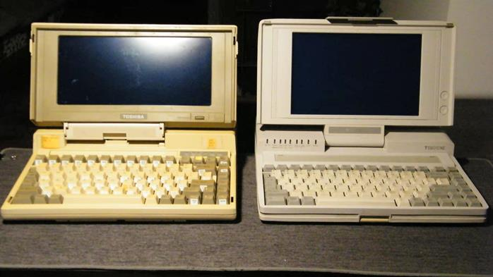

## 契机

大约在2016年，某个夏日的夜晚，还是小学六年级学生的我像往常一样，坐在电视机前，等待老爸播放这周的电影。那天是周五。我家有个传统，会在周五由老爸挑一部电影，全家人坐在沙发上，享受晚上的休闲时光。

记得那次放的电影是《乔布斯传》。电影拍得不错，但其中最吸引我的，是乔布斯早期接触过的那些电脑设备。那种闪烁着绿色荧光的屏幕，是我第一次见，感觉真是太帅了。于是乎，我开始对古董计算机产生兴趣。

    
    
最早的收藏

这张图片是我初二时拍摄的。左上角是夏普PC-1500，是我最早收到的一台古董计算机。夏普PC-1500使用了一块修改版Z80处理器，内存有2KB，但可以加内存卡，最多能达到18KB。这台机器在国内保有量极大，价格也十分便宜，是爱好者入门的最佳选择。夏普PC-1500有配套的底座（底座有绘图功能）、人造皮革盒子，还有可选配件，比如图中夏普PC-1500左边的那个小盒子，是它的串口通讯模块。夏普PC-1500的底座里有镍铬充电电池，接近40年的历史让它彻底损坏，出现漏液，所以一拿到手，我就将电池拆了下来，这是拿到古董计算机之后应该做的第一件事。

夏普PC-1500下面的是兄弟EP-20打字机，非常普通的机器，使用热升华原理打印。原配色带早已停产，但是如果使用热敏纸，就可以不用色带，也能打印。

演示视频：<https://www.bilibili.com/video/BV1fb4y1S7fe?spm_id_from=333.999.0.0>

兄弟EP-20打字机下面是Kyotronic 85膝上电脑，它使用8085CPU，内存有16KB。这台电脑当时是四兄弟：

    

    

    

    

这四台电脑内部架构几乎一模一样，所不同的是它们的制造商，从左往右依次是：京瓷、RadioShack、NEC和Olivetti。这台电脑据说是当年美国记者最爱使用的记录工具。机内附带了几个程序，有BASIC解释器、文字编辑器和通讯工具。

刚到手的时候，它的键盘有几个按键失灵，拆开后发现，键盘电路板有开裂，所幸并不严重，只要飞线就能解决。受制于技术，当年的电脑集成度不高，主板上芯片非常多。有时候，这种布满集成电路的电路板有特殊的美感。

    

    

演示视频：<https://www.bilibili.com/video/BV1jX4y1P7dL?spm_id_from=333.999.0.0>

右侧从上往下，依次是卡西欧FX-801P、NES游戏主机、中华学习机CEC-I和夏普MZ-700。

卡西欧FX-801P是当时一款常见的可编程计算器，机器附带了一个磁带机和热敏打印机，可以说麻雀虽小五脏俱全。NES游戏主机是FC（也就是所谓“红白机”）的北美版本，个人感觉它的外观比FC好看。中华学习机是Apple II的国内修改版，增加了汉字字库和一些内置程序（LOGO绘图程序）。夏普MZ-700是当时一款常见的家用机，使用Z80处理器，内存有16KB。我收到的版本其实是MZ-731。

    

如图，真正的MZ-700键盘上方是没有任何东西的，而MZ-731则附带了一个四色矢量绘图仪（和夏普PC-1500底座上的那个是一样的结构，不同之处在于绘制的宽度）和一个磁带机。不过这绘图仪和磁带机都是可拆卸的，可以看作是“扩展模组”。在这里，权且把MZ-700看作是一个系列的名称吧，可以这么理解：MZ-731是MZ-700系列中的一种配置。

刚收到这台机器时，它的键盘有按键失灵，绘图仪的撞针结构也无法动弹。所幸也是很容易修复的故障。

    

    

    

个人认为，MZ-700的外观非常漂亮，键盘非常养眼（尽管手感不好）。不过美中不足的是，这款机型没有图形显示功能，只能通过特殊的字符拼出“图形”。尽管如此，MZ-700平台上依然有很多相当出色的游戏，这些游戏可以在SharpMZ网站上下载。

但是，如何将游戏文件加载到这么老的电脑上呢？

首先，用SharpMZ网站提供的一个转换程序，将游戏文件转换为WAV音频，然后用录音机将音频录入磁带，再把磁带放到机器的磁带机上读取，就可以啦。

演示视频：<https://www.bilibili.com/video/BV1Yy4y1E7wc?spm_id_from=333.999.0.0>

照片中还有一些小玩意，其中比较有意思的，是GameBoy打印机和GameBoy相机。

任天堂在1989年发布了一款便携式游戏机——GameBoy。它和红白机一样，需要插卡才能玩。然而在90年代中后期，任天堂似乎不打算让GameBoy停留在“游戏机”层面。于是乎，GameBoy Camera登场了。这是一种特殊的游戏卡，它带有一个3.6mm²的CCD图像传感器，可以拍摄30张128x112分辨率的灰度图像。这些图像甚至能通过配套的热敏打印机打印出来，几乎就是一台“拍立得”相机。

    
    
GameBoy相机和打印机

    
    
GameBoy相机拍摄的图像

## 开始迷上计算器

初二暑假的一个下午，我在逛数码之家论坛的时候，看到了这样一个帖子：

<https://zhuanlan.zhihu.com/p/188540332>

***“电与磁的极致艺术”***

帖子中介绍的HP9100计算机，它那密布原件的电路板、前卫的后现代造型、令人惊叹的技术，让我赞叹不已。从那时起，我开始将注意力转移到计算器上。

    
    
部分计算器收藏

在收藏计算器的这段时间里，我认识了不少有着相同爱好的人，也丰富了关于古董计算机的知识。在初二到高一的这段时间里，我陆陆续续集齐了一些在计算器发展史上有一定意义的机器，比如三大计算器制造商的初代图形计算器（Casio fx7000g、HP 28S和TI-81）。其中，我收藏的最老的计算器是Casio Personal Mini（1974），这是世界上第一台手持式计算器Casio Mini的后续版本。许多70~80年代的计算器使用荧光管（VFD）作为显示器。荧光管是一种电子管，能发出幽幽的蓝色荧光——那是阴极射线撞击在稀土元素上发出的光，非常好看。

古老的计算器有一个非常有趣的地方：在计算时有明显的延迟，在这段时间里，你可以看到屏幕上有数字在飞快地跳动——这是计算器内部工作的写照。

Casio Personal Mini就有这种现象，请看视频：

<https://www.bilibili.com/video/BV1SZ4y1j7jc?spm_id_from=333.999.0.0>

## 回归计算机收藏

高一下学期，我注册了支付宝和闲鱼账号。

闲鱼是一个网上二手交易平台，时不时会出现一些正在出售古董计算机。

以前，一般都是我的父母帮我购买这些老设备，而我知道，太贵的机器是买不来的，所以我一般都挑便宜的买。有了自己的闲鱼账号之后，我发现，很多标价较高的机器，可以通过砍价砍到一个非常低的价格。于是乎，我用压岁钱又买了一大批机器。

    
    
ThinkPad系列（从左往右、从上往下：370C、380Z、345C、750C、220、230CS、340CSE、560X）

展示视频：

750P：<https://www.bilibili.com/video/BV1c64y1c7o1?spm_id_from=333.999.0.0>

230CS：<https://www.bilibili.com/video/BV1vb4y1d7yi?spm_id_from=333.999.0.0>

370C：<https://www.bilibili.com/video/BV1sV411s7mA?spm_id_from=333.999.0.0>

    
    
从上往下、从左往右：HP Omnibook 800CT、SHARP CS2166、TQ-12H、IBM ThinkPad 750P、三菱Amity、NDSL、EPSON HX-20、Commodore 116、Casio fx-120、TI Voyage 200

    
    
IBM打印机

    
    
IBM 5152打印机

展示视频：<https://www.bilibili.com/video/BV1Zw41197GG?spm_id_from=333.999.0.0>

IBM 5152打印机是和著名的IBM 5160配套的，这一点可以在老照片中得到证明。

    
    
最左边的那个就是IBM 5152

    
    
DEC AlphaStation 200高性能服务器（1994年发布，使用了64位处理器）

展示视频：<https://www.bilibili.com/video/BV1KL411n7hm?spm_id_from=333.999.0.0>

    
    
卡西欧PB700

展示视频：<https://www.bilibili.com/video/BV173411z77c?spm_id_from=333.999.0.0>

这台机器和夏普PC-1500一样，在当时也是进口了很多。但这台机器的显示功能更加强大，图形处理功能也更加出色。国内曾有过仿制（贴牌？）机型，叫做“南华”。这台机器的底座上继承了绘图仪和磁带机，磁带机有两种版本，一种用的是上图的普通磁带，另一种用的是迷你磁带。

因为年代久远，绘图仪的塑料拨片断裂了，所幸也不难修复。

    
    
HP 37900D信令分析仪

展示视频：<https://www.bilibili.com/video/BV1JU4y1F7yw?spm_id_from=333.999.0.0>

这台机器使用了EL屏幕，琥珀色的黄色光芒，非常有赛博朋克的感觉。

    
    
佳能Navigatior HD40

演示视频：<https://www.bilibili.com/video/BV11m4y197WB?spm_id_from=333.999.0.0>

这台机器是一个传真机，但是内置了一台完整的计算机。它使用8086处理器，标准的PC AT架构，可以运行Windows 2.03。机器还有一个触摸屏，可以在内置的“麒麟传真收发系统”中操作。

机器非常重，估计有20千克。机器的CRT屏幕似乎使用了长余辉材料，关机之后屏幕上还有图像残留，很长时间才消失不见。

因为使用的是AT架构，所以一般的键盘是无法接上去使用的。必须使用一个转接器才能将现代的PS/2接口键盘接在这台机器上。

    
    
东芝Libretto 50M

非常迷你的笔记本电脑，使用了奔腾处理器。有触摸屏，在当时算是非常不错了。

    
    
兄弟牌电动助力打字机

演示视频：<https://www.bilibili.com/video/BV1HY411V7VZ?spm_id_from=333.999.0.0>

机械打字机的升级版，打字更省力，回车、换行能自动进行。

    
    
Bondwell B200笔记本电脑

演示视频：<https://www.bilibili.com/video/BV1wr4y1a7Jm?spm_id_from=333.999.0.0>

普通的8088笔记本电脑，世界上最早的一批笔记本电脑之一。键盘失灵，还没有修复。屏幕有一些故障，应该是电容老化。注意，这种老笔记本电脑的软驱一般是720K的，1.44MB格式化的软盘并不支持。

    
    
左：东芝T1200 右：东芝T1200XE

T1200演示视频：<https://www.bilibili.com/video/BV17v411x75T?spm_id_from=333.999.0.0>

T1200是世界上最早的笔记本电脑之一，带有一块20MB硬盘，8086的CPU。

T1200XE是一台普通的286笔记本电脑，也带有一块40MB硬盘。

## Vintage和Modern的结合

收藏了很多机器之后，我开始思考，怎样用这些机器做一点有趣的事情。

首先，我想到了我收藏的一台矢量绘图仪——夏普CE-515P。

为什么说它是“矢量绘图仪”呢？因为，它的绘图方式，是直接拿一只笔在纸上移动，画出来的都是线条，因此不存在所谓“点阵”一说，而是真真正正的“矢量”。如果要绘制圆形，则使用许多直线近似。虽说矢量理论上分辨率无限，但在这台机器上，精度受制于步进电机的最小步距，这大概是0.2mm，也够高了。

    

一开始，我在网上无法找到它的原配说明书，不过这台机器当年在国内相当流行，并不缺乏资料。在知网上，我查到了驱动它的方法。我写了个C++小程序，能把图片转换成CE-515P可以接受的代码。

    
    
我在知网上找到的文章

    

我把CE-515P通过LPT接口连接到IBM ThinkPad 345C上，再通过软盘将转换好的代码文件拷到IBM ThinkPad 345C上，用DOS自带的EDIT软件打开，用Print功能向LPT端口发送代码，就能实现矢量图绘制。

在驱动过程中，我遇到了很多困难。最初很不成功，绘制的线条位置完全错乱。我仔细地查找原因，发现，每个指令都必须有回车符隔开，并且划线指令后面接的坐标个数有限制。明白这两点花了我很长时间，在老设备上调试也是十分的麻烦。但是，这就是玩老机器的乐趣所在：像侦探一样发现问题，享受解决问题带来的成就感。

我将CE-515P绘制图片的过程拍摄成视频，发到了哔哩哔哩视频网站上，收获了可观的播放量。

链接：<https://www.bilibili.com/video/BV1v64y1b7qY?spm_id_from=333.999.0.0>

许多人对于老电脑的印象是：又慢又卡，放视频像PPT。但就我的经验来看，并不是这样的。在给IBM ThinkPad 345C换上CF卡固态硬盘后，开机能稳定在20秒之内——这已经超越许多现在的电脑了。在使用Windows3.2操作系统时，也没有多少的卡顿出现。我并不是想把老机器和新机器进行没有意义的比较，老机器上的程序所需要的计算量并没有现在的程序那么大，因此在老平台上使用体验并没有很差。但在这里，我想反驳一下某些把老电脑和“又慢又卡”等同的门外汉。

在老电脑平台上，能体验到很多软件的初代版本。比如，1994年发布的Adobe Premier 1.1现在还可以用来剪辑视频，这是一种相当不同寻常的体验。

    
    
在一台486笔记本电脑上用Premier 1.1剪辑视频

使用视频：<https://www.bilibili.com/video/BV1vi4y1o7aQ?spm_id_from=333.999.0.0&vd_source=d1096704192403b7037bba2d2bfa5b39>

收藏古董计算机，还可以体验许多数码产品的“最初形态”：

比如，左图是最新推出的Surface

    

    

Laptop Studio笔记本电脑，右图是世界上第一款翻转屏笔记本电脑——IBM ThinkPad 750P，发布于1994年。二者都采用了翻转屏设计，且都有数位屏功能。

某种意义上，古董电脑上的很多设计是现代电脑的“祖宗”。

## 未来和展望

作为一位准大学生，我越发感到，保存计算机历史记忆的意义重大。作为一名收藏者，我有一种使命感，那就是，要将这些设备完好地保存下去。有许多人觉得我这是在“捡垃圾”，是“垃圾佬”，但其中真正的乐趣和意义，只有圈内人能理解、明白。无论如何，我都会努力继续下去，这相当于是我人生的一大事业。同时，我会在哔哩哔哩视频网站上继续更新视频，将古董计算机的文化、知识，传递给更多的人。

2022年6月16日 星期四

Cansanel

---------

作者：方可元

昵称：Cansanel

学生，古董计算机收集爱好者，哔哩哔哩UP主

转载自si9ibd9tpre8g7的图书馆


