## 缘起

随着技术的发展，各类产品的形态一直在不断变化，近几十年间，就连恶意软件都在不断地改头换面。眼下，各种恶意软件的主要目的是窃取用户的信用卡信息和身份信息，有些玩的大的黑客甚至用恶意软件瘫痪了核电站。此外，现代黑客都很小心，这些攻击行为一般都非常隐蔽。不过回顾历史，之前的恶意软件可不是这样的。相比窃取账户牟利，老一代黑客更喜欢用病毒摧毁别人的电脑，而且他们以这些行为为荣，经常在受害者屏幕上打出各种嘲讽的文字，炫耀意味十足。

不过现在这类病毒已经不多见了，它们经常利用的漏洞早就被微软或者新的防护机制给彻底封死了。最近，Internet Archive (archive.org) 添加了一个特别的版块“Malware Museum”，让我们得以一瞥当年的历史。这家恶意软件博物馆由芬兰安全公司 F-secure 的首席资源官米科·哈普林 (Mikko Hypponen) 一手打造，收藏了上世纪80和90年代的一些 MS-DOS 病毒。

为了方便国内用户访问，本站开辟了专题展览板块——“DOS病毒博物馆”，对其进行展示。在浏览了这个博物馆后你会发现其实过去的黑客都还挺简单的，他们要么会故意毁掉你的硬件，要么就完全是在炫技搞恶作剧。下面我们开始漫游“DOS病毒博物馆”。

## 漫游

电脑病毒竟然和小游戏一样好玩。

在“DOS病毒博物馆”这个线上博物馆里，你会发现了一批带有 “复古” 气息的电脑病毒。

### 最萌病毒 —— WALKER

    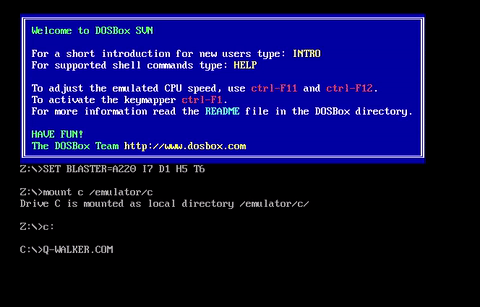
    
WALKER 病毒：大王叫我来寻你的电脑

有没有想起 32 位像素红白机？但其实它们的年纪，可能比你都要大。Q Walker病毒又是一个标准的炫技病毒，它会在屏幕上绘制一个穿蓝色大衣、手持武器的老人，这个形象出自游戏《Bad Street Brawler》。

在体验中的某一刻，甚至觉得它们的“萌”，超越了历史，不小心就击中了喜爱二次元的我。

### 最赌病毒 —— Q CASINO

Q CASINO 病毒强迫用户在保存文档时 “赌” 上一局。如果输了，你的文档也就没了。

    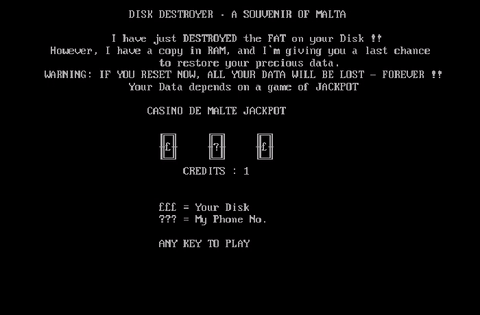
    
Q CASINO 病毒：简直就像玩老虎机

### 活泼的弹窗病毒 —— HYMN

    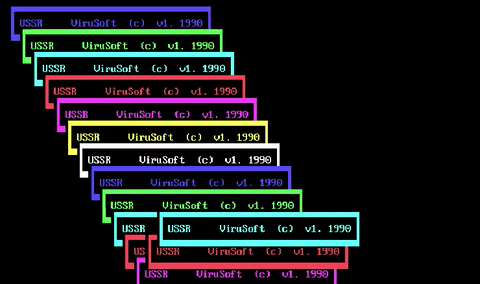
    
HYMN： 总有一种 Windows 电脑死机的错觉

大多数电脑病毒带有电子音背景。配合弹窗画面，怀旧感十足。

### 最得瑟的病毒 —— MARKIZ

    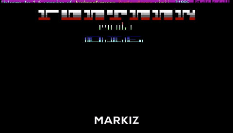
    
MARKIZ 病毒：从没见过你这么嘚瑟的病毒

### 最浪漫的病毒 —— ELVIRA

    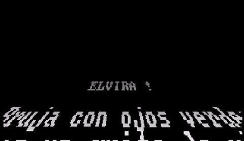
    
ELVIRA.COM 病毒：这不就是星球大战的滚动字幕吗

这不是星球大战的滚动字幕吗，清醒点，这可不是最新一部《星球大战》的视频文件，当ELVIRA！字符出现在你的电脑屏幕上，其实意味着系统中了病毒。

但是别担心！ELVIRA病毒并不会对程序或CPU造成什么伤害，只是会在每天的16：30自动播放一段浪漫的情诗。

>ELVIRA !艾莉薇雅！（英语） 
>Black and White 
>Girl衣色黑白的女孩 
>from Paris从巴黎而来 
>You make me feel 
>alive.你让我如沐春风 
>ELVIRA !艾莉薇雅！（法语） 
>Pars. Reviens. 
>Respire.你离去、又归来、轻喘着 
>Puis repars.倏而远走 
>J’aime ton 
>mouvement.怎能不为你的活力沉醉 
>ELVIRA !艾莉薇雅！（西班牙语） 
>Bruja con ojos 
>verdes有着绿眼睛的姑娘 
>Eres un grito de 
>vida,你是我生命的呼喊 
>un canto de 
>libertad.为你献上这首自由的歌唱 

### 最暖病毒 —— SKYNET

早年的病毒只是出于黑客的兴趣，大部分病毒并无太大杀伤力，甚至有些还卖萌说：

>“我其实是一个很温柔的病毒。”

    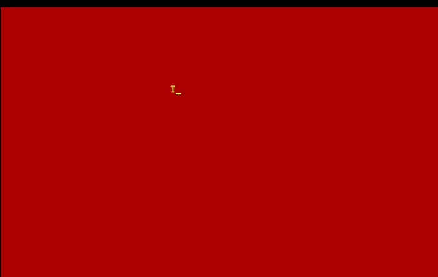
    
SKYNET 病毒: 作为一个病毒这样卖萌真的好吗?

>“别怕， 
>我是个很友好的病毒， 
>你今天做的工作已经够多了， 
>所以我会让你的电脑慢一点， 
>好运， 
>拜拜” 

如果去掉“病毒”两个字，这么温柔又体贴的软件你舍得它离开吗？

### 最有创造性的病毒 —— MARS

    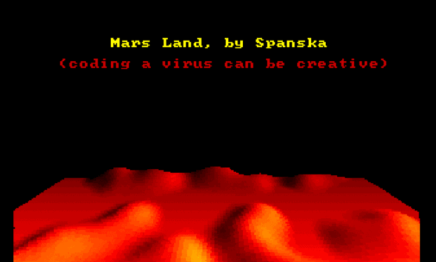
    
MARS 病毒

MARS病毒会控制被感染的系统，用代码绘制有着红色隆起的地形，也许这种画面在现在的我们看来非常简陋，然而在以像素图和文字为主流的DOS时代，这种以体素（voxel，基础的3D“像素”）绘制的三维图像几乎超出了当时所有软件的视觉效果。

“写病毒也可以很有创造性”，对于这一点，也许应该有限度地表示认同，当然，如果它不是一个病毒那就更好不过了。

### ZHU 病毒

    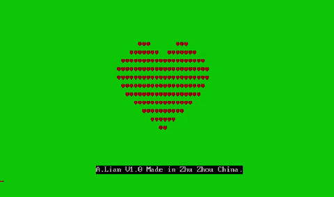
    
ZHU 病毒：中国制造，这个配色很有特色

### HA! ：“熊孩子”哈哈病毒

    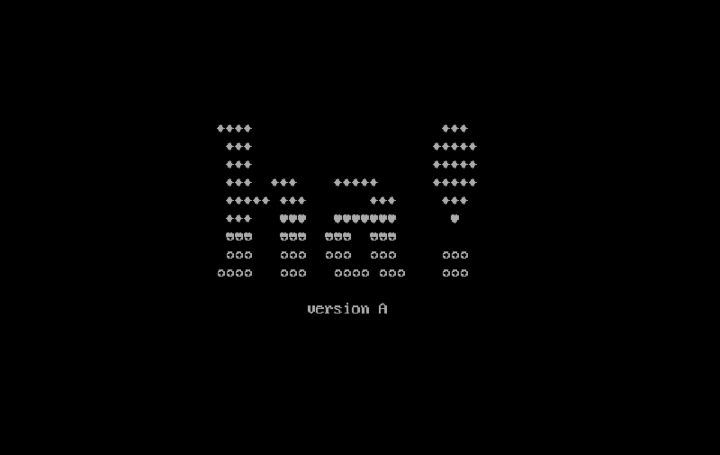
    
HA! 病毒

### MARINE 病毒

    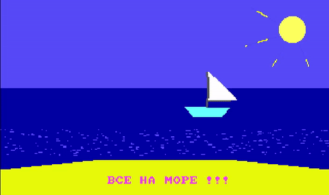
    
MARINE 病毒：我小学一年级的画作也能拿来做病毒？

### TECHNO 病毒

Techno 也是一个有趣的病毒，它会侵占电脑的命令文档，快速播放电子音科技感舞曲长达 110s，直到 TECHNO 字样布满整个电子屏幕，而在重启十次之后，它又会再放一遍。

    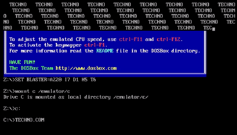
    
TECHNO 病毒：妈妈，就是这个病毒残害了我的耳朵。

### 别样的技术美学

上世纪 90 年代末是病毒的繁荣期，其实，在当年的 DOS 系统下尚未出现图形交互界面，想要绘制出如此动感的画面，并不是一件很容易的事情。当时的先驱们为了一时的炫技，想必也是颇费了一番心思。

    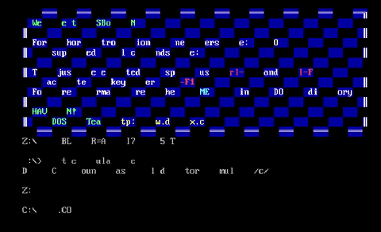
    
AA 病毒：我做 PPT 也用这个 “棋盘式” 动画

在电脑病毒博物馆中绿叶、彩虹、波普风格的图案展示，为我们展现了去除 “致毒” 部分后留下的美学和信息价值。

    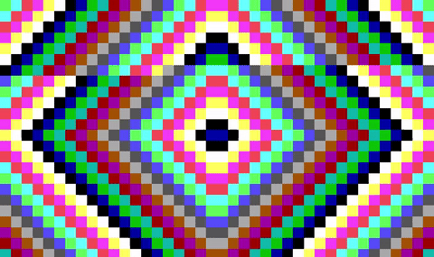
    
VIRDEM 病毒：HM 今年流行这个花色的裙子

有些病毒更像是一种波普风格的数字艺术，让人眼花缭乱却又不失美感。

虽然它们时代遥远，但却有着一种浓浓的现代感。很好奇当年的程序员哥哥们是怎么做出这么有趣的病毒的。

    
    
LSD 病毒：好像在显微镜中观察细胞

### 会感染电脑吗？

你可能好奇如何 “玩” 这些 DOS 时期的酷炫电脑病毒？

电脑病毒博物馆专门将这些病毒 “搬上” 了网页版的 JavaScript 模拟器。使用网页交互，不同电脑、不同操作系统的人都可以体验到感染 DOS 时期病毒的场景。

    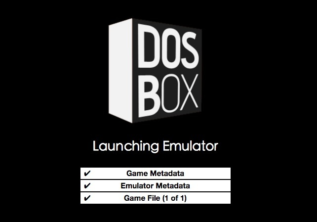
    
DOSBox

由于系统的更新换代，这些古老的病毒们早已不再具备实际上的危害，甚至从现代技术眼光看来，有些病毒的编写显得颇为稚嫩粗糙。

病毒同样是时代的记忆，他们曾经在那个时代留下了影响。如果没有电脑病毒博物馆，这曾经有趣的历史，就会不经意间，与你我彼此错过。

---------


