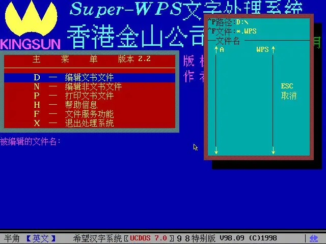
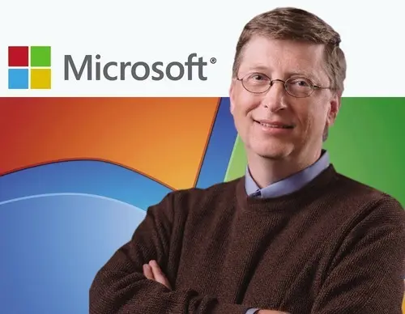
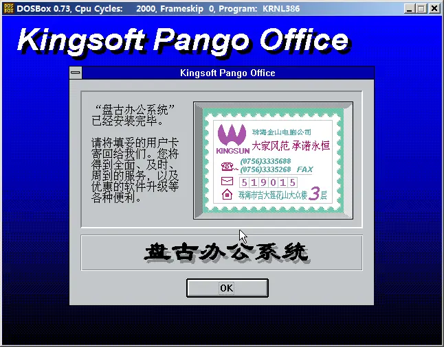

WPS是一款神奇的软件。

年龄大（比如：70后）的人往往很熟悉。那是因为曾几何时，WPS并不只意味着一款字处理软件，它甚至就是个人电脑的代名词。

年龄小些（比如：90后）的人往往很熟悉。那是因为这几年WPS因为强大的功能、免费使用和全平台覆盖正在逐步成为国内装机率最高的应用软件之一。

那么中间那段时间怎么回事儿？关于这个故事就可以引出来“中国第一程序员”求伯君的故事。当然如果细究求伯君的故事还可以引出来雷军的故事。今天讲讲求伯君的故事。

他被称为“中国第一程序员”，25岁就凭一己之力击溃“英美联军” 为何却在最巅峰的时候激流勇退？20年前，在中关村随便招呼一声，立马会围过来1000个粉丝，比盖茨火多了。他曾果断拒绝微软开出的75万美元年薪，只为打造独一无二的民族品牌，他就是“WPS之父”求伯君。

<div align="center">
    
    <p>求伯君</p>
</div>

1964年11月，求伯君出生在浙江新昌。3岁话还没说利索，就先背会了九九乘法口诀。5岁的时候，求伯君的围棋水平已经达到业余五段。

上小学，求伯君的数学天赋彻底爆发了出来，十次考试有十次满分。到后来，只要求伯君在课堂，数学老师就有点小紧张，因为他总能挑出毛病，一不小心数学老师就被带沟里。

高中，求伯君连续3年参加县里的数学竞赛，每次都是毫无悬念的第一。

1980年高考，求伯君以数学满分的傲人成绩考入国防科大数学系。这一年，比求伯君大8岁的张旋龙正在香港准备接手父亲的金山公司。

```
张旋龙，方正集团董事，是方正集团创办人之一，也是金山软件创始人之一。今天的“金山软件股份有限公司”是由香港金山公司衍化而来。香港金山公司是张铠卿在1973年创建的。张铠卿是张旋龙的父亲。1980年以后，香港金山公司由张旋龙接手管理。
注：张旋龙与张小龙没有亲属关系！呵呵！
```

<div align="center">
    
    <p>张旋龙</p>
</div>

1983年12月22日，我国第一台每秒钟运算达1亿以上，代表巨型计算机最高水平的计算机——“银河”在国防科大横空出世。求伯君非常兴奋，因为当时他正在为开发学校的图书管理系统软件而日夜奋战。

结果4天以后，管理软件“冒烟”测试成功，那个程序也让他小赚40块。随后“一个学生成功开发国防科大图书馆管理系统”的消息被刊登在长沙日报上，求伯君一时间成了新闻人物。

1984年8月，求伯君被分配到河北徐水的石油部物探局仪器厂。当年年底，他就发现当时最流行的汉字系统CCDOS输入法存在一个小bug，由此导致电脑运行速度特别慢。

求伯君三下五除二搞定了那个漏洞，此后输入一个汉字能节省一倍多的时间，求伯君就成了厂里的红人，不少企业要过来挖角。

1986年春天，厂里来了5个深圳大学的实习生，求伯君暗恋上了其中一个长发飘飘的。可是酝酿了3个月，那三个字楞没说出口。

等实习女生走了以后，求伯君才回过味来“人世间最痛苦的事情莫过于此”，他后悔莫及，决定马上追去深圳。

不过等真到了深圳，求伯君一个星期就把那女孩子忘记了，因为“深圳什么都好”，他第一次听说“时间就是金钱，效率就是生命。”

求伯君突然意识到自己一直都在“浪费生命”。等公交车到了深圳大学的门口，求伯君却决定马不停蹄赶回了原单位，他要辞职。

求伯君离开徐水后的第一站是去涿县，因为那里有个大学同学相约见面。

不巧，老同学遇到了计算机打印的难题，求伯君赶紧帮忙。一帮不要紧，马上搞出了一个24点阵打印驱动程序。老同学一看高手来了，“为什么不搞一个通用的？”

于是，求伯君把自己关在老同学的电脑房里，熬了整整9天9晚，全部重写了打印驱动程序，改成了一个可以支持多种打印机的驱动程序。

随后，求伯君带着那8张西山打印驱动程序去了北京，他决定看一眼天安门后就去深圳。

不过，等他把打印驱动亮给大学同学看的时候，有哥们建议“干嘛不去四通试试，没准他们会录用你。”当时四通刚刚推出一款新型的打印机，正缺一个合适的驱动程序。

四通当然很识货，2000块就搞定那套程序的全部版权，而且分10个月付清。随后万老板就以500元每套的价格卖了600多套。

求伯君亏大了，不过他并不在乎，因为最吸引他的还是深圳的女大学生。

不料，等求伯君在北京站等火车的时候，被万老板手下的人硬拉了回去，“明年我们会成立深圳四通，一定调你过去！”

就这样，求伯君留在了四通，他成了当年四通唯一一个在北京没房没户口的外地员工。

这个时候，张旋龙出现了，彼时他已经是金山的老板。金山是四通合作伙伴之一，有一批机器的输入输出系统有问题，计算机无法启动，他找到求伯君，结果求伯君只花了一个晚上就给解决了。

张旋龙大惊失色，“香港一个50人的团队蹲了三个星期都没搞定，结果被这个毛头小子轻松就搞定了！”

1987年，深圳四通成立，求伯君收拾行李一心南下，临行前，总部这边却反悔了“求伯君是个人才，不能放走。”

求伯君火了，当即就给四通万总写了一封辞职信。3天后，求伯君得到了回复“同意求伯君调去深圳，建议沈总与王总陪同一并调往深圳。”

刚开始，求伯君负责四通深圳分公司的一个经营部，不过求伯君根本无心赚钱，他整天就琢磨怎么开发软件。刚巧张旋龙抛出绣球“来金山，我让你专心搞软件！”正中求伯君下怀。

到了金山，求伯君决定大干一场，目标很明确“重新写一个汉字处理系统，取代当时最火的WordStar。”

于是，求伯君带着一台386电脑，把自己关在南山的一间偏远小房间里。只要是醒着，他就不停地写代码，什么时候困得看不清电脑屏幕了，才眯一会儿。

结果仅仅过了2个月，求伯君就被送进了医院，而且连进3次“急性肝炎发作”。医生强制要求住院一个月，求伯君就把电脑搬进病房里继续写，“那段时间很孤独，有问题不知道问谁，解决了也没人分享。”

1年零4个月后的1989年9月，求伯君在医院里终于敲完了12万2千行的最后一个代码。从此，中文处理的WPS1.0横空出世。

<div align="center">
    
    <p>WPS 2.2</p>
</div>

{{site.data.alerts.tip}}
<b><a href='{{ "/emularity.html?machine=ucdos" | prepend: site.computer_museum_base_url }}' target='_blank' onclick="return checkLinks();">体验WPS 2.2</a></b>
{{site.data.alerts.end}}

没有发布会、没有鲜花和掌声，也没有任何广告，WPS就这样悄无声息地进入了千家万户的电脑。短短1年，WPS成了中国电脑的标配，迅速积累了2000万用户，那年，求伯君25岁。

尽管盗版铺天盖地，不过还有3万多人坚持买正版，而正版一套WPS为2200元，你说金山一年能卖多少钱？在还没有微软的中国，WPS几乎就是PC的最佳代名词。

于是，求伯君住进了别墅，开上了丰田佳美。彼时的雷军正在珞珈山下的武大求学，“根本不敢相信我国能做出这么好的软件。”

不过3年后的1992年，微软进入中国。当时微软还是友军，是金山的大客户，由金山帮微软做汉化。

```
这里馆长要插播一下。雷军就是在1992年加入的金山公司。
```

<div align="center">
    
    <p>雷军</p>
</div>

后来，微软提出“WPS在文档中能否兼容Word”，求伯君很傻很天真就答应了，结果2个月后才发现，微软根本就是敌军，哗啦啦把2000多万抢走一大半。

<div align="center">
    
    <p>来自比尔盖茨的“一节课”</p>
</div>

张旋龙惊呆了，求伯君也惊呆了。

```
馆长想说，这是比尔盖兹给当年雄心勃勃想要走向世界的中国软件行业上的一节课。这节课真的“好痛”，中国软件行业用了很多年才渐渐从中走出来。
```

其实早在微软开发Windows95的时候，就因为绑定IE浏览器，把当时最大的浏览器“网景”给搞死了。历史总是这么惊人的相似，同样的招数，不一样的对手，盖茨又是大胜。

WPS由盛转衰，金山内部乱作一团，求伯君大喝一声“迎战”，他找来了雷军做战友，两个人摩拳擦掌开发新产品。

求伯君的第一招是搞出一套类似于Office套件的产品，取名叫盘古组件，里面有WPS、电子表和字典。

<div align="center">
    
    <p>盘古组件</p>
</div>

为此，前前后后投入了200多万，不过最后盘古组件上市一共才卖出1000多套。到底为何遭遇溃败？求伯君反思出四点原因。

一是力量太分散，WPS的优势没有发挥出来。二是宣传没做好，很多用户并不知道盘古的存在，更不知道盘古里有WPS。三是盘古本身并什么多大新意，完全就是硬搞出个东西对抗微软。四是销售不到位，产品在手，没有好嘴，自然卖不出去。

盘古的失利，让很多人看不到希望，开发部的成员走了三分之二，加上当时微软向求伯君抛去了橄榄枝，整个金山岌岌可危。

不少江湖朋友劝求伯君“名气这么大，搞搞几个大的系统集成，多赚点钱是正道”求伯君哪能看着自己一手养大的孩子就此夭折，他果断拒绝了微软开出的75万美元的年薪，坚信“Word能做到的事，我也能做到！”

可是，微软太强大了。当时的金山开发队伍只剩下十几个业务骨干，而微软已经形成了200多人的大队伍。

```
馆长想说，这是软件产业化车轮碾压软件英雄的经典案例，从此软件行业的主战场再无孤单英雄！
```

只有付出比对手多几倍甚至十几倍的劳动和汗水才行呀。于是，求伯君把张旋龙送他的别墅卖了200多万，他决定孤注一掷，推出第二招“潜心开发新一代WPS”。

经过长达两年的准备，终于在1997年的8月，WPS97问世。仅上市2个月，就卖出了1.3万套，求伯君和他的WPS彻底翻盘。

这一次，求伯君底气十足，“我不反对大家用Word，但也请你试一下WPS97。”WPS作为首款运行在Windows上的国产文字处理软件，当年被很多媒体评为“1997年中国电脑界的10大事件之一”。

{{site.data.alerts.tip}}
<b><a href='{{ "/emularity.html?machine=wps97" | prepend: site.computer_museum_base_url }}' target='_blank' onclick="return checkLinks();">体验WPS97</a></b>
{{site.data.alerts.end}}

WPS97的逆袭成功看似偶然，但实则水到渠成，是求伯君的3大法宝给了WPS翻盘的机会。

第一，WPS97集文字办公、电子表格、多媒体演示和图像处理于一体，而且安装小巧，不占用多大内存，不像office安装程序需要好几个硬盘。

第二，WPS非常紧凑，让每一个功能键都发挥最大的作用，没有一个多余。例如F8是模拟现实，不需要鼠标也可以操作。

第三，大打民族牌。WPS1.0积累的2000多万的用户群是求伯君翻盘的制胜法宝，因为对第一代网民来说，WPS已经不仅仅是一款软件，而是一种情怀。

“学电脑就是从WPS开始的；毕业论文都是用WPS打的；和媳妇就是在学习WPS的过程中相识的……”说小点是个人感情，说大了这就是民族情怀。

此后的WPS再次成为主流。

```
1998年，联想集团入股金山，成为金山的大股东，金山公司重组。求伯君任金山的副董事长，而雷军任总经理。
```

2000年中国加入WTO后，中国政府首次进行大规模正版软件的采购，WPS打响政府采购的第一枪，当年北京政府一口气购买了11143套。

可惜，高潮之后很快就出现断崖式下跌。从2002年之后的3年，WPS一度在市场上消失了。

什么原因呢？原来是求伯君又把WPS所有的代码都推倒重写了。有人说他是不得已而为之，因为WPS自身需要改造，这次主要的目标是要能兼容微软的office。

不过，3年后的2005年9月12日，求伯君带着WPS Office最新2005版本站在众人面前，他做出了最好的解释“如果你想要扩大wps这座大厦的空间，唯一能做的，就是推倒重来。”

重构是每个软件团队手持的“双刃剑”！一方面可以让软件团队一次性的抛弃所有“发臭”的代码和历史负担，另一方面是巨大的成本！WPS可以成功，但是倒在“重构”的案例也是比比皆是！

此后，求伯君推出第三招，WPS个人版全部实现免费，并相继推出了手机WPS、平板WPS。在微软的强大对手面前，WPS重获新生，再一次赢得了生存空间。

2007年10月9日，求伯君结束20年的长跑，终于带领金山在港交所挂牌上市，他也圆了金山数百名员工的财富梦。

<div align="center">
    
    <p>金山软件香港上市</p>
</div>

作为第一代码农，求伯君慢慢淡出了人们的视线。对于他来说，20年的光阴恍如昨日，但他所创造的传奇将被永远铭记在IT行业的历史长河中。


---------

出处：https://www.jianshu.com/p/84b6cd7341f7


